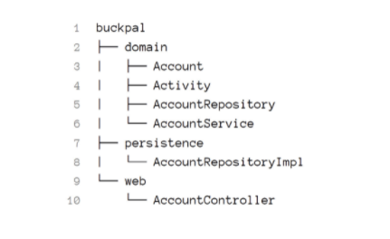
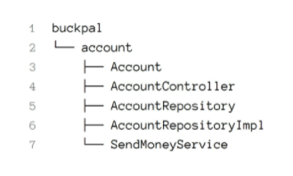
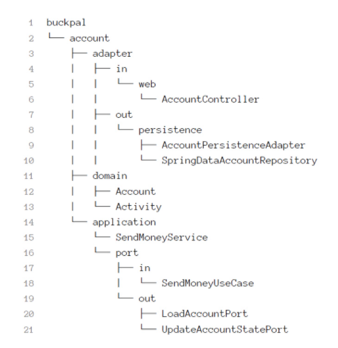
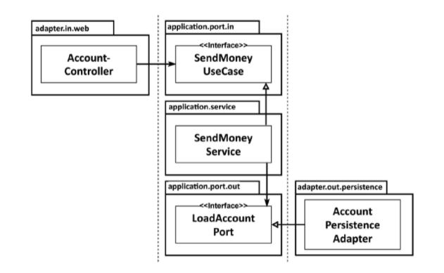

# Get Your Hands Dirty on Clean Architecture

> https://learning.oreilly.com/library/view/get-your-hands/9781839211966/
>
> 스터디
>
> 2021.08.11 ~ 

## Chapter 1 - What's Wrong With Layers?

레이어는 견고한 아키텍처 패턴이다. 올바르게 이해한다면 웹 및 persistence 계층과 독립적인 도메인 로직를 구축할 수 있다. 원하는 경우 도메인 로직에 영향을 주지 않고 웹 또는 persistence 기술을 전환할 수 있다. 기존 기능에 영향을 주지 않고 새로운 기능을 추가할 수 있습니다.

좋은 계층 구조를 통해 우리는 변화하는 요구 사항과 외부 요인에 빠르게 적응할 수 있다.

그렇다면 레이어 아키텍처에 무슨 문제가 있을까?

계층화된 아키텍처는 너무 많은 열린 측면을 가지고 있다. 나쁜 습관이 침투하여 시간이 지남에 따라 소프트웨어를 변경하기가 점점 더 어려워진다. 아래에 이유가 있다.

### 데이터베이스 기반 설계를 촉진한다

기존의 레이어 아키텍처의 기초는 데이터베이스이다.

모든 것이 persistence 계층 위에 구축된다. 이것은 여러 가지 이유로 인해 문제가 됩다.

대부분의 경우 데이터베이스 구조가 어떻게 생겼는지 생각하고 그 위에 도메인 논리를 구현하는 것으로 넘어간다.

이것은 종속성의 자연스러운 흐름을 따르기 때문에 기존의 계층 구조에서 의미가 있다.

**그러나 비즈니스 관점에서는 전혀 의미가 없다.** 다른 작업을 수행하기 전에 도메인 로직를 설계해야 한다. 그래야만 제대로 이해했는지 알 수 있다. 그리고 올바른 도메인 로직을 구축하고 있다는 것을 알게 된 후에야 이를 중심으로 persistence 및 웹 레이어를 구축해야 한다.

도메인 계층에서 데이터베이스 엔터티를 사용하면 지속성 계층과 강력한 결합이 이루어진다.

일반적으로 위의 그림과 같이 persistence 계층의 일부로 ORM 엔터티가 있다. 계층은 그 아래의 계층에 액세스할 수 있으므로 도메인 계층은 해당 엔터티에 접근할 수 있다.

**이것은 persistence 계층과 도메인 계층 사이에 강력한 결합을 생성한다. 우리 서비스는 persistence 모델을 비즈니스 모델로 사용하며 도메인 논리뿐만 아니라 eager vs lazy loading, 데이터베이스 트랜잭션, 캐시 플러시 및 유사한 하우스키핑 작업도 처리해야 한다.**

**persistence 코드는 사실상 도메인 코드에 결합되어 있기 때문에 변경하기가 어렵다.** 이는 우리 아키텍처의 목표가 되어야 하는 유연하고 옵션을 열어두는 것과는 반대이다.

### 바로 가기가 쉽다(레이어 경계가 흐려진다)

기존의 계층 구조에서 유일한 전역 규칙은 특정 계층에서 동일한 계층 또는 그 아래 계층의 구성 요소에만 액세스할 수 있다는 것이다.

따라서 상위 계층의 특정 구성 요소에 액세스해야 하는 경우 해당 구성 요소를 한 계층 아래로 푸시하면 액세스할 수 있다.

persistence 계층의 모든 항목에 액세스할 수 있으므로 시간이 지남에 따라 뚱뚱해지는 경향이 있다.

Helper 또는 Util 요소는 특정 계층에 속하지 않으므로 최하위 계층으로 밀어 내려서 접근하다 보면 점점 뚱뚱해진다.

**이러한 현상으로 레이어 경계가 점점 흐려진다.**

### 테스트가 어려워 진다

계층화된 아키텍처 내에서 일반적인 발전은 계층을 건너뛰는 것이다. 우리는 Entity의 단일 필드만 조작하기 때문에 웹 레이어에서 직접 Persistence 레이어에 액세스하고 도메인 레이어를 귀찮게 할 필요가 없다.

그러나, **도메인 계층을 건너뛰면 코드 기반 전체에 도메인 로직이 분산되는 경향이 있다.**

처음 몇 번은 괜찮게 느껴지지만 자주 발생하면 두 가지 단점이 있다.

첫째, 단일 필드만 조작하는 경우에도 웹 계층에서 도메인 로직을 구현한다. 앞으로 유스케이스가 확장된다면? 우리는 웹 계층에 더 많은 도메인 로직을 추가하여 책임을 혼합하고 애플리케이션 전체에 필수적인 도메인 로직를 퍼뜨린다.

둘째, 웹 계층 테스트에서 도메인 계층뿐만 아니라 persistence 계층도 mocking해야 한다. 이것은 단위 테스트에 복잡성을 추가한다.

웹 구성요소는 시간이 지남에 따라 증가하므로 서로 다른 persistence 구성요소에 대한 의존도가 높아져 테스트의 복잡성이 가중될 수 있다. 어느 순간, 우리가 의존성을 이해하고 mocking 하는데 실제로 서비스 코드를 작성하는 것보다 더 많은 시간이 소요된다. 

### Use Case를 숨긴다

우리는 일반적으로 새 코드를 만드는 것보다 기존 코드를 변경하는 데 훨씬 더 많은 시간을 보낸다.

기능을 추가하거나 변경할 적절한 위치를 자주 찾기 때문에 아키텍처는 코드 기반을 빠르게 탐색하는 데 도움이 된다. 이와 관련하여 계층화된 아키텍처는 어떻게 유지되고 있을까?

계층화된 아키텍처에서 도메인 로직이 계층 전체에 쉽게 분산될 수 있다. 계층을 건너뛰는 접근이 많아진다. 그리고 도메인과 지속성 계층 모두에서 액세스할 수 있도록 특정 구성 요소들이 최하위 계층에 존재할 수 있다. 이것은 새로운 기능을 추가할 적절한 위치를 찾는 것을 어렵게 만든다.

계층 구조는 도메인 서비스의 "폭"에 대한 규칙을 부과하지 않는다. 시간이 지남에 따라 위의 그림과 같이 여러 사용 사례를 지원하는 매우 광범위한 서비스로 이어지는 경우가 많다.

광범위한 서비스는 persistence 계층에 대한 많은 종속성을 가지며 웹 계층의 많은 구성 요소가 persistence 계층에 의존한다. 이것은 서비스를 테스트하기 어렵게 만들 뿐만 아니라 우리가 작업하려는 사용 사례를 담당하는 서비스를 찾기 어렵게 만든다.

각각 단일 사용 사례를 제공하는 고도로 전문화된 좁은 도메인 서비스가 있다면 얼마나 쉬울까? UserService에서 사용자 등록 사용 사례를 검색하는 대신 RegisterUserService를 열고 작업을 시작하면 된다.

### 동시에 개발하기 어려워진다

소프트웨어 개발자로서 내 경력에서 "완료된" 소프트웨어를 본 적이 없다는 사실을 제외하고, 특정 날짜까지 완료된다는 것은 일반적으로 우리가 병렬로 작업해야 함을 의미한다.

이러한 기대를 충족하려면 아키텍처가 병렬 작업을 지원해야 합니다. 그리고 계층화된 아키텍처는 여기에서 우리에게 실제로 도움이 되지 않는다.

애플리케이션에 새로운 사용 사례를 추가한다고 상상해보자. 세 명의 개발자가 있다. 한명은 필요한 기능을 웹 레이어에 추가하고, 한명은 도메인 레이어, 한명은 persistence 레이어에 기능을 추가할 수 있다.

일반적으로 계층 구조에서는 병렬로 작업하기 힘들다. 모든 것이 persistence 레이어 위에 구축되기 때문에 persistence 레이어가 먼저 개발되어야 한다. 그런 다음 도메인 계층이 오고 마지막으로 웹 계층이 온다. 따라서 한 명의 개발자만 동시에 기능에 대해 작업할 수 있다.

개발자가 먼저 인터페이스를 정의하면 각 개발자가 실제 구현을 기다릴 필요 없이 이러한 인터페이스에 대해 작업할 수도 있다.

물론 이마저도 persistence 레이어와 도메인 로직이 결합되어있지 않은 경우(데이터베이스 중심으로 설계를 하지 않은 경우)에만 가능하다.

코드베이스에 광범위한 서비스가 있는 경우 다른 기능을 병렬로 작업하는 것이 어려울 수도 있다. 동일한 서비스가 병렬로 편집되어 병합 충돌이 발생한다.

### 유지 보수 가능한 소프트웨어를 구축하는 데 어떤 도움이 될까?

위에 언급한 주제들은 계층화된 아키텍처가 많은 것들이 잘못될 수 있음을 보여준다.  
매우 엄격한 자기 훈련이 없으면 시간이 지남에 따라 성능이 저하되고 유지 보수가 어려워지기 쉽다.  
그리고 이러한 자기 훈련은 일반적으로 관리자가 개발 팀에 대해 새로운 마감일을 정할 때마다 덜 엄격해진다.

계층화된 아키텍처의 함정을 염두에 두는 것은  
다음 번에 우리가 지름길을 택하는 것에 반대하고  
계층화된 아키텍처든 다른 아키텍처 스타일이든 대신 유지 관리 가능한 솔루션을 구축하는 데 도움이 될 것이다.

## Chapter 2 - Inverting Dependencies

### The Single Responsibility Principle

소프트웨어 개발에 종사하는 모든 사람이 SRP(Single Responsibility Principle)를 알고 있거나 적어도 안다고 가정할 수 있다. 이 원칙의 일반적인 해석은 다음과 같다. 구성 요소는 한 가지만 제대로 수행해야 하며 올바르게 수행해야 한다.

좋은 조언이긴 하지만 SRP의 실제 의도는 아니다.

SRP의 실제 정의는 다음과 같습니다.  
구성 요소에는 변경 이유가 하나만 있어야 한다.  
우리가 볼 수 있듯이, '책임'은 실제로 '한 가지만 하라'가 아니라 '변해야 할 이유'로 번역되어야 한다.

SRP의 이름을 "단일 변경 이유"로 바꿔야 할 것 같다.

구성 요소가 변경해야 할 이유가 하나뿐이라면 결국 하나만 수행하게 될 수도 있지만,  
더 중요한 것은 구성 요소가 변경해야 할 이유가 이 하나뿐이라는 것이다.

이는 아키텍처에 어떤 의미가 있을까?

구성 요소를 변경해야 하는 이유가 하나뿐이라면 다른 이유로 소프트웨어를 변경해도 이 구성 요소는 전혀 걱정하지 않아도 된다. 소프트웨어가 예상대로 작동한다는 것을 알고 있기 때문이다.

구성 요소의 각 종속성이 이 구성 요소를 변경할 수 있는 가능한 이유임(점멸 화살표)  
앞의 그림에서 구성요소 A는 많은 다른 구성요소(직접적 또는 일시적)에 의존하는 반면 구성요소 E는 의존성이 전혀 없다.

구성 요소 E를 변경하는 유일한 이유는 새로운 요구 사항으로 인해 E의 기능을 변경해야 하는 경우이다.  
그러나 구성 요소 A는 다른 구성 요소에 종속되기 때문에 다른 구성 요소가 변경될 때 변경해야 할 수 있다.

많은 코드베이스는 SRP 위반으로 인해 시간이 지남에 따라 변경하기가 더 어려워지고, 따라서 비용이 증가한다.  
시간이 지남에 따라 구성 요소는 점점 더 많은 변경 이유를 수집한다.  
변경해야 할 많은 이유를 수집한 후 한 구성 요소를 변경하면 다른 구성 요소가 실패할 수 있다.

### A Tale about Side Effects

다른 소프트웨어 팀에서 만든 10년 된 코드베이스를 우리 팀이 물려받은 프로젝트에 참여한 적이 있다. 클라이언트는 향후 유지 관리 및 개발을 개선하고 비용을 절감하기 위해 개발 팀을 교체하기로 결정했었다.

예상했던 대로 코드가 실제로 어떤 기능을 하는지 파악하기가 쉽지 않았고, 코드베이스의 한 영역에서 변경한 사항들은 다른 부분에서 부작용을 일으키는 경우가 많았다. 하지만 철저한 테스트, 자동화된 테스트 추가, 많은 리팩터링 등을 통해 관리했다.

코드베이스를 성공적으로 유지 및 확장한 후, 고객은 소프트웨어 사용자들에게 매우 어색한 방식으로 새로운 기능을 구현해 줄 것을 요청했다. 그래서 전체적인 변경사항이 적기 때문에 구현 비용이 훨씬 적게 드는 보다 사용자 친화적인 방식으로 수행하자고 제안했다. 그러나 매우 중요한 특정 구성 요소에서 약간의 변경이 필요했다.

클라이언트는 거절하고 더 어색하고 비싼 솔루션을 주문했다. 그 이유를 물었더니 과거 개발팀의 그 한 가지 부품 변화로 인해 항상 다른 것이 고장났기 때문에 부작용이 두렵다고 한다.

슬프게도 이것은 잘못 설계된 소프트웨어를 수정하는 데 추가 비용을 지불하도록 클라이언트를 훈련시키는 방법의 한 예시다. 운 좋게도 대부분의 클라이언트는 이 방법과 함께 하지 않을테니, 대신 좋은 소프트웨어를 빌드해 보자.

### The Dependency Inversion Principle

우리의 계층 구조에서 계층 간 종속성은 항상 아래쪽, 즉 다음 계층을 가리킨다. SRP를 높은 수준에 적용하면 상위 계층이 하위 계층보다 변경해야 할 이유가 더 많다는 것을 알 수 있다.

Persistence 계층에 대한 도메인 계층의 종속성으로 인해 persistence 계층의 각 변경은 잠재적으로 도메인 계층의 변경을 필요로 한다. 그러나 도메인 코드는 우리 애플리케이션에서 가장 중요한 코드이다. 지속성 코드에서 무언가가 변경될 때 이를 변경하고 싶지 않다.

그렇다면 이 의존성을 어떻게 없앨 수 있을까?  
DIP(Dependency Inversion Principle)가 답을 제공한다.  
우리는 코드베이스 내에서 모든 종속성의 방향을 바꿀 수 있다.  

우리는 의존성의 양쪽에서 코드를 제어할 수 있을 때만 의존성을 반전시킬 수 있다. 타사 라이브러리에 대한 종속성이 있는 경우 해당 라이브러리의 코드를 제어하지 않으므로 반전할 수 없다.

persistence 코드가 도메인 코드에 종속되도록 도메인과 persistence 코드 간의 종속성을 반전시켜 도메인 코드를 변경해야 하는 이유의 수를 줄이도록 하자.

도메인 계층에는 persistence 계층의 엔티티 및 리포지토리와 함께 작동하는 서비스가 있다.

도메인 계층으로 엔티티를 끌어올리려고 한다. 엔티티는 도메인 객체를 나타내며 도메인 코드는 엔티티의 상태 변화를 중심으로 이루어지기 때문이다.

그러나 persistence 계층의 리포지토리는 도메인 계층에 있는 엔티티에 따라 달라지기 때문에 두 계층 간에 순환 종속성을 갖게 된다. 여기가 DIP를 적용하는 곳이다. 도메인 계층에 리포지토리에 대한 인터페이스를 만들고 persistence 계층의 실제 리포지토리가 이를 구현하도록 합니다.

**도메인 계층에 인터페이스를 도입하여 지속성 계층이 도메인 계층에 종속되도록 종속성을 반전할 수 있다.**  
이 트릭을 사용하여 지속성 코드에 대한 억압적인 종속성에서 도메인 로직을 해방시켰다. 이것은 다음 섹션에서 논의할 두 가지 아키텍처 스타일의 핵심 기능입니다.

### Clean Architecture

클린 아키텍처에서 비즈니스 규칙은 설계상 테스트 가능하며 프레임워크, 데이터베이스, UI 기술 및 기타 외부 애플리케이션이나 인터페이스와 독립적이다.

도메인 코드에는 외부로 향하는 종속성이 없어야 한다. 대신 DIP의 도움으로 모든 종속성이 도메인 코드를 가리킨다.

다음 그림은 그러한 아키텍처가 추상적인 수준에서 어떻게 보일 수 있는지 보여준다.

이 아키텍처의 레이어는 동심원으로 서로 둘러싸여 있다. 이러한 아키텍처의 주요 규칙은 해당 계층 간의 모든 종속성이 내부를 가리켜야 한다는 종속성 규칙이다.

아키텍처의 핵심에는 주변 사용 사례에서 액세스하는 도메인 엔터티가 포함된다. 사용 사례는 이전에 서비스라고 불렀지만 단일 책임(즉, 변경해야 하는 단일 이유)을 갖도록 더 세분화되어 앞에서 논의한 광범위한 서비스의 문제를 방지한다.

이 코어 주변에서 비즈니스 규칙을 지원하는 애플리케이션의 다른 모든 구성 요소를 찾을 수 있다. 이러한 지원은 예를 들어 persistence를 제공하거나 UI를 제공하는 것을 의미할 수 있습니다. 또한 외부 레이어는 다른 타사 구성 요소에 대한 어댑터를 제공할 수 있다.

**도메인 코드는 어떤 persistence 또는 UI 프레임워크가 사용되는지에 대해 아무것도 모르기 때문에 해당 프레임워크에 특정한 코드를 포함할 수 없으며 비즈니스 규칙에 집중한다.** 도메인 코드를 모델링할 수 있는 자유가 있다. 예를 들어, DDD(Domain-Driven Design)를 가장 순수한 형태로 적용할 수 있다. 지속성 또는 UI 관련 문제에 대해 생각할 필요가 없기 때문에 훨씬 쉽다.

**예상할 수 있듯이 Clean 아키텍처에는 비용이 따른다.** 도메인 레이어는 지속성 및 UI와 같은 외부 레이어와 완전히 분리되어 있으므로 **각 레이어에서 애플리케이션 엔터티의 모델을 유지해야 한다.**

예를 들어, 지속성 계층에서 객체 관계형 매핑(ORM) 프레임워크를 사용한다고 가정해 보자. ORM 프레임워크는 일반적으로 데이터베이스 구조 및 데이터베이스 열에 대한 개체 필드 매핑을 설명하는 메타데이터가 포함된 특정 엔터티 클래스를 이야기한다. 도메인 계층은 persistence 계층을 모르기 때문에 도메인 계층에서 동일한 엔티티 클래스를 사용할 수 없으며 두 계층에서 모두 생성해야 한다. 즉, **도메인 계층이 persistence 계층과 데이터를 주고받을 때 두 표현 사이를 변환해야 한다.** 도메인 레이어와 다른 외부 레이어 간에 동일한 변환이 적용됩니다.

이 분리는 프레임워크 특정 문제에서 도메인 코드를 자유롭게 하기 위해 정확히 달성하고자 하는 것이다. 예를 들어, Java Persistence API(자바 세계의 표준 ORM-API)는 ORM 관리 엔터티가 도메인 모델에서 사용하지 않을 수 있는 기본 생성자를 가져야 한다. 8장, 경계 간의 매핑에서 우리는 도메인과 지속성 레이어 간의 결합을 수용하는 "노매핑" 전략을 포함하여 다양한 매핑 전략에 대해 이야기할 것이다.

로버트 C. 마틴의 클린 아키텍처는 다소 추상적이기 때문에 좀 더 세부적인 수준으로 가서 클린 아키텍처 원칙을 보다 구체적인 형태로 제공하는 "육각형 아키텍처"를 살펴보겠습니다.

### Hexagonal Architecture

육각형 아키텍처는 애플리케이션 코어가 각 어댑터와 상호 작용할 수 있는 특정 포트를 제공하기 때문에 "포트 앤 어댑터" 아키텍처라고도 한다.

애플리케이션 코어는 육각형으로 표시되어 이 아키텍처 스타일에 이름을 부여한다. 그러나 육각형 모양은 의미가 없으므로 팔각형을 그려서 "팔각형 아키텍처"라고 부를 수도 있다. 전설에 따르면 응용 프로그램이 다른 시스템이나 어댑터에 연결하는 4개 이상의 면이 있을 수 있음을 보여주기 위해 일반적인 직사각형 대신 육각형이 사용되었다고 한다.

육각형 내에서 도메인 엔티티와 함께 사용할 수 있는 사용 사례를 찾을 수 있다. 육각형에는 나가는 종속성이 없으므로 Martin의 클린 아키텍처의 종속성 규칙은 참으로 유지된다. 대신 모든 종속성이 중앙을 가리킨다.

육각형 외부에서 애플리케이션과 상호 작용하는 다양한 어댑터를 찾을 수 있다. 웹 브라우저와 상호 작용하는 웹 어댑터, 외부 시스템과 상호 작용하는 일부 어댑터 및 데이터베이스와 상호 작용하는 어댑터가 있을 수 있다.

왼쪽 어댑터는 애플리케이션을 구동하는 어댑터(애플리케이션 코어를 호출하므로)이고 오른쪽에 있는 어댑터는 애플리케이션에 의해 구동된다(애플리케이션 코어에 의해 호출되기 때문에).

애플리케이션 코어와 어댑터 간의 통신을 허용하기 위해 애플리케이션 코어는 특정 포트를 제공한다.  
애플리케이션 코어를 호출하는(구동하는) 어댑터의 경우 이러한 포트는 코어의 사용 사례 클래스 중 하나에 의해 구현되고 어댑터에 의해 호출되는 인터페이스일 수 있다.  
구동되는 어댑터의 경우 어댑터에 의해 구현되고 코어에 의해 호출되는 인터페이스일 수 있다.

핵심 개념으로 인해 이 아키텍처 스타일은 "포트 앤 어댑터" 아키텍처라고도 한다. Clean 아키텍처와 마찬가지로 이 육각형 아키텍처를 레이어로 구성할 수 있다. 가장 바깥쪽 계층은 응용 프로그램과 다른 시스템 간에 변환하는 어댑터로 구성된다. 다음으로 포트와 사용 사례 구현을 결합하여 애플리케이션의 인터페이스를 정의하기 때문에 애플리케이션 계층을 형성할 수 있다. 마지막 레이어에는 도메인 엔터티가 포함된다.

다음 장에서는 이러한 아키텍처를 코드로 구성하는 방법에 대해 논의할 것이다.

### How Does This Help Me Build Maintainable Software?

클린 아키텍처, 6각형 아키텍처 또는 포트 및 어댑터 아키텍처라고 부르자. 도메인 코드가 외부에 종속되지 않도록 종속성을 반전함으로써 모든 지속성 및 UI 관련 문제에서 도메인 로직을 분리할 수 있다. 코드베이스 전체에서 변경해야 하는 이유의 수, 변경해야 할 이유가 적다는 것은 유지 관리가 용이하다는 것을 의미한다.

도메인 코드는 비즈니스 문제에 가장 적합하도록 자유롭게 모델링할 수 있는 반면 persistence 및 UI 코드는 persistence 및 UI 문제에 가장 적합하도록 자유롭게 모델링할 수 있다.

이 책의 나머지 부분에서는 육각형 아키텍처 스타일을 웹 애플리케이션에 적용할 것이다. 먼저 애플리케이션의 패키지 구조를 만들고 종속성 주입의 역할에 대해 논의한다.

## Chapter 3 - Organizing Code

코드만 봐도 아키텍처를 알 수 있다면 좋지 않을까?

이 장에서는 코드를 구성하는 다양한 방법을 살펴보고 육각형 아키텍처를 직접 반영하는 표현적인 패키지 구조를 알아본다.

미개발 소프트웨어 프로젝트에서 우리가 가장 먼저 제대로 하려고 하는 것이 패키지 구조이다. 우리는 프로젝트의 나머지 부분에 사용할 멋진 패키지 구조를 설계한다. 그러다 프로젝트 진행 중에 정신이 없어지고 많은 곳에서 패키지 구조가 구조화되지 않은 코드 난장판을 위한 외관일 뿐이라는 것을 깨닫게 된다. 한 패키지의 클래스는 가져와서는 안 되는 다른 패키지에서 클래스를 가져온다.

예제 응용프로그램의 코드를 구성하기 위한 다양한 옵션에 대해 논의할 것이다. 좀 더 구체적으로, 사용자가 자신의 계좌에서 다른 계좌로 송금할 수 있는 "송금" 사용 사례를 살펴보자.

### Organizing by Layer

코드를 구성하는 첫 번째 접근 방식은 계층을 사용하는 것이다. 다음과 같이 코드를 구성할 수 있다.

계층별로 코드를 구성할 때 기능적 측면이 혼합되는 경향이 있다.  

각 계층, 웹, 도메인 및 persistence에 대해 전용 패키지가 있다.  
1장, What's Wrong With Layers?에서 논의한 바와 같이, 간단한 계층은 여러 가지 이유로 인해 코드에 가장 적합한 구조가 아닐 수 있으므로, 여기서는 이미 종속성 반전 원칙을 적용했으며, 도메인 패키지의 도메인 코드에 대한 종속성만 허용한다.  
이를 위해 도메인 패키지에 AccountRepository 인터페이스를 도입하고 persistence 패키지에 구현했다.

그러나 이 패키지 구조가 차선책인 이유를 적어도 세 가지 찾을 수 있다.

**첫째, 애플리케이션의 기능적 단위나 기능 사이에 패키지 경계가 없다.**  
사용자 관리 기능을 추가하면 웹 패키지에 UserController를 추가하고 도메인 패키지에 UserService, UserRepository 및 User를 추가하고 지속성 패키지에 UserRepositoryImpl을 추가한다.  
추가 구조가 없으면 이는 빠르게 클래스를 엉망으로 만들어 응용 프로그램의 관련되지 않은 기능 간에 원치 않는 부작용을 초래할 수 있습니다.

**둘째, 애플리케이션이 제공하는 Use Case를 볼 수 없다.** AccountService 또는 AccountController 클래스가 구현하는Use Case를 알 수 있을까? 특정 기능을 찾고 있다면 어떤 서비스가 그것을 구현하는지 추측한 다음 해당 서비스 내에서 책임 있는 메소드를 검색해야 한다.

**마찬가지로 패키지 구조 내에서 대상 아키텍처를 볼 수 없다.**  
6각형 아키텍처 스타일을 따랐다고 추측할 수 있으며 웹 및 persistence 패키지의 클래스를 탐색하여 웹 및 persistence 어댑터를 찾을 수 있다.  
그러나 웹 어댑터가 호출하는 기능과 persistence 어댑터가 도메인 계층에 제공하는 기능을 한 눈에 볼 수 없습니다. **들어오는 포트와 나가는 포트는 코드에 숨겨져 있습니다.**

### Organizing by Feature

"계층별 구성" 접근 방식의 몇 가지 문제를 해결해 보자

다음 접근 방식은 코드를 기능별로 구성하는 것이다.

기능별로 코드를 구성할 때 기본 아키텍처가 명확하지 않은 경향이 있다.  
본질적으로 계정과 관련된 모든 코드를 상위 수준 계정 패키지에 넣었다. 레이어 패키지도 제거했다.

각각의 새로운 기능 그룹은 계정 옆에 새로운 상위 수준 패키지를 갖게 되며 외부에서 액세스해서는 안 되는 클래스에 대한 package-private 가시성을 사용하여 기능 간에 패키지 경계를 적용할 수 있다.

package-private 가시성과 결합된 패키지 경계를 통해 기능 간의 원치 않는 종속성을 피할 수 있다.

또한 책임을 줄이기 위해 AccountService의 이름을 SendMoneyService로 변경했습니다(패키지별 접근 방식에서도 가능).  
이제 클래스 이름만 봐도 "Send Money" Use Case를 코드가 구현함을 알 수 있습니다.  
응용프로그램의 기능을 코드에 표시하는 것은 Robert Martin이 "screaming architecture"라고 부르는 것인데, 이는 응용프로그램이 우리에게 의도를 전달하기 때문입니다(Robert C의 Clean Architecture). 마틴, 프렌티스 홀, 2017, 21장).

그러나 package-by-feature 접근 방식은 아키텍처를 훨씬 덜 가시적으로 만든다.  

어댑터를 식별할 수 있는 패키지 이름이 없으며 여전히 수신 및 발신 포트가 표시되지 않는다.  
게다가 SendMoneyService가 AccountRepository 인터페이스만 알고 구현은 알 수 없도록 도메인 코드와 지속성 코드 간의 종속성을 역전시켰지만 package-private 가시성을 사용하여 도메인 코드를 실수로 인한 종속성으로부터 persistence 코드로 보호할 수는 없습니다.

### An Architecturally Expressive Package Structure

육각형 아키텍처에는 엔터티, Use Case, 수신 및 발신 포트, 수신 및 발신(또는 "driving" 및 "driven") 어댑터가 주요 아키텍처 요소로 있습니다. 이 요소들을 아키텍처를 표현하는 패키지 구조에 맞춰보자.

아키텍처 표현이 풍부한 패키지 구조에서 각 아키텍처 요소는 제 위치를 가진다.

아키텍처의 각 요소는 패키지 중 하나에 직접 매핑될 수 있다.  
최상위 수준에서 다시 **account라는 패키지**가 있는데, 이는 이것이 계정에 대한 Use Case를 구현하는 모듈임을 나타낸다.

다음 레벨에는 도메인 모델이 포함된 domain 패키지가 있다.  

**application 패키지**에는 이 도메인 모델에 대한 서비스 계층이 포함되어 있다.  
SendMoneyService는 input 포트 인터페이스인 SendMoneyUseCase를 구현하고. 
persistence 어댑터에 의해 구현되는 output 포트 인터페이스인 LoadAccountPort 및 UpdateAccountStatePort를 사용한다.

**adapter 패키지**에는 응용 프로그램 계층의 input 포트를 호출하는 input 어댑터와 응용 프로그램 계층의 output 포트에 대한 구현을 제공하는 output 어댑터가 포함되어 있다.  
우리의 경우에는 각각 고유한 하위 패키지가 있는 웹 및 persistence 어댑터를 사용하여 간단한 웹 애플리케이션을 구축하고 있다.

사무실 벽에 걸린 육각형 아키텍처에 대한 높은 수준의 뷰를 가지고 있으며, 사용 중인 타사 API로 클라이언트를 수정하는 것에 대해 동료와 이야기를 나누고 있다고 상상해 보자.  
이에 대해 논의하는 동안 아키텍처에 있는 해당 out 어댑터를 가리키면 서로를 더 잘 이해할 수 있다.  
그런 다음 이야기를 마치면 IDE 앞에 앉아 바로 클라이언트에 대한 작업을 시작할 수 있다. 앞서 언급한 API 클라이언트의 코드는 adapter/out/<어댑터 이름> 패키지에서 찾을 수 있기 때문이다.

이러한 패키지 구조는 소위 "아키텍처-코드 격차" 또는 "모델-코드 격차"에 대항하는 강력한 요소이다.(Just Enough Architecture by George Fairbanks, Marshall & Brainerd, 2010, 167페이지).  
이 용어들은 대부분의 소프트웨어 개발 프로젝트에서 아키텍처가 코드에 직접 매핑될 수 없는 추상적 개념에 불과하다는 사실을 설명한다.  
시간이 지남에 따라 패키지 구조가 아키텍처를 반영하지 않으면 코드는 일반적으로 대상 아키텍처에서 점점 더 벗어날 것입니다.

패키지가 너무 많다는 것은 패키지 간에 액세스를 허용하기 위해 모든 것이 공개되어야 한다는 것을 의미하지 않는가?

**adapter 패키지의 경우** 적어도 이것은 사실이 아닙니다. 포함된 모든 클래스는 애플리케이션 패키지 내에 있는 포트 인터페이스를 제외하고 외부 세계에서 호출되지 않기 때문에 **package-private일 수 있습니다.** 따라서 응용 프로그램 계층에서 어댑터 클래스로의 우발적인 종속성이 없습니다.

그러나 **application 및 domain 패키지 내에서 일부 클래스는 실제로 공개되어야 한다.**  
포트는 설계상 어댑터에서 액세스할 수 있어야 하므로 public 포트여야 한다.  
도메인 클래스는 public 상태여야 서비스 및 어댑터가 액세스할 수 있다.  
서비스는 수신 포트 인터페이스 뒤에 숨겨질 수 있으므로 공용일 필요가 없다.

adapter 코드를 자체 패키지로 이동하면 필요할 경우 한 어댑터를 다른 구현으로 매우 쉽게 교체할 수 있다는 추가 이점이 있다.  
간단한 키-값 데이터베이스에 대해 구현을 시작했다고 상상해 보자.  
결국 어떤 데이터베이스가 가장 좋을지 확신하지 못했기 때문에 이제 SQL 데이터베이스로 전환해야 한다.  
새로운 어댑터 패키지에 관련된 모든 out 포트를 구현한 다음 이전 패키지를 제거하기만 하면 된다.

이 패키지 구조의 또 다른 매우 매력적인 장점은 DDD 개념에 직접 매핑된다는 것이다.  
이 경우 상위 패키지인 account는 다른 경계 컨텍스트와 통신하기 위한 전용 진입점 및 출구 지점(포트)이 있는 경계 컨텍스트이다.  
도메인 패키지 내에서 DDD가 제공하는 모든 도구를 사용하여 원하는 도메인 모델을 구축할 수 있다.

모든 구조와 마찬가지로 소프트웨어 프로젝트의 수명 동안 이 패키지 구조를 유지하려면 규칙이 필요하다.  
또한 패키지 구조가 맞지 않아 아키텍처/코드 간극을 넓히고, 아키텍처를 반영하지 않는 패키지를 만드는 것 외에 다른 방법이 보이지 않는 경우가 있다.

완벽이란 없다. 그러나 표현적인 패키지 구조를 사용하면 최소한 코드와 아키텍처 사이의 간격을 줄일 수 있다.

### The Role of Dependency Injection

앞에서 설명한 패키지 구조는 Clean 아키텍처로 발전하지만,  
이러한 아키텍처의 필수적인 요구사항은 애플리케이션 계층이 2장 "*Inverting Dependencies*."에서 배운 바와 같이 들어오고 나가는 어댑터에 종속성을 갖지 않는 것이다.

웹 어댑터와 같은 수신 어댑터의 경우 제어 흐름이 어댑터와 도메인 코드 간의 의존성과 동일한 방향을 가리키기 때문에 이 작업이 쉽다.  
어댑터는 단순히 애플리케이션 계층 내에서 서비스를 호출한다.  
애플리케이션에 대한 진입점을 명확하게 구분하기 위해 그럼에도 불구하고 포트 인터페이스 간에 실제 서비스를 숨기고 싶을 수 있다.

persistence 어댑터와 같은 나가는 어댑터의 경우 의존성 역전 원칙을 사용하여 종속성을 제어 흐름의 방향으로 전환해야 한다.

우리는 이미 그것이 어떻게 작동하는지 봤다.  
adapter 내의 클래스에서 구현하는 인터페이스를 애플리케이션 계층 내에 만든다.   
육각형 아키텍처 내에서 이 인터페이스는 port입니다.  
그런 다음 애플리케이션 계층은 이 포트 인터페이스를 호출하여 다음 그림과 같이 어댑터의 기능을 호출한다.

웹 컨트롤러는 서비스에 의해 구현되는 수신 포트를 호출한다.  
서비스는 어댑터에 의해 구현되는 나가는 포트를 호출한다.

그러나 포트 인터페이스를 구현하는 실제 객체를 응용 프로그램에 제공자는 누구일까?  
adapter에 의존성을 도입하고 싶지 않기 때문에 애플리케이션 계층 내에서 포트를 수동으로 인스턴스화하고 싶지 않다.

여기서 의존성 주입이 작동한다.  
모든 레이어에 의존하는 중립적인 컴포넌트를 소개한다.  
이 구성 요소는 아키텍처를 구성하는 대부분의 클래스를 인스턴스화하는 역할을 한다.

앞의 예제 그림에서 중립 의존성 주입 구성 요소는 AccountController, SendMoneyService 및 AccountPersistenceAdapter 클래스의 인스턴스를 생성한다.  
AccountController에는 SendMoneyUseCase 인터페이스가 필요하기 때문에 의존성 주입은 생성 중에 SendMoneyService 클래스의 인스턴스를 제공한다.  
컨트롤러는 인터페이스만 알면 되기 때문에 실제로 SendMoneyService 인스턴스가 있다는 것을 알지 못한다.

마찬가지로 SendMoneyService 인스턴스를 구성할 때 의존성 주입 메커니즘은 LoadAccountPort 인터페이스의 모습으로 AccountPersistenceAdapter 클래스의 인스턴스를 주입한다.  
서비스는 인터페이스 뒤에 있는 실제 클래스를 절대 알지 못한다.

### How Does This Help Me Build Maintainable Software?

실제 코드 구조를 대상 아키텍처에 최대한 가깝게 취하는 6각형 아키텍처용 패키지 구조를 살펴봤다.  
코드에서 아키텍처의 요소를 찾는 것은 이제 아키텍처 다이어그램에서 특정 package의 이름과 함께 package 구조를 탐색하는 문제로 communication, 개발 및 유지 보수에 도움이 된다.

