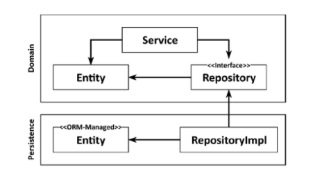
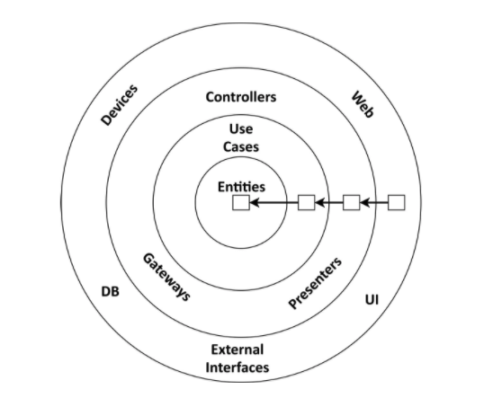
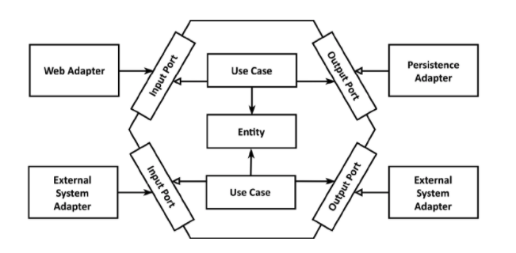

# Get Your Hands Dirty on Clean Architecture

> https://learning.oreilly.com/library/view/get-your-hands/9781839211966/
>
> 스터디
>
> 2021.08.11

## Chapter 2 - Inverting Dependencies

### The Single Responsibility Principle

소프트웨어 개발에 종사하는 모든 사람이 SRP(Single Responsibility Principle)를 알고 있거나 적어도 안다고 가정할 수 있다. 이 원칙의 일반적인 해석은 다음과 같다. 구성 요소는 한 가지만 제대로 수행해야 하며 올바르게 수행해야 한다.

좋은 조언이긴 하지만 SRP의 실제 의도는 아니다.

SRP의 실제 정의는 다음과 같습니다.  
구성 요소에는 변경 이유가 하나만 있어야 한다.  
우리가 볼 수 있듯이, '책임'은 실제로 '한 가지만 하라'가 아니라 '변해야 할 이유'로 번역되어야 한다.

SRP의 이름을 "단일 변경 이유"로 바꿔야 할 것 같다.

구성 요소가 변경해야 할 이유가 하나뿐이라면 결국 하나만 수행하게 될 수도 있지만,  
더 중요한 것은 구성 요소가 변경해야 할 이유가 이 하나뿐이라는 것이다.

이는 아키텍처에 어떤 의미가 있을까?

구성 요소를 변경해야 하는 이유가 하나뿐이라면 다른 이유로 소프트웨어를 변경해도 이 구성 요소는 전혀 걱정하지 않아도 된다. 소프트웨어가 예상대로 작동한다는 것을 알고 있기 때문이다.

구성 요소의 각 종속성이 이 구성 요소를 변경할 수 있는 가능한 이유임(점멸 화살표)  
앞의 그림에서 구성요소 A는 많은 다른 구성요소(직접적 또는 일시적)에 의존하는 반면 구성요소 E는 의존성이 전혀 없다.

구성 요소 E를 변경하는 유일한 이유는 새로운 요구 사항으로 인해 E의 기능을 변경해야 하는 경우이다.  
그러나 구성 요소 A는 다른 구성 요소에 종속되기 때문에 다른 구성 요소가 변경될 때 변경해야 할 수 있다.

많은 코드베이스는 SRP 위반으로 인해 시간이 지남에 따라 변경하기가 더 어려워지고, 따라서 비용이 증가한다.  
시간이 지남에 따라 구성 요소는 점점 더 많은 변경 이유를 수집한다.  
변경해야 할 많은 이유를 수집한 후 한 구성 요소를 변경하면 다른 구성 요소가 실패할 수 있다.

### A Tale about Side Effects

다른 소프트웨어 팀에서 만든 10년 된 코드베이스를 우리 팀이 물려받은 프로젝트에 참여한 적이 있다. 클라이언트는 향후 유지 관리 및 개발을 개선하고 비용을 절감하기 위해 개발 팀을 교체하기로 결정했었다.

예상했던 대로 코드가 실제로 어떤 기능을 하는지 파악하기가 쉽지 않았고, 코드베이스의 한 영역에서 변경한 사항들은 다른 부분에서 부작용을 일으키는 경우가 많았다. 하지만 철저한 테스트, 자동화된 테스트 추가, 많은 리팩터링 등을 통해 관리했다.

코드베이스를 성공적으로 유지 및 확장한 후, 고객은 소프트웨어 사용자들에게 매우 어색한 방식으로 새로운 기능을 구현해 줄 것을 요청했다. 그래서 전체적인 변경사항이 적기 때문에 구현 비용이 훨씬 적게 드는 보다 사용자 친화적인 방식으로 수행하자고 제안했다. 그러나 매우 중요한 특정 구성 요소에서 약간의 변경이 필요했다.

클라이언트는 거절하고 더 어색하고 비싼 솔루션을 주문했다. 그 이유를 물었더니 과거 개발팀의 그 한 가지 부품 변화로 인해 항상 다른 것이 고장났기 때문에 부작용이 두렵다고 한다.

슬프게도 이것은 잘못 설계된 소프트웨어를 수정하는 데 추가 비용을 지불하도록 클라이언트를 훈련시키는 방법의 한 예시다. 운 좋게도 대부분의 클라이언트는 이 방법과 함께 하지 않을테니, 대신 좋은 소프트웨어를 빌드해 보자.

### The Dependency Inversion Principle

우리의 계층 구조에서 계층 간 종속성은 항상 아래쪽, 즉 다음 계층을 가리킨다. SRP를 높은 수준에 적용하면 상위 계층이 하위 계층보다 변경해야 할 이유가 더 많다는 것을 알 수 있다.

Persistence 계층에 대한 도메인 계층의 종속성으로 인해 persistence 계층의 각 변경은 잠재적으로 도메인 계층의 변경을 필요로 한다. 그러나 도메인 코드는 우리 애플리케이션에서 가장 중요한 코드이다. 지속성 코드에서 무언가가 변경될 때 이를 변경하고 싶지 않다.

그렇다면 이 의존성을 어떻게 없앨 수 있을까?  
DIP(Dependency Inversion Principle)가 답을 제공한다.  
우리는 코드베이스 내에서 모든 종속성의 방향을 바꿀 수 있다.  

우리는 의존성의 양쪽에서 코드를 제어할 수 있을 때만 의존성을 반전시킬 수 있다. 타사 라이브러리에 대한 종속성이 있는 경우 해당 라이브러리의 코드를 제어하지 않으므로 반전할 수 없다.

persistence 코드가 도메인 코드에 종속되도록 도메인과 persistence 코드 간의 종속성을 반전시켜 도메인 코드를 변경해야 하는 이유의 수를 줄이도록 하자.

도메인 계층에는 persistence 계층의 엔티티 및 리포지토리와 함께 작동하는 서비스가 있다.

도메인 계층으로 엔티티를 끌어올리려고 한다. 엔티티는 도메인 객체를 나타내며 도메인 코드는 엔티티의 상태 변화를 중심으로 이루어지기 때문이다.

그러나 persistence 계층의 리포지토리는 도메인 계층에 있는 엔티티에 따라 달라지기 때문에 두 계층 간에 순환 종속성을 갖게 된다. 여기가 DIP를 적용하는 곳이다. 도메인 계층에 리포지토리에 대한 인터페이스를 만들고 persistence 계층의 실제 리포지토리가 이를 구현하도록 합니다.

**도메인 계층에 인터페이스를 도입하여 지속성 계층이 도메인 계층에 종속되도록 종속성을 반전할 수 있다.**  
이 트릭을 사용하여 지속성 코드에 대한 억압적인 종속성에서 도메인 로직을 해방시켰다. 이것은 다음 섹션에서 논의할 두 가지 아키텍처 스타일의 핵심 기능입니다.

### Clean Architecture

클린 아키텍처에서 비즈니스 규칙은 설계상 테스트 가능하며 프레임워크, 데이터베이스, UI 기술 및 기타 외부 애플리케이션이나 인터페이스와 독립적이다.

도메인 코드에는 외부로 향하는 종속성이 없어야 한다. 대신 DIP의 도움으로 모든 종속성이 도메인 코드를 가리킨다.

다음 그림은 그러한 아키텍처가 추상적인 수준에서 어떻게 보일 수 있는지 보여준다.

이 아키텍처의 레이어는 동심원으로 서로 둘러싸여 있다. 이러한 아키텍처의 주요 규칙은 해당 계층 간의 모든 종속성이 내부를 가리켜야 한다는 종속성 규칙이다.

아키텍처의 핵심에는 주변 사용 사례에서 액세스하는 도메인 엔터티가 포함된다. 사용 사례는 이전에 서비스라고 불렀지만 단일 책임(즉, 변경해야 하는 단일 이유)을 갖도록 더 세분화되어 앞에서 논의한 광범위한 서비스의 문제를 방지한다.

이 코어 주변에서 비즈니스 규칙을 지원하는 애플리케이션의 다른 모든 구성 요소를 찾을 수 있다. 이러한 지원은 예를 들어 persistence를 제공하거나 UI를 제공하는 것을 의미할 수 있습니다. 또한 외부 레이어는 다른 타사 구성 요소에 대한 어댑터를 제공할 수 있다.

**도메인 코드는 어떤 persistence 또는 UI 프레임워크가 사용되는지에 대해 아무것도 모르기 때문에 해당 프레임워크에 특정한 코드를 포함할 수 없으며 비즈니스 규칙에 집중한다.** 도메인 코드를 모델링할 수 있는 자유가 있다. 예를 들어, DDD(Domain-Driven Design)를 가장 순수한 형태로 적용할 수 있다. 지속성 또는 UI 관련 문제에 대해 생각할 필요가 없기 때문에 훨씬 쉽다.

**예상할 수 있듯이 Clean 아키텍처에는 비용이 따른다.** 도메인 레이어는 지속성 및 UI와 같은 외부 레이어와 완전히 분리되어 있으므로 **각 레이어에서 애플리케이션 엔터티의 모델을 유지해야 한다.**

예를 들어, 지속성 계층에서 객체 관계형 매핑(ORM) 프레임워크를 사용한다고 가정해 보자. ORM 프레임워크는 일반적으로 데이터베이스 구조 및 데이터베이스 열에 대한 개체 필드 매핑을 설명하는 메타데이터가 포함된 특정 엔터티 클래스를 이야기한다. 도메인 계층은 persistence 계층을 모르기 때문에 도메인 계층에서 동일한 엔티티 클래스를 사용할 수 없으며 두 계층에서 모두 생성해야 한다. 즉, **도메인 계층이 persistence 계층과 데이터를 주고받을 때 두 표현 사이를 변환해야 한다.** 도메인 레이어와 다른 외부 레이어 간에 동일한 변환이 적용됩니다.

이 분리는 프레임워크 특정 문제에서 도메인 코드를 자유롭게 하기 위해 정확히 달성하고자 하는 것이다. 예를 들어, Java Persistence API(자바 세계의 표준 ORM-API)는 ORM 관리 엔터티가 도메인 모델에서 사용하지 않을 수 있는 기본 생성자를 가져야 한다. 8장, 경계 간의 매핑에서 우리는 도메인과 지속성 레이어 간의 결합을 수용하는 "노매핑" 전략을 포함하여 다양한 매핑 전략에 대해 이야기할 것이다.

로버트 C. 마틴의 클린 아키텍처는 다소 추상적이기 때문에 좀 더 세부적인 수준으로 가서 클린 아키텍처 원칙을 보다 구체적인 형태로 제공하는 "육각형 아키텍처"를 살펴보겠습니다.

### Hexagonal Architecture

육각형 아키텍처는 애플리케이션 코어가 각 어댑터와 상호 작용할 수 있는 특정 포트를 제공하기 때문에 "포트 앤 어댑터" 아키텍처라고도 한다.

애플리케이션 코어는 육각형으로 표시되어 이 아키텍처 스타일에 이름을 부여한다. 그러나 육각형 모양은 의미가 없으므로 팔각형을 그려서 "팔각형 아키텍처"라고 부를 수도 있다. 전설에 따르면 응용 프로그램이 다른 시스템이나 어댑터에 연결하는 4개 이상의 면이 있을 수 있음을 보여주기 위해 일반적인 직사각형 대신 육각형이 사용되었다고 한다.

육각형 내에서 도메인 엔티티와 함께 사용할 수 있는 사용 사례를 찾을 수 있다. 육각형에는 나가는 종속성이 없으므로 Martin의 클린 아키텍처의 종속성 규칙은 참으로 유지된다. 대신 모든 종속성이 중앙을 가리킨다.

육각형 외부에서 애플리케이션과 상호 작용하는 다양한 어댑터를 찾을 수 있다. 웹 브라우저와 상호 작용하는 웹 어댑터, 외부 시스템과 상호 작용하는 일부 어댑터 및 데이터베이스와 상호 작용하는 어댑터가 있을 수 있다.

왼쪽 어댑터는 애플리케이션을 구동하는 어댑터(애플리케이션 코어를 호출하므로)이고 오른쪽에 있는 어댑터는 애플리케이션에 의해 구동된다(애플리케이션 코어에 의해 호출되기 때문에).

애플리케이션 코어와 어댑터 간의 통신을 허용하기 위해 애플리케이션 코어는 특정 포트를 제공한다.  
애플리케이션 코어를 호출하는(구동하는) 어댑터의 경우 이러한 포트는 코어의 사용 사례 클래스 중 하나에 의해 구현되고 어댑터에 의해 호출되는 인터페이스일 수 있다.  
구동되는 어댑터의 경우 어댑터에 의해 구현되고 코어에 의해 호출되는 인터페이스일 수 있다.

핵심 개념으로 인해 이 아키텍처 스타일은 "포트 앤 어댑터" 아키텍처라고도 한다. Clean 아키텍처와 마찬가지로 이 육각형 아키텍처를 레이어로 구성할 수 있다. 가장 바깥쪽 계층은 응용 프로그램과 다른 시스템 간에 변환하는 어댑터로 구성된다. 다음으로 포트와 사용 사례 구현을 결합하여 애플리케이션의 인터페이스를 정의하기 때문에 애플리케이션 계층을 형성할 수 있다. 마지막 레이어에는 도메인 엔터티가 포함된다.

다음 장에서는 이러한 아키텍처를 코드로 구성하는 방법에 대해 논의할 것이다.

### How Does This Help Me Build Maintainable Software?

클린 아키텍처, 6각형 아키텍처 또는 포트 및 어댑터 아키텍처라고 부르자. 도메인 코드가 외부에 종속되지 않도록 종속성을 반전함으로써 모든 지속성 및 UI 관련 문제에서 도메인 로직을 분리할 수 있다. 코드베이스 전체에서 변경해야 하는 이유의 수, 변경해야 할 이유가 적다는 것은 유지 관리가 용이하다는 것을 의미한다.

도메인 코드는 비즈니스 문제에 가장 적합하도록 자유롭게 모델링할 수 있는 반면 persistence 및 UI 코드는 persistence 및 UI 문제에 가장 적합하도록 자유롭게 모델링할 수 있다.

이 책의 나머지 부분에서는 육각형 아키텍처 스타일을 웹 애플리케이션에 적용할 것이다. 먼저 애플리케이션의 패키지 구조를 만들고 종속성 주입의 역할에 대해 논의한다.

