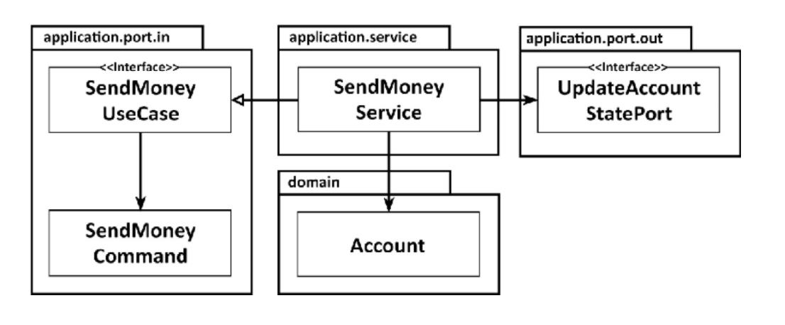

# Get Your Hands Dirty on Clean Architecture

> https://learning.oreilly.com/library/view/get-your-hands/9781839211966/
>
> 스터디
>
> 2021.08.18

## Chapter 4 - Implementing a Use Case

애플리케이션, 웹 및 persistence 계층이 아키텍처에서 느슨하게 결합되어 있으므로 적합한 도메인 코드를 완전히 자유롭게 모델링할 수 있다. 우리는 DDD를 할 수도 있고, 풍부하거나 빈약한 도메인 모델을 구현할 수도 있고, 우리만의 방식을 발명할 수도 있다.

이전 장에서 소개한 육각형 아키텍처 스타일 내에서 Use Case 를 구현하는 독창적인 방법을 설명한다.

도메인 중심 아키텍처에 적합하므로 도메인 엔터티로 시작한 다음 이를 중심으로 Use Case를 구축한다.

### Implementing the domain model

한 계정에서 다른 계정으로 돈을 보내는 Use Case를 구현하려고 한다.

이것을 객체 지향 방식으로 모델링하는 한 가지 방법은 Account에서 돈을 인출하고 대상 계정에 입금할 수 있도록 돈을 인출 및 입금할 수 있는 **Account** 엔터티를 만드는 것이다.

```java
package buckpal.domain;

public class Account {
  private AccountId id;
  private Money baselineBalance;
  private ActivityWindow activityWindow;
  
  // constructors and getters omitted
  
  public Money calculateBalance() {
    return money.add(this.baselineBalance,
                     this.activityWindow.calculateBalance(this.id)
    );
  }
  
  // 출금
  public boolean withdraw(Money money, AccountId targetAccountId) {
    if (!mayWithdraw(money)) {
      return false;
    }
    
    Activity withdrawal = new Activity(
        this.id,
        this.id,
        targetAccountId,
        LocalDateTime.now(),
        money
    );
    
    this.activityWindow.addActivity(withdrawal);
    
    return true;
  }
  
  private boolean mayWithdraw(Money money) {
    return money.add(
        this.calculateBalance(),
        money.negate()
    ).isPositive();
  }
  
  // 입금
  public boolean deposit(Money money, AccountId sourceAccountId) {
    Activity deposit = new Activity(
        this.id,
        sourceAccountId,
        this.id,
        LocalDateTime.now(),
        money
    );
    
    this.activityWindow.addActivity(deposit);
    
    return true;
  }
}
```

Account 엔터티는 실제 계정의 현재 스냅샷을 제공한다.  
계정에서 모든 출금 및 입금은 ActivityWindow 엔터티에 기록된다. 계정의 모든 활동을 항상 메모리에 로드하는 것은 현명하지 않기 때문에 Account 엔터티는 ActivityWindow 값 객체에 기록된 최근 며칠 또는 몇 주의 활동 창만 보유한다.

현재 Account의 잔액을 계속 계산할 수 있도록 Account 엔터티에는 활동 창의 첫 번째 활동 직전 계정의 잔액을 나타내는 baselineBalance 속성이 추가로 있다. 총 잔액은 baselineBalance에 activityWindow에 있는 모든 활동의 잔액을 더한 것이다.

이 모델을 사용하면 계정에서 돈을 출금하고 입금하는 것은 withdraw() 및 deposit() 메서드에서 수행되는 것처럼 활동 창에 새 활동을 추가하는 문제이다. 인출하기 전에 보유 금액을 초과 인출할 수 없다는 비즈니스 규칙을 확인한다.

이제 돈을 인출하고 입금할 수 있는 Account 엔터티가 있으므로 바깥쪽으로 이동하여 이를 중심으로 Use Case를 구축할 수 있다.

### A Use Case in a Nutshell

사용사례가 실제로 무엇을 하는지 보자. 일반적으로 다음 단계를 따른다

- 입력을 받는다
- 비즈니스 규칙을 검증한다
- 모델 상태를 조작한다
- 출력을 반환한다

Use Case는 incoming adapter에서 입력을 받는다. 이 단계를 'Validate Input'으로 부르지 않은 이유는 Use Case 코드가 도메인 로직에 관심을 가져야 하고 Input 유효성 검사로 이를 오염시켜서는 안된다고 생각하기 때문이다. Input 유효성 검사는 다른 곳에서 수행하게 된다.

그러나 Use Case는 비즈니스 규칙을 검증할 책임이 있다. Domain 엔티티와 이 책임을 공유한다. 이 장의 뒷부분에서 Input 유효성 검사와 비즈니스 규칙 유효성 검사의 차이점에 대해 알아 본다.

비즈니스 규칙이 충족되면 Use Case는 입력을 기반으로 어떤 방식으로든 모델의 상태를 조작한다. 일반적으로 Domain 객체의 상태를 변경하고, 새로운 상태를 persistence 어탭터에 의해 구현된 포트에 전달하여 영속화 한다. Use Case는 다른 outgoing 어댑터를 사용할 수도 있다.

마지막 단계는 outgoing 어댑터의 반환값을 출력 객체로 변환하는 것이다.

이러한 단계를 염두에 두고 "Send Money" Use Case 구현을 살펴보자

1장. What's Wrong with Layers?에서 논의된 광범위한 서비스의 문제를 피하기 위해 모든 Use Case를 단일 서비스 클래스에 넣는 대신 각 Use Case에 대해 별도의 서비스 클래스를 만든다.

```java
@RequiredArgsConstructor
@Transactional
public class SendMoneyService implements SendMoneyUseCase {
  private final LoadAccountPort loadAccountPort;
  private final AccountLock accountLock;
  private final UpdateAccountStatePort updateAccountStatePort;
  
  @Override
  public boolean sendMoney(SendMoneyCommand command) {
    // TODO: valudate business rules
    // TODO: manipulate model state
    // TODO: return output
  }
}
```

이 서비스는 incoming 포트 인터페이스인 SendMoneyUseCase를 구현하고,  
outgoing 포트 인터페이스인 LoadAccountPort를 호출하여 Account을 로드하고,  
UpdateAccountStatePort를 호출하여 데이터베이스에 업데이트된 Account 상태를 유지한다.  

다음 그림은 관련 구성요소에 대한 overview이다.



### Validating Input

입력 유효성 검사에 대해 알아보자. 여전히 이것은 application 계층에 속한다고 생각하므로 여기서 논의한다.  
Use Case로 보내기 전에 호출 어댑터가 유효성 검사를 하도록 하지 않는 이유는 무엇일까?  
우리는 호출자가 Use Case에 필요한 모든 검증을 했다고 신뢰하길 원하는가?  
**Use Case는 둘 이상의 어댑터에서 호출될 수 있으므로 각 어댑터에서 유효성 검사를 구현해야 하며, 잘못되거나 완전히 잊어버릴 수 있다.**

application 계층은 입력 유효성 검사를 신경써야 한다. 그렇지 않으면 application 코어 외부에서 잘못된 입력을 받을 수 있고 이로 인해 모델의 상태가 손상될 수 있다.

그러면 Use Case 클래스가 아니라면 입력 유효성 검사를 어디에 둘 것인가?

**입력 모델이 처리하도록 하자. "Send Money" Use Case의 경우 입력 모델은 이전 코드 예제에서 이미 본 SendMoneyCommand 클래스이다.** 좀 더 정확하게는 생성자 내에서 수행할 것이다.

```java
package buckpal.application.port.in;

@Getter
public class SendMoneyCommand {
  private final AccountId sourceAccountId;
  private final AccountId targetAccountId;
  private final Money money;

  public SendMoneyCommand(AccountId sourceAccountId,
                          AccountId targetAccountId,
                          Money money) {
    this.sourceAccountId = sourceAccountId;
    this.targetAccountId = targetAccountId;
    this.money = money;
    requireNonNull(sourceAccountId);
    requireNonNull(targetAccountId);
    requireNonNull(money);
    requireGreaterThan(money, 0);
  }
}
```

송금을 위해서는 원본 및 대상 계정의 ID와 이체할 금액이 필요하다. 어떤 매개변수도 null이 아니어야 하며 금액은 0보다 커야 한다. 이러한 조건 중 하나라도 위반되면 구성 중에 예외를 throw하여 객체 생성을 거부한다.

SendMoneyCommand의 필드를 final로 설정해서 불변으로 만든다. 따라서 성공적으로 구성되면 상태가 유효하고 잘못된 값으로 변경할 수 없음을 확인할 수 있다.

SendMoneyCommand는 Use Case API의 일부이므로 수신 포트 패키지에 있다. 따라서 유효성 검사는 애플리케이션의 핵심(6각형 아키텍처의 육각형 내)에 남아 있지만 신성한 Use Case 코드를 오염시키지 않는다.

Java 세계에서 validation 작업에 대한 사실상의 표준은 Bean Validation API(https://beanvalidation.org/)이다. 이를 통해 클래스 필드에 대한 주석으로 필요한 유효성 검사 규칙을 표현할 수 있다.

```java
package buckpal.application.port.in;

@Getter

public class SendMoneyCommand extends SelfValidating<SendMoneyCommand> {

  @NotNull
  private final Account.AccountId sourceAccountId;

  @NotNull 
  private final Account.AccountId targetAccountId;

  @NotNull  
  private final Money;
  
  public SendMoneyCommand(Account.AccountId sourceAccountId,
                          Account.AccountId targetAccountId,
                          Money money) {
    this.sourceAccountId = sourceAccountId;
    this.targetAccountId = targetAccountId;
    this.money = money;
    requireGreaterThan(money, 0);
    this.validateSelf();
  }
}
```

SelfValidating 추상 클래스는 validateSelf() 메서드를 제공한다. 이 메서드는 단순히 생성자의 마지막 순서로 호출한다. 이것은 필드(이 경우 @NotNull)에 대한 Bean 유효성 검증 주석을 평가하고 위반의 경우 예외를 던진다. Validation이 특정 검증에 충분한 표현이 되지 않는다면, 우리는 커스텀 검증을 추가할 수 있다. 추가로 금액이 0보다 큰지 확인했다.

SelfValidating 클래스의 구현은 다음과 같다.

```java
package shared;

public abstract class SelfValidating<T> {
  
  private Validator;
  
  public SelfValidating(){
    ValidatorFactory factory = Validation.buildDefaultValidatorFactory();
    validator = factory.getValidator();
  }

  protected void validateSelf() {
    Set<ConstraintViolation<T>> violations = validator.validate((T) this);
    if (!violations.isEmpty()) {
      throw new ConstraintViolationException(violations);
    }
  }
}
```

입력 모델에 있는 유효성 검사를 통해 Use Case 구현 주위에 부패 방지 계층을 효과적으로 만들었다. 이것은 아래의 다음 레이어를 호출하는 계층화된 아키텍처의 의미에서 레이어가 아니라, 호출자에게 잘못된 입력을 다시 반송하는 Use Case 주변의 얇은 보호 화면이다.

### The Power of Constructors

이전 입력 모델인 SendMoneyCommand는 생성자에게 많은 책임을 둔다. 클래스는 변경할 수 없으므로 생성자의 인수 목록에는 클래스의 각 속성에 대한 매개변수가 포함된다. 그리고 생성자는 매개변수의 유효성도 검사하므로 잘못된 상태의 개체를 생성할 수 없다.

우리의 경우 생성자에는 세 개의 매개변수만 있다. 더 많은 매개변수가 있다면 어떨까? 빌더 패턴을 사용하면 좀 더 편리하게 사용할 수 있지 않을까? 긴 매개변수 목록이 있는 생성자를 비공개로 만들고 빌더의 build() 메서드에서 호출을 숨길 수 있다. 그러면 20개의 매개변수가 있는 생성자를 호출하는 대신 다음과 같은 객체를 만들 수 있다.

```java
new SendMoneyCommandBuilder()
    .sourceAccountId(new AccountId(41L))
    .targetAccountId(new AccountId(42L))
    // ... initialize many other fields
    .build();
```

빌더가 유효하지 않은 상태의 객체를 생성할 수 없도록 생성자가 유효성 검사를 수행하도록 할 수 있다.

괜찮을까? SendMoneyCommandBuilder에 다른 필드를 추가해야 할 경우 어떻게 되는지 생각해 보자. 우리는 생성자와 빌더에 새 필드를 추가한다. 그리고 난 뒤, 동료(또는 전화, 이메일, 나비...)가 우리의 생각을 방해한다. 휴식 후, 코딩으로 돌아가서 작성자를 호출하는 코드에 새 필드를 추가하는 것을 잊을 수 있다.

잘못된 상태에서 변경할 수 없는 개체를 만들려고 시도하는 것에 대해 컴파일러로부터 경고 메시지를 받지 못했다. 물론, 런타임에(아마도 단위 테스트에서) 매개변수를 놓쳤기 때문에 유효성 검사 로직이 활성화되어 오류가 발생하긴 한다.

그러나 **생성자를** 빌더 뒤에 숨기는 대신 **직접 사용**하면 새 필드가 추가되거나 기존 필드가 제거될 때마다 컴파일 오류의 흔적을 따라 나머지 코드베이스에 해당 **변경 사항을 반영할 수 있다**.

긴 매개 변수 목록은 형식을 적절하게 지정할 수도 있으며, 좋은 IDE는 매개 변수 이름 힌트를 제공한다.

### Different Input Models for Different Use Cases

다른 Use Case에 대해 동일한 입력 모델을 사용하고 싶을 수 있다.  
"Register Account" 및 "Update Account Details" Use Case를 고려해 보자.  
 둘 다 처음에는 거의 동일한 입력, 즉 계정 설명과 같은 일부 계정 세부 정보가 필요하다

차이점은 "Update Account Details" Use Case에서는 특정 계정을 업데이트할 수 있도록 계정의 ID가 필요하다는 것이다.  
그리고 "Register Account" Use Case는 소유자에게 할당할 수 있도록 소유자의 ID가 필요할 수 있다.  
따라서 두 Use Case 간에 동일한 입력 모델을 공유할 경우  
"Update Account Details" Use Case에 Null값인 계정 ID를 전달하고  
 "Register Account" Use Case에 Null값인 소유자 ID를 전달할 수 있어야 한다.

불변 Command 객체에서 필드의 유효한 상태로 **Null을 허용하는 것은 그 자체로 코드 스멜**이다.  
그러나 중요한 것은 서로 ID가 필요 없기 때문에 등록과 업데이트 Use Case 대한 검증은 서로 달라야 한다.  
우리는 사용자 정의 검증 로직을 Use Case 자체에 구축해야 했고, 입력 검증 문제로 신성한 비즈니스 코드를 오염시켰다.

각 **Use Case 에 대한 전용 입력 모델은 Use Case를 훨씬 더 명확하게 만들고 다른 Use Case와 분리하여 원치 않는 부작용을 방지한다**. 그러나 다른 Use Case에 대해 들어오는 데이터를 다른 입력 모델에 매핑해야 하기 때문에 비용이 든다. 우리는 8장, "경계 간의 매핑"에서 다른 매핑 전략과 함께 이 매핑 전략에 대해 논의할 것이다.

### Validating Business Rules

입력의 유효성을 검사하는 것은 Use Case 논리의 일부가 아니지만 비즈니스 규칙의 유효성을 검사하는 것은 Use Case 논리이다.  
**비즈니스 규칙은 애플리케이션의 핵심**이며 적절한 주의를 기울여 처리해야 한다.  
언제 입력 유효성 검사를 처리하고 언제 비즈니스 규칙 유효성 검사를 처리할까?

**둘 사이의 매우 실용적인 차이점은 비즈니스 규칙의 유효성을 검증하려면 도메인 모델의 현재 상태에 대한 액세스가 필요하지만 입력의 유효성은 그렇지 않다는 것이다.  
입력 유효성 검사는 @NotNull 주석으로 했던 것처럼 선언적으로 구현할 수 있지만 비즈니스 규칙에는 더 많은 컨텍스트가 필요하다.**

**입력 유효성 검사는 구문적 유효성 검사이고 비즈니스 규칙은 Use Case의 맥락에서 의미론적 유효성 검사라고 말할 수도 있다.**

"원본 계정은 초과 인출되어서는 안 됩니다"라는 규칙을 가정해 보자.  
위의 정의에 따르면 이것은 원본 및 대상 계정이 존재하는지 여부를 확인하기 위해 모델의 현재 상태에 액세스해야 하기 때문에 비즈니스 규칙이다.

대조적으로 "이체 금액은 0보다 커야 합니다"라는 규칙은 모델에 액세스하지 않고도 유효성을 검사할 수 있으므로 입력 유효성 검사의 일부로 구현할 수 있다.

이 구분이 논쟁의 대상이 될 수 있다. 이체 금액이 매우 중요하여 어떤 경우에도 이를 검증하는 것이 비즈니스 규칙으로 간주되어야 한다고 주장할 수 있다.

그러나 위의 구분은 code base 내에 특정 유효성 검사를 배치하고 나중에 다시 쉽게 찾을 수 있도록 도와줍니다.  
유효성 검사에 현재 모델 상태에 대한 액세스가 필요한지 여부에 대한 질문에 답하는 것만큼 간단하다.  
이것은 처음에 규칙을 구현하는 데 도움이 될 뿐만 아니라 미래의 유지 관리 엔지니어가 규칙을 다시 찾는 데 도움이 된다.

그렇다면 비즈니스 규칙을 구현하는 방법은 무엇입니까?

가장 좋은 방법은 "원본 계정은 초과 인출되지 않아야 함" 규칙에 대해 수행한 것처럼 **비즈니스 규칙을 도메인 엔터티에 넣는 것**이다.

```java
package buckpal.domain;

public class Account {

  // ...
  public boolean withdraw(Money, AccountId targetAccountId) {
    if (!mayWithdraw(money)) {
      return false;
    }
    // ...
  }
}


```

이렇게 하면 비즈니스 규칙을 쉽게 찾고 추론할 수 있다. 이 규칙을 준수해야 하는 비즈니스 로직 바로 옆에 있기 때문이다.

도메인 엔터티에서 비즈니스 규칙의 유효성을 검사할 수 없는 경우 도메인 엔터티에서 작업을 시작하기 전에 Use Case 코드에서 간단히 수행할 수 있다.

```java
package buckpal.application.service;

@RequiredArgsConstructor
@Transactional
public class SendMoneyService implements SendMoneyUseCase {

  // ...
  @Override
  public boolean sendMoney(SendMoneyCommand command) {
    requireAccountExists(command.getSourceAccountId());
    requireAccountExists(command.getTargetAccountId());
    ...
  }
}
```

실제 유효성 검사를 수행하고 이 유효성 검사가 실패하는 경우 전용 예외를 throw하는 메서드를 호출하기만 하면 된다.  
그런 다음 사용자와 인터페이스하는 어댑터는 이 예외를 사용자에게 오류 메시지로 표시하거나 적절해 보이는 다른 방식으로 처리할 수 있다.

위의 경우 유효성 검사는 단순히 원본 및 대상 계정이 데이터베이스에 실제로 존재하는지 확인한다.  
더 복잡한 비즈니스 규칙에서는 먼저 데이터베이스에서 도메인 모델을 로드한 다음 상태를 확인해야 할 수 있다.  
**어쨌든 도메인 모델을 로드해야 하는 경우 이전에 "원본 계정이 초과 인출되어서는 안 됨" 규칙에서 했던 것처럼 도메인 엔터티 자체에서 비즈니스 규칙을 구현해야 한다.**

### Rich versus Anemic Domain Model

우리의 아키텍처 스타일은 도메인 모델을 구현하는 방법을 열어 둔다.

DDD 철학에 따라 "풍부한" 도메인 모델을 구현할 것인지 "빈약한" 도메인 모델을 구현할 것인지에 대한 논의가 자주 있다.  
각각이 우리 아키텍처에 어떻게 맞는지 논의해 보자.

**풍부한 도메인 모델**에서는 가능한 한 많은 도메인 논리가 응용 프로그램의 핵심에 있는 엔터티 내에서 구현된다.  
엔터티는 상태를 변경하는 방법을 제공하고 비즈니스 규칙에 따라 유효한 변경만 허용한다.  
이것이 이전에 Account 엔터티에서 추구했던 방식이다.

이 시나리오에서 Use Case 구현은 어디에 있나?

이 경우 Use Case는 도메인 모델의 진입점 역할을 한다.  
그런 다음 Use Case는 사용자의 의도만 나타내고 실제 작업을 수행하는 도메인 엔터티에 대한 최적화 메서드 호출로 변환한다.  
많은 비즈니스 규칙이 Use Case 구현 대신 엔터티에 있다.

"Send Money" Use Case 서비스는 원본 및 대상 계정 엔터티를 로드하고 withdraw() 및 deposit() 메서드를 호출한 다음 데이터베이스로 다시 보낸다.  
사실 Use Case는 계정 초과 인출을 방지하기 위해 원본 및 대상 계정 간에 다른 자금 이체가 동시에 발생하지 않도록 해야 하지만 단순성을 위해 이 비즈니스 규칙은 생략한다.

**빈약한 도메인 모델**에서 엔터티 자체는 매우 얇다. 일반적으로 상태를 유지하기 위한 필드와 이를 읽고 변경하기 위한 getter 및 setter 메서드만 제공합니다. 도메인 논리가 포함되어 있지 않다.

이는 도메인 논리가 Use Case 클래스에서 구현됨을 의미한다. 그들은 비즈니스 규칙의 유효성을 검사하고, 엔터티의 상태를 변경하고, 데이터베이스에 저장하는 역할을 하는 나가는 포트로 전달하는 일을 담당한다. "풍부함"은 엔터티 대신 Use Case에 포함된다.

논의된 아키텍처 접근 방식을 사용하여 두가지 모두 구현할 수 있다. 필요에 맞는 것을 자유롭게 선택하자.

### Different Output Models for Different Use Cases

Use Case가 작업을 완료하면 호출자에게 무엇을 반환해야 할까?

입력과 유사하게 출력이 가능한 한 유스 케이스와 관련이 있는 경우 이점이 있다.  출력에는 호출자가 작동하는 데 실제로 필요한 데이터만 포함되어야 한다.

"Send Money" Use Case의 이전 예제 코드에서 Boolean을 반환했다. 이것은 이 컨텍스트에서 반환할 수 있는 최소의 그리고 가장 구체적인 값이다.

업데이트된 엔터티가 포함된 전체 계정을 호출자에게 반환하고 싶을 수 있다.  
아마도 호출자는 계정의 새로운 잔액에 관심이 있을 것이다.

하지만 "Send Money" Use Case가 이 데이터를 반환하도록 해야할까? 발신자에게 정말 필요할까?  
만약 필요하다면 해당 데이터에 액세스하기 위한 전용 Use Case를 만들어야 하지 않을까?

이러한 질문에는 정답이 없다.  
그러나 **Use Case를 가능한 한 구체적으로 유지하도록 요청해야 한다. 의심스러운 경우 가능한 한 적게 반환하라**.

Use Case 간에 동일한 출력 모델을 공유하면 사용 사례가 밀접하게 결합되는 경향이 있습니다.  
Use Case 중 하나가 출력 모델의 새 필드를 필요로 하는 경우 다른 유스 케이스는 관련성이 없더라도 이 필드도 처리해야 한다.  
공유 모델은 장기적으로 여러 가지 이유로 뚱뚱해지는 경향이 있다.  
**단일 책임 원칙을 적용하고 모델을 분리된 상태로 유지하면 Use Case를 분리하는 데 도움이 된다.**

같은 이유로 도메인 엔티티를 출력 모델로 사용하려는 유혹을 이겨내고자 할 수도 있다.  
우리는 도메인 엔터티가 필요 이상으로 변경되는 것을 원하지 않는다. 그러나 엔터티를 입력 또는 출력 모델로 사용하는 방법에 대해서는 11장, 의식적으로 바로 가기를 사용하는 방법에 대해 자세히 설명한다.

### What about Read-Only Use Cases?

모델의 상태를 수정하는 Use Case 를 구현하는 방법에 대해 논의했다. 읽기 전용 사례를 구현하려면 어떻게 해야 할까?

UI에서 계정 잔액을 표시해야 한다고 가정해 보자. 이에 대한 구체적인 활용 사례를 만들어야 할까?

이와 같은 읽기 전용 작업의 사용 사례에 대해 이야기하는 것은 어색하다. 물론 UI에서 요청된 데이터는 "View Account Balance"라고 하는 특정 Use Case를 구현하는 데 필요하다. 이것이 프로젝트의 맥락에서 Use Case로 간주된다면 반드시 다른 것과 마찬가지로 구현해야 한다.

**그러나 애플리케이션 코어의 관점에서 이것은 데이터에 대한 단순한 쿼리이다**. 따라서 프로젝트 컨텍스트에서 Use Case로 간주되지 않는 경우 쿼리로 구현하여 실제 Use Case와 구분할 수 있다.

아키텍처 스타일 내에서 이를 수행하는 한 가지 방법은 **쿼리에 대한 전용 수신 포트를 만들고 "쿼리 서비스"에서 구현**하는 것이다.

```java
package buckpal.application.service;

@RequiredArgsConstructor
class GetAccountBalanceService implements GetAccountBalanceQuery {
  private final LoadAccountPort loadAccountPort;
  
  @Override
  public Money getAccountBalance(AccountId accountId) {
    return loadAccountPort.loadAccount(accountId, LocalDateTime.now())
        .calculateBalance();
  }
}
```

쿼리 서비스는 사용 사례 서비스와 마찬가지로 동작한다.  
GetAccountBalanceQuery라는 incoming 포트를 구현하고 outgoing 포트인 LoadAccountPort를 호출하여 실제로 데이터베이스에서 데이터를 로드한다.

이러한 방식으로 읽기 전용 쿼리는 코드베이스에서 Use Cases(또는 "Commands")를 수정하는 것과 명확하게 구별할 수 있습니다. 이 기능은 CQS(Command-Query Separation) 및 CQRS(Command-Query Responsibration)와 같은 개념과 잘 어울린다.

코드에서 서비스는 실제로 outgoing 포트에 쿼리를 전달하는 것 외에 다른 작업을 수행하지 않는다. 레이어 간에 동일한 모델을 사용하는 경우 바로 가기를 사용하여 클라이언트가 outgoing 포트를 직접 호출하도록 할 수 있다. 이 지름길에 대해서는 11장,11장 '의식적으로 지름길을 택하라'에서 이야기해보자.

### How Does This Help Me Build Maintainable Software?

우리의 아키텍처는 우리가 적합하다고 생각하는 대로 도메인 로직을 구현할 수 있게 해주지만,  
**우리가 Use Case의 입력과 출력을 독립적으로 모델링하면 원치 않는 부작용을 피할 수 있다.**

예를 들어, Use Case 간에 모델을 공유하는 것보다 더 많은 작업이 필요하다.  
각 Use Case에 대해 별도의 모델을 도입하고 이 모델과 엔티티 간에 매핑해야 한다.

그러나 **Use Case별 모델을 사용하면 Use Case를 명확하게 이해할 수 있으므로 장기적으로 유지 관리가 더 쉬워진다**.  
또한 여러 개발자가 서로의 발을 밟지 않고 **다른 Use Case에서 병렬로 작업할 수 있다.**

**철저한 입력 검증과 함께 케이스별 입력 및 출력 모델을 사용하면 유지 관리가 가능한 코드베이스를 구축할 수 있다.**
