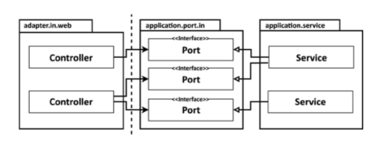
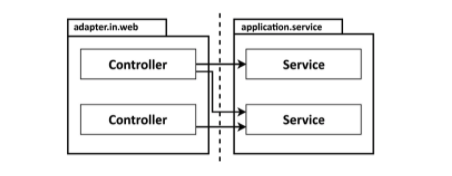
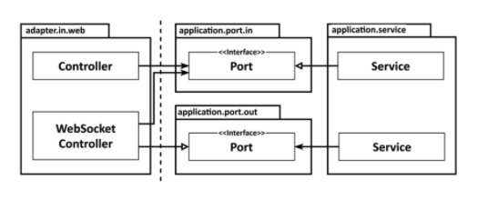

# Get Your Hands Dirty on Clean Architecture

> https://learning.oreilly.com/library/view/get-your-hands/9781839211966/
>
> 스터디
>
> 2021.08.25

## Chapter 5 - Implementing a Web Adapter

오늘날 대부분의 응용 프로그램에는 웹 브라우저를 통해 상호 작용할 수 있는 UI 또는 다른 시스템이 응용 프로그램과 상호 작용하기 위해 호출할 수 있는 HTTP API와 같은 일종의 웹 인터페이스가 있다.

대상 아키텍처에서 외부 세계와의 모든 통신은 어댑터를 통해 이루어진다. 따라서, 이러한 웹 인터페이스를 제공하는 어댑터를 구현하는 방법에 대해 논의해 보자.

### Dependency Inversion

수신 어댑터는 애플리케이션 서비스에 의해 구현된 인터페이스인 전용 수신 **포트**를 통해 애플리케이션 계층과 통신한다.



웹 어댑터는 "드라이빙" 또는 "들어오는" 어댑터이다. 외부에서 요청을 받아 애플리케이션 코어에 대한 호출로 변환하여 수행할 작업을 알려준다. 제어 흐름은 웹 어댑터의 컨트롤러에서 애플리케이션 계층의 서비스로 이동한다.

응용 프로그램 계층은 웹 어댑터가 통신할 수 있는 특정 포트를 제공한다. 
**서비스는** 이러한 **포트를 구현**하고 **웹 어댑터**는 이러한 **포트를 호출**할 수 있다.

자세히 살펴보면 이것이 **Dependency Inversion Principle**이 실행되고 있음을 알 수 있다. 

제어 흐름이 왼쪽에서 오른쪽으로 진행되기 때문에 다음 그림과 같이 웹 어댑터가 사용 사례를 직접 호출하도록 할 수도 있다.(포트 인터페이스를 제거하고 서비스를 직접 호출할 수 있다.)



그렇다면 어댑터와 사용 사례 사이에 또 다른 간접 계층을 추가하는 이유는 무엇일까? 
그 이유는 포트가 외부 세계가 애플리케이션 코어와 상호 작용할 수 있는 장소의 명세이기 때문이다.
포트가 있으면 외부 세계와 어떤 통신이 발생하는지 정확히 알 수 있다.
이는 레거시 코드베이스에서 작업하는 유지 관리 엔지니어에게 중요한 정보이다.

11장에서 다룰 바로 가기 방법 중 하나는 들어오는 포트를 그대로 두고 애플리케이션 서비스를 직접 호출하는 것이다.

그러나 여전히 한 가지 의문이 남아 있는데, 이는 대화형 응용프로그램과 관련이 있다.
웹 소켓을 통해 사용자의 브라우저로 실시간 데이터를 전송하는 응용 프로그램을 상상해 보자.
응용 프로그램 코어는 어떻게 이 실시간 데이터를 웹 어댑터로 전송하고, 웹 어댑터는 사용자의 브라우저로 전송합니까?

이 시나리오에서는 반드시 포트가 필요하다. 이 포트는 다음 그림과 같이 웹 어댑터에서 구현하고 애플리케이션 코어에서 호출해야 한다.



기술적으로 말하면 이것은 나가는 포트가 되며, 웹 어댑터를 들어오고 나가는 어댑터로 만든다. 그러나 동일한 어댑터가 동시에 둘 다 될 수 없는 이유는 없다.

이 장의 나머지 부분에서는 웹 어댑터가 가장 일반적인 경우이기 때문에 들어오는 어댑터라고 가정한다.

### Responsibilities of a Web Adapter

웹 어댑터는 실제로 무엇을 할까?
BuckPal 애플리케이션에 REST API를 제공하고 싶다고 가정해 보자.
웹 어댑터의 책임은 어디에서 시작되고 어디에서 끝나는가?

웹 어댑터는 일반적으로 다음 작업을 수행한다.

- HTTP 요청을 Java 객체에 매핑
- 권한 검사를 수행
- 입력 확인
- 사용 사례의 입력 모델에 입력을 매핑
- 사용 사례를 호출
- 사용 사례의 출력을 다시 HTTP로 매핑
- HTTP 응답을 반환

우선 웹 어댑터는 특정 URL 경로, HTTP 메서드 또는 콘텐츠 유형과 같은 특정 기준과 일치하는 HTTP 요청을 수신해야 한다.
그런 다음 일치하는 HTTP 요청의 매개변수와 콘텐츠를 작업할 수 있는 **객체로 역직렬화**해야 한다.

일반적으로 웹 어댑터는 **인증 및 권한 부여 검사**를 수행하고 실패하면 오류를 반환한다.

그런 다음 들어오는 객체의 상태를 확인할 수 있다.
그러나 우리는 이미 사용 사례에 대한 입력 모델의 책임으로 입력 유효성 검사에 대해 논의했다.
사용 사례에 대한 입력 모델은 사용 사례의 컨텍스트에서 유효한 입력만 허용해야 한다.
그러나 여기에서는 웹 어댑터에 대한 입력 모델에 대해 이야기하고 있다.
입력 모델에서 사용 사례에 따라 완전히 다른 구조와 의미를 가질 수 있으므로 다른 유효성 검사를 수행해야 할 수도 있다.

사용 사례의 입력 모델에서 이미 수행한 것과 동일한 유효성 검사를 웹 어댑터에서 구현하는 것을 선호하지 않는다.
대신 웹 어댑터의 입력 모델을 사용 사례의 입력 모델로 변환할 수 있는지 확인해야 한다.
이 변환을 수행하지 못하게 하는 모든 것은 **유효성 검사 오류**이다.

웹 어댑터의 다음 책임은 **변환된 입력 모델의 특정 사용 사례를 호출**하는 것이다.
그런 다음 어댑터는 사용 사례의 출력을 가져와 HTTP 응답으로 직렬화하고, 이 응답은 호출자에게 다시 전송된다.

도중에 문제가 발생하여 예외가 발생하면 웹 어댑터는 오류를 호출자에게 다시 보내는 메시지로 변환해야 한다.

이것들은 웹 어댑터의 어깨를 짓누르는 많은 책임이다. 그러나 애플리케이션 계층이 신경써서는 안 될 많은 책임도 있다.
HTTP와 관련된 모든 항목이 응용 프로그램 계층으로 유출되어서는 안 된다.
애플리케이션 코어가 HTTP를 외부에서 처리한다는 것을 알고 있다면,
기본적으로 HTTP를 사용하지 않는 다른 수신 어댑터에서 동일한 도메인 로직을 수행할 수 있는 옵션을 잃게 된 것이다.
좋은 아키텍처에서는 옵션을 열어두고자 한다.

**웹 계층 대신 도메인 및 응용 프로그램 계층으로 개발을 시작하면 웹 어댑터와 응용 프로그램 계층 간의 이러한 경계가 자연스럽게 나타납니다. 특정 수신 어댑터에 대해 생각하지 않고 사용 사례를 먼저 구현하면 경계가 흐려지지 않을 것이다.**

### Slicing Controllers

Java 세계의 Spring MVC와 같은 대부분의 웹 프레임워크에서 우리는 이전에 논의한 책임을 수행하는 컨트롤러 클래스를 생성한다. 그렇다면 애플리케이션에 대한 모든 요청에 응답하는 단일 컨트롤러를 구축할 필요는 없다. 웹 어댑터는 둘 이상의 클래스로 구성될 수 있다.

그러나 3장, 코드 구성에서 논의한 것처럼 이러한 클래스를 동일한 패키지 계층에 넣어 함께 속하는 것으로 표시하도록 주의해야 한다.

그렇다면 몇 개의 컨트롤러를 만들까요? 너무 적은 것 보다는 많은게 낫다고 생각한다. 각 컨트롤러가 가능한 한 좁고 다른 컨트롤러와 가능한 한 적게 공유하는 웹 어댑터 슬라이스를 구현해야 합니다.

BuckPal 애플리케이션 내에서 계정 엔터티에 대한 작업을 수행해보자.
널리 사용되는 접근 방식은 계정과 관련된 모든 작업에 대한 요청을 수락하는 단일 AccountController를 만드는 것이다.
REST API를 제공하는 Spring 컨트롤러는 다음과 같은 형태일 수 있다.

```java
package buckpal.adapter.web;

@RestController
@RequiredArgsConstructor
class AccountController {
    private final GetAccountBalanceQuery getAccountBalanceQuery;
    private final ListAccountsQuery listAccountsQuery;
    private final LoadAccountQuery loadAccountQuery;
    private final SendMoneyUseCase sendMoneyUseCase;
    private final CreateAccountUseCase createAccountUseCase;

    @GetMapping("/accounts")
    List<AccountResource> listAccounts() {
    ...
    }

    @GetMapping("/accounts/id")
    AccountResource getAccount(@PathVariable("accountId") Long accountId) {
    ...
    }

    @GetMapping("/accounts/{id}/balance")
    long getAccountBalance(@PathVariable("accountId") Long accountId) {
    ...
    }
    
    @PostMapping("/accounts")
    AccountResource createAccount(@RequestBody AccountResource account) {
    ...
    }

    @PostMapping("/accounts/send/{sourceAccountId}/{targetAccountId}/{amount}")
    void sendMoney(
        @PathVariable("sourceAccountId") Long sourceAccountId,
        @PathVariable("targetAccountId") Long targetAccountId,
        @PathVariable("amount") Long amount
    ) {
    ...
    }
}
```

계정 리소스에 관한 모든 것이 단일 클래스에 있어 기분이 좋다. 그러나 이 접근 방식의 단점에 대해 논의해보자.

첫째, **클래스당 코드가 적은 것이 좋다.**

컨트롤러가 몇 년에 걸쳐 200줄의 코드만 축적해도 50줄보다 파악하기가 여전히 어렵다.  메서드로 깔끔하게 분리하더라도 마찬가지다.

테스트 코드의 경우에도 동일하다. 컨트롤러 자체에 코드가 많다면 테스트 코드도 많을 것이다.
그리고 종종 테스트 코드는 더 추상적인 경향이 있기 때문에 프로덕션 코드보다 이해하기 더 어렵다.
또한 특정 프로적션 코드에 대한 테스트도 쉽게 찾을 수 있도록 하고 싶다. 이 코드는 소규모 클래스에서 더 쉽게 찾을 수 있다.

그러나 똑같이 중요한 것은 모든 작업을 단일 컨트롤러 클래스에 넣는 것이 데이터 구조의 재사용을 장려한다는 것이다.
앞의 코드 예제에서 많은 작업이 AccountResource 모델 클래스를 공유한다.
모든 작업에 필요한 모든 것을 위한 버킷 역할을 한다. AccountResource에는 id 필드가 있을 수 있다.
이것은 생성 작업에서 필요하지 않으며 도움이 되는 것보다 더 많은 혼란을 야기할 수 있다.
계정이 사용자 객체와 일대다 관계를 갖고 있다고 상상해 보자.
책을 만들거나 업데이트할 때 이러한 사용자 객체를 포함해야 하나? 목록 작업으로 사용자가 반환되어야 하나?
이것은 간단한 예이지만, 위의 모든 프로젝트에서는 언젠가 이러한 질문을 던질 것이다.

따라서 **각 작업에 대해 별도의 패키지에 별도의 컨트롤러를 만드는 접근 방식을 권장**한다.
또한 **가능한 한 사용 사례에 가깝게 메서드와 클래스의 이름을 지정**해야 한다.

```java
package buckpal.adapter.web;

@RestController
@RequiredArgsConstructor
public class SendMoneyController {

  private final SendMoneyUseCase;

  @PostMapping("/accounts/send/{sourceAccountId}/{targetAccountId}/{amount}")
  void sendMoney(
      @PathVariable("sourceAccountId") Long sourceAccountId,
      @PathVariable("targetAccountId") Long targetAccountId,
      @PathVariable("amount") Long amount
  ) {
    SendMoneyCommand command = new SendMoneyCommand(
        new AccountId(sourceAccountId),
        new AccountId(targetAccountId),
        Money.of(amount));
    
    sendMoneyUseCase.sendMoney(command);
  }
}
```

또한 각 컨트롤러에는 CreateAccountResource 또는 UpdateAccountResource와 같은 자체 모델이 있거나 앞의 예와 같이 기본 형식을 입력으로 사용할 수 있다.

이러한 특수 모델 클래스는 컨트롤러 패키지에 비공개일 수 있으므로 실수로 다른 곳에서 재사용할 수 없다.
컨트롤러는 여전히 모델을 공유할 수 있지만 다른 패키지의 공유 클래스를 사용하면 더 많은 생각을 하게 되며,
결국 필드의 절반이 필요하지 않다는 것을 알게 되고 결국 직접 생성하게 될 것이다.

또한 컨트롤러와 서비스의 이름에 대해 깊이 생각해야 한다.
예를 들어, CreateAccount 대신 RegisterAccount가 더 나은 이름이 되지 않을까?
BuckPal 애플리케이션에서 계정을 만드는 유일한 방법은 사용자가 계정을 등록하는 것이다.
따라서 클래스 이름에 "등록"이라는 단어를 사용하여 의미를 더 잘 전달한다.
일반적으로  Create..., Update... 및 Delete...가 유스 케이스를 충분히 설명하는 경우가 분명히 있지만 실제로 사용하기 전에 두 번 생각하고 싶을 수도 있다.

이 슬라이싱 스타일의 또 다른 이점은 여러 작업에서 병렬 작업을 쉽게 수행할 수 있다는 것이다.
두 개발자가 다른 작업을 수행하는 경우 병합 충돌이 발생하지 않는다.

### How Does This Help Me Build Maintainable Software?

애플리케이션용 웹 어댑터를 작성할 때,
HTTP를 애플리케이션의 사용 사례에 대한 메소드 호출로 변환하고
결과를 다시 HTTP로 변환하고
도메인 논리를 수행하지 않는 어댑터를 빌드한다는 점을 염두에 두어야 한다.

반면에 응용 계층은 HTTP를 처리하면 안 되므로 HTTP 세부 정보가 유출되지 않도록 해야 한다.
따라서 필요에 따라 다른 어댑터로 웹 어댑터를 교체할 수 있습니다.

웹 컨트롤러를 슬라이싱할 때 모델을 공유하지 않는 작은 클래스를 많이 만드는 것을 두려워해서는 안 됩니다.
테스트를 더 쉽게 파악하고, 병렬 작업을 지원할 수 있다.
이렇게 세분화된 컨트롤러를 설치하는 것이 초기에는 더 많은 작업이 필요하지만, 유지보수를 하는 동안 효과가 있을 것이다.
