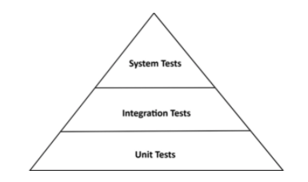

# Get Your Hands Dirty on Clean Architecture

> https://learning.oreilly.com/library/view/get-your-hands/9781839211966/
>
> 스터디
>
> 2021.08.31

## Chapter 7 - Testing Architecture Elements

내가 목격한 많은 프로젝트에서 자동화된 테스트는 미스터리이다. Wiki에 문서화된 먼지가 많은 규칙에 의해 모두가 적합하다고 생각하는 대로 테스트를 작성하지만, 아무도 팀의 테스트 전략에 대한 특정 질문에 답할 수 없다.

이 장에서는 육각형 아키텍처에 대한 테스트 전략을 제공한다. 아키텍처의 각 요소에 대해 다루기 위한 테스트 유형에 대해 논의한다. 

### The Test Pyramid

테스트 피라미드를 따라 테스트에 대한 논의를 시작한다. 이 수치는 우리가 얼마나 많은 테스트를 목표로 해야 하는지 결정하는 데 도움이 된다.

테스트 피라미드에 따르면 저렴한 테스트는 많이 만들고 비싼 테스트는 적게 만들어야 한다.



기본적으로 구축 비용이 저렴하고 유지 관리가 쉽고 빠르게 실행되며 안정적인 세분화된 테스트에 대한 높은 적용 범위를 가져야 한다는 것이다. 이것은 단일 "단위"(일반적으로 클래스)가 예상대로 작동하는지 확인하는 단위 테스트이다.

테스트가 여러 단위와 교차 단위 경계, 아키텍처 경계 또는 시스템 경계를 결합하면 빌드 비용이 더 많이 들고 실행 속도가 느려지고 취약해지는 경향이 있다(기능 오류 대신 일부 구성 오류로 인해 실패).
피라미드는 이러한 테스트가 더 비싸질수록, 테스트의 높은 적용 범위를 목표로 해야 하는 것이 적어진다는 것을 알려준다. 그렇지 않으면 새로운 기능 대신 테스트를 구축하는 데 너무 많은 시간을 할애할 것이기 때문이다.

상황에 따라 테스트 피라미드는 종종 다른 레이어로 표시된다. 육각형 아키텍처 테스트에 대해 논의하기 위해 선택한 레이어를 살펴보자. "단위 테스트", "통합 테스트" 및 "시스템 테스트"의 정의는 컨텍스트에 따라 다르다. 한 프로젝트에서 그것들은 다른 것과 다른 것을 의미할 수 있다. 다음은 이 장에서 사용할 용어에 대한 해석이다.

**단위 테스트**는 피라미드의 기초이다. 단위 테스트는 일반적으로 단일 클래스를 인스턴스화하고 해당 인터페이스를 통해 기능을 테스트한다. 테스트 중인 클래스에 다른 클래스에 대한 종속성이 있는 경우 해당 다른 클래스는 인스턴스화되지 않고 테스트 중에 필요에 따라 실제 클래스의 동작을 시뮬레이션하는 모의 객체로 대체된다.

**통합 테스트**는 피라미드의 다음 계층을 형성한다. 이 테스트는 여러 장치의 네트워크를 인스턴스화하고 엔트리 클래스의 인터페이스를 통해 일부 데이터를 네트워크로 전송하여 이 네트워크가 예상대로 작동하는지 확인한다. 우리의 해석에서 **통합 테스트는 두 레이어 사이의 경계를 넘을 것이므로 객체 네트워크가 완전하지 않거나 특정 시점에서 모의 객체에 대해 작동해야 한다**.

**시스템 테스트**는 마지막으로 애플리케이션을 구성하는 전체 객체 네트워크를 가동하고 애플리케이션의 모든 계층에서 특정 사용 사례가 예상대로 작동하는지 확인한다.

시스템 테스트 위에 애플리케이션의 UI를 포함하는 **종단 간 테스트 레이어**가 있을 수 있다. 이 책에서는 백엔드 아키텍처에 대해서만 논의하기 때문에 여기서는 종단 간 테스트를 고려하지 않을 것이다.

이제 몇 가지 테스트 유형을 정의했으므로 6각형 아키텍처의 각 계층에 가장 적합한 테스트 유형을 보자.

### Testing a Domain Entity With Unit Tests

아키텍처의 중심에 있는 도메인 엔터티를 살펴보는 것으로 시작한다. 4장, 사용 사례 구현에서 Account 엔터티를 생각해 보자. 계정의 상태는 계정이 과거 특정 시점의 잔액(기준 잔액)과 그 이후의 입출금(활동) 목록으로 구성된다. 이제 withdraw() 메서드가 예상대로 작동하는지 확인하려고 한다.

```java
class AccountTest {
  
    @Test
    void withdrawalSucceeds() {
        AccountId accountId = new AccountId(1L);
        Account account = defaultAccount()
            .withAccountId(accountId)
            .withBaselineBalance(Money.of(555L))
            .withActivityWindow(new ActivityWindow(
                defaultActivity()
                    .withTargetAccount(accountId)
                    .withMoney(Money.of(999L)).build(),
                defaultActivity()
                    .withTargetAccount(accountId)
                    .withMoney(Money.of(1L)).build()))
            .build();

        boolean success = account.withdraw(Money.of(555L), new AccountId(99L));
        assertThat(success).isTrue();
        assertThat(account.getActivityWindow().getActivities()).hasSize(3);
        assertThat(account.calculateBalance()).isEqualTo(Money.of(1000L));
    }
}
```

앞의 테스트는 특정 상태에서 Account를 인스턴스화하고, 해당 withdraw() 메서드를 호출하고, 인출이 성공했으며 테스트 중인 Account 개체의 상태에 예상되는 부작용이 있는지 확인하는 일반 단위 테스트이다.

테스트는 설정하기 쉽고 이해하기 쉽고 매우 빠르게 실행된다. 테스트는 이보다 훨씬 간단하지 않다. 이와 같은 단위 테스트는 도메인 엔터티 내에서 인코딩된 비즈니스 규칙을 확인하는 가장 좋은 방법이다. 도메인 엔터티 동작은 다른 클래스에 대한 종속성이 거의 또는 전혀 없기 때문에 다른 유형의 테스트가 필요하지 않다.

### Testing a Use Case with Unit Tests

레이어를 바깥쪽으로 이동하면 테스트할 다음 아키텍처 요소는 사용 사례이다. 4장, 사용 사례 구현에서 논의된 SendMoneyService의 테스트를 살펴보자. SendMoney 사용 사례는 다른 트랜잭션이 그 동안 잔액을 변경할 수 없도록 소스 계정을 잠근다. 소스 계정에서 성공적으로 돈을 인출할 수 있으면 대상 계정도 잠그고 거기에 돈을 입금한다. 마지막으로 두 계정을 다시 잠금 해제한다.

트랜잭션이 성공하면 모든 것이 예상대로 작동하는지 확인하려고 한다.

```java
class SendMoneyServiceTest {

    // declaration of fields omitted
    
    @Test
    void transactionSucceeds() {
      
      	//given
        Account sourceAccount = givenSourceAccount();
        Account targetAccount = givenTargetAccount();
        
        givenWithdrawalWillSucceed(sourceAccount);
        givenDepositWillSucceed(targetAccount);
        
        Money money = Money.of(500L);
        
        SendMoneyCommand command = new SendMoneyCommand(
            sourceAccount.getId(),
            targetAccount.getId(),
            money);
        
        //when
        boolean success = sendMoneyService.sendMoney(command);
        
        //then
        assertThat(success).isTrue();
        
        AccountId sourceAccountId = sourceAccount.getId();
        AccountId targetAccountId = targetAccount.getId();
        
        then(accountLock).should().lockAccount(eq(sourceAccountId));
        then(sourceAccount).should().withdraw(eq(money), eq(targetAccountId));
        then(accountLock).should().releaseAccount(eq(sourceAccountId));
        
        then(accountLock).should().lockAccount(eq(targetAccountId));
        then(targetAccount).should().deposit(eq(money), eq(sourceAccountId));
        then(accountLock).should().releaseAccount(eq(targetAccountId));
        thenAccountsHaveBeenUpdated(sourceAccountId, targetAccountId);
    }

    // helper methods omitted
}
```

테스트를 좀 더 읽기 쉽게 만들기 위해 동작 중심 개발에서 일반적으로 사용되는 given/when/then 섹션으로 구성된다.

**"given"** 섹션에서 소스 및 대상 Account 인스턴스를 만들고 이름이 given...()으로 시작하는 일부 메서드를 사용하여 올바른 상태로 만든다. 또한 사용 사례에 대한 입력 역할을 하는 SendMoneyCommand의 인스턴스를 만든다. 

**"when"** 섹션에서 우리는 단순히 sendMoney() 메서드를 호출하여 사용 사례를 호출한다.

**"then"** 섹션은 트랜잭션이 성공했음을 확인하고 원본 및 대상 계정과 계정 잠금 및 잠금 해제를 담당하는 AccountLock 인스턴스에서 특정 메서드가 호출되었는지 확인한다.

내부적으로 테스트는 Mockito 라이브러리(https://site.mockito.org/) 라이브러리를 사용하여 given...() 메서드에서 모의 객체를 생성한다. Mockito는 또한 모의 객체에서 특정 메서드가 호출되었는지 여부를 확인하기 위해 then() 메서드를 제공한다.

**테스트 중인 사용 사례 서비스는 상태 비저장이므로 "then" 섹션에서 특정 상태를 확인할 수 없다**. 대신 테스트는 서비스가 (모킹된) 종속성에 대한 특정 메서드와 상호 작용했는지 확인한다. 이는 테스트가 동작뿐만 아니라 테스트 중인 코드의 구조 변경에 취약하다는 것을 의미한다. **이는 테스트 중인 코드가 리팩토링되는 경우 테스트를 수정해야 할 가능성이 더 높다는 것을 의미한다**.

이를 염두에 두고 테스트에서 실제로 확인하려는 상호 작용에 대해 깊이 생각해야 한다. 이전 테스트에서 했던 것처럼 모든 상호 작용을 확인하지 않고 대신 **가장 중요한 상호 작용에 집중하는 것이 좋다**. **그렇지 않으면 테스트 중인 클래스가 변경될 때마다 테스트를 변경해야 하므로 테스트의 가치가 떨어진다.**

**이 테스트는 여전히 단위 테스트이지만 종속성의 상호 작용을 테스트하고 있기 때문에 통합 테스트에 가깝다**. **그러나 본격적인 통합 테스트보다 생성 및 유지 관리가 더 쉽다. 왜냐하면 우리는 모킹 작업을 하고 있고 실제 종속성을 관리할 필요가 없기 때문이다.**

### Testing a Web Adapter with Integration Tests

다른 레이어 밖으로 이동하면 어댑터에 도달한다. 웹 어댑터 테스트에 대해 논의해 보자.

예를 들어, 웹 어댑터는 HTTP를 통해 JSON 문자열 형식의 입력을 받고 이에 대해 일부 유효성 검사를 수행하고 입력을 사용 사례에서 예상하는 형식으로 매핑한 다음 해당 사용 사례로 전달한다. 그런 다음 사용 사례의 결과를 JSON에 다시 매핑하고 HTTP 응답을 통해 클라이언트에 반환한다.

웹 어댑터 테스트에서 이러한 모든 단계가 예상대로 작동하는지 확인하려고 한다.

```java
@WebMvcTest(controllers = SendMoneyController.class)
class SendMoneyControllerTest {

    @Autowired
    private MockMvc mockMvc;
    
    @MockBean
    private SendMoneyUseCase sendMoneyUseCase;
    
    @Test
    void testSendMoney() throws Exception {
        mockMvc.perform(
            post("/accounts/send/{sourceAccountId}/{targetAccountId}/{amount}"
                 , 41L, 42L, 500)
                .header("Content-Type", "application/json"))
            .andExpect(status().isOk());
        
        then(sendMoneyUseCase).should()
            .sendMoney(eq(new SendMoneyCommand(
                new AccountId(41L),
                new AccountId(42L),
                Money.of(500L))));
    }
}
```

앞의 테스트는 Spring Boot 프레임워크로 빌드된 SendMoneyController라는 웹 컨트롤러에 대한 표준 통합 테스트이다. testSendMoney() 메서드에서 입력 개체를 만든 다음 웹 컨트롤러에 모의 HTTP 요청을 보낸다. 요청 본문에는 입력 개체가 JSON 문자열로 포함된다.

isOk() 메서드를 사용하여 HTTP 응답의 상태가 200인지 확인하고 모의 사용 사례 클래스가 호출되었는지 확인한다.

웹 어댑터의 대부분의 책임은 이 테스트에서 다룬다.

**우리는 MockMvc 객체로 이를 mocking하고 있기 때문에 HTTP 프로토콜을 통해 실제로 테스트하지 않는다.** 
**우리는 프레임워크가 HTTP에서 모든 것을 적절하게 변환한다고 믿는다. 프레임워크를 테스트할 필요가 없다.**

그러나 JSON에서 SendMoneyCommand 개체로 입력을 매핑하는 데 필요한 전체 경로가 포함된다.
4장 사용 사례 구현에서 설명한 대로 SendMoneyCommand 객체를 자체 검증 명령으로 구축했다면,
이 매핑이 사용 사례에 대해 구문적으로 유효한 입력을 생성하는지 확인했다.
(**참고** : **입력 유효성 검사는 구문적 유효성 검사이고 비즈니스 규칙은 Use Case의 맥락에서 의미론적 유효성 검사라고 말할 수도 있다.**)
또한, Use Case가 실제로 호출되고 HTTP 응답이 예상한 상태임을 확인했다.

그렇다면 이것이 단위 테스트가 아닌 통합 테스트인 이유는 무엇인가?
이 테스트에서는 단일 웹 컨트롤러 클래스만 테스트하는 것처럼 보이지만 내부에는 더 많은 일이 진행되고 있다.
@WebMvcTest 주석을 사용하여 특정 요청 경로, Java와 JSON 간의 매핑, HTTP 입력 유효성 검사 등에 대한 응답을 담당하는 전체 객체 네트워크를 인스턴스화하도록 Spring에 지시한다.
그리고 이 테스트에서는 웹 컨트롤러가 이 네트워크의 일부로 작동하는지 확인한다.

**웹 컨트롤러는 Spring 프레임워크에 많이 바인딩되어 있으므로 별도로 테스트하는 대신 이 프레임워크에 통합하여 테스트하는 것이 좋다**. **일반 단위 테스트로 웹 컨트롤러를 테스트하면 모든 매핑 및 유효성 검사 및 HTTP 항목에 대한 적용 범위를 잃게 되며 실제로 프로덕션 환경에서 작동하는지 여부를 확신할 수 없다.**

### Testing a Persistence Adapter with Integration Tests

비슷한 이유로 단위 테스트 대신 통합 테스트로 지속성 어댑터를 다루는 것이 합리적이다.
어댑터 내의 로직을 검증할 뿐만 아니라 데이터베이스에 대한 매핑도 확인하기를 원하기 때문이다.

6장, 지속성 어댑터 구현에서 구축한 지속성 어댑터를 테스트하려고 한다.
어댑터에는 두 가지 방법이 있다. 하나는 데이터베이스에서 계정 엔터티를 로드하는 것이고 다른 하나는 새 계정 활동을 데이터베이스에 저장하는 것이다.

```java
@DataJpaTest
@Import({AccountPersistenceAdapter.class, AccountMapper.class})
class AccountPersistenceAdapterTest {
  
    @Autowired
    private AccountPersistenceAdapter adapterUnderTest;

    @Autowired
    private ActivityRepository activityRepository;

    @Test
    @Sql("AccountPersistenceAdapterTest.sql")
    void loadsAccount() {
        Account account = adapter.loadAccount(
            new AccountId(1L),
            LocalDateTime.of(2018, 8, 10, 0, 0));
        
        assertThat(account.getActivityWindow().getActivities()).hasSize(2);
        assertThat(account.calculateBalance()).isEqualTo(Money.of(500));
    }

    @Test
    void updatesActivities() {
        Account account = defaultAccount()
            .withBaselineBalance(Money.of(555L))
            .withActivityWindow(new ActivityWindow(
                defaultActivity()
                    .withId(null)
                    .withMoney(Money.of(1L)).build()))
            .build();
        
        adapter.updateActivities(account);
        assertThat(activityRepository.count()).isEqualTo(1);
        
        ActivityJpaEntity savedActivity = activityRepository.findAll().get(0);
        assertThat(savedActivity.getAmount()).isEqualTo(1L);
    }
}
```

@DataJpaTest를 사용하여 데이터베이스에 연결하는 Spring 데이터 저장소를 포함하여 데이터베이스 액세스에 필요한 객체 네트워크를 인스턴스화하도록 Spring에 지시합니다. 
특정 객체가 해당 네트워크에 추가되었는지 확인하기 위해 @Import 문을 추가합니다. 이러한 객체는 수신 도메인 객체를 데이터베이스 객체에 매핑하기 위해 테스트 대상 어댑터에서 필요하다.

loadAccount() 메서드에 대한 테스트에서 SQL 스크립트를 사용하여 데이터베이스를 특정 상태로 설정했다. 그런 다음 어댑터 API를 통해 계정을 로드하고 SQL 스크립트에서 데이터베이스 상태를 제공할 것으로 예상되는 상태가 계정에 있는지 확인한다.

updateActivities()에 대한 테스트는 반대이다. 새 계정 활동으로 계정 개체를 만들고 어댑터에 전달하여 영속화한다. 그런 다음 ActivityRepository의 API를 통해 활동이 데이터베이스에 저장되었는지 확인한다.

이 테스트의 중요한 측면은 데이터베이스를 mocking하지 않는다는 것다. 테스트가 실제로 데이터베이스에 도달하고 있다.
우리가 데이터베이스를 mocking했다면 테스트는 여전히 동일한 코드 라인을 커버하여 코드 라인의 동일한 높은 적용 범위를 생성할 것이다. 그러나 이러한 높은 적용 범위에도 불구하고 테스트는 SQL 문의 오류 또는 데이터베이스 테이블과 Java 객체 간의 예기치 않은 매핑 오류로 인해 실제 데이터베이스가 있는 환경에서 실패할 가능성이 여전히 높다.

기본적으로 Spring은 테스트 중에 사용할 메모리 내 데이터베이스를 가동한다. 이것은 우리가 아무것도 구성할 필요가 없고 테스트가 즉시 작동하기 때문에 매우 실용적이다.

이 인메모리 데이터베이스는 우리가 프로덕션에서 사용하는 데이터베이스가 아닐 가능성이 높기 때문에 테스트가 인메모리 데이터베이스에 대해 완벽하게 작동하더라도 실제 데이터베이스에 문제가 발생할 가능성이 여전히 높다. 예를 들어 데이터베이스는 고유한 SQL을 구현하는 것을 좋아한다.

이러한 이유로 지속성 어댑터 테스트는 실제 데이터베이스에 대해 실행해야 한다. Test containers(https://www.testcontainers.org/)와 같은 라이브러리는 이와 관련하여 요청 시 데이터베이스가 있는 Docker 컨테이너를 실행하는 데 큰 도움이 된다.

실제 데이터베이스에 대해 실행하면 두 개의 서로 다른 데이터베이스 시스템을 관리할 필요가 없다는 추가 이점이 있다. 테스트 중에 메모리 내 데이터베이스를 사용하는 경우 특정 방식으로 구성해야 하거나 각 데이터베이스에 대해 별도의 버전의 데이터베이스 마이그레이션 스크립트를 생성해야 할 수 있다. 이는 전혀 재미가 없습니다.

### Testing Main Paths with System Tests

시스템 테스트 피라미드 위에서 시스템 테스트는 전체 애플리케이션을 시작하고 해당 API에 대한 요청을 실행하여 모든 계층이 함께 작동하는지 확인한다.

"Send Money" 사용 사례에 대한 시스템 테스트에서 애플리케이션에 HTTP 요청을 보내고 응답과 계정의 새 잔액을 확인한다.

```java
@SpringBootTest(webEnvironment = WebEnvironment.RANDOM_PORT)
class SendMoneySystemTest {
  
    @Autowired
    private TestRestTemplate restTemplate;

    @Test
    @Sql("SendMoneySystemTest.sql")
    void sendMoney() {
        Money initialSourceBalance = sourceAccount().calculateBalance();
        Money initialTargetBalance = targetAccount().calculateBalance();
        
        ResponseEntity response = whenSendMoney(
            sourceAccountId(),
            targetAccountId(),
            transferredAmount());
        
        then(response.getStatusCode())
            .isEqualTo(HttpStatus.OK);
        
        then(sourceAccount().calculateBalance())
            .isEqualTo(initialSourceBalance.minus(transferredAmount()));
        
        then(targetAccount().calculateBalance())
            .isEqualTo(initialTargetBalance.plus(transferredAmount()));
    }

    private ResponseEntity whenSendMoney(
        AccountId sourceAccountId,
        AccountId targetAccountId,
        Money amount) {
        
        HttpHeaders headers = new HttpHeaders();
        headers.add("Content-Type", "application/json");
        HttpEntity<Void> request = new HttpEntity<>(null, headers);
        
        return restTemplate.exchange(
            "/accounts/sendMoney/{sourceAccountId}/{targetAccountId}/{amount}",
            HttpMethod.POST,
            request,
            Object.class,
            sourceAccountId.getValue(),
            targetAccountId.getValue(),
            amount.getAmount());
    }

    // some helper methods omitted
}
```

@SpringBootTest를 사용하여 애플리케이션을 구성하는 전체 객체 네트워크를 시작하도록 Spring에 지시한다. 또한 임의의 포트에 자신을 노출하도록 애플리케이션을 구성하고 있다.

테스트 방법에서는 단순히 요청을 생성하여 애플리케이션에 보낸 다음 응답 상태와 계정의 새 잔액을 확인하기만 하면 된다.

웹 어댑터 테스트에서 이전에 했던 것처럼 MockMvc가 아닌 TestRestTemplate을 사용하여 요청을 보낸다. 이것은 우리가 실제 HTTP를 수행하고 있음을 의미하며 테스트를 프로덕션 환경에 조금 더 가깝게 만든다.

실제 HTTP를 사용하는 것처럼 실제 출력 어댑터를 사용한다. 우리의 경우 애플리케이션을 데이터베이스에 연결하는 지속성 어댑터일 뿐이다. 다른 시스템과 통신하는 응용 프로그램에서는 추가 출력 어댑터가 있어야 한다. 시스템 테스트를 위해서라도 이러한 모든 타사 시스템을 가동하고 실행하는 것이 항상 가능한 것은 아니므로 결국 이를 mocking할 수 있다. 
우리의 6각형 아키텍처는 출력 포트 인터페이스 몇 개만 제거하면 되므로 이 작업을 최대한 쉽게 수행할 수 있다.

테스트를 가능한 한 읽기 쉽게 만들기 위해 노력했다. 나는 helper 메서드 안에 모든 추악한 논리를 숨겼다. 이러한 메서드는 이제 사물의 상태를 확인하는 데 사용할 수 있는 도메인별 언어를 형성한다.

이와 같은 도메인별 언어는 모든 유형의 테스트에서 좋은 아이디어이지만 시스템 테스트에서는 훨씬 더 중요하다.
시스템 테스트는 단위 또는 통합 테스트보다 애플리케이션의 실제 사용자를 훨씬 더 잘 시뮬레이션하므로 사용자 관점에서 애플리케이션을 검증하는 데 사용할 수 있다. 적절한 어휘가 있으면 훨씬 쉽다. 이 어휘는 또한 응용 프로그램 사용자를 구현하는 데 가장 적합하고 프로그래머가 아닌 도메인 전문가가 테스트에 대해 추론하고 피드백을 제공할 수 있도록 한다. 테스트용 어휘를 생성하기 위한 프레임워크를 제공하는 Jgiven(http://jgiven.org/)과 같은 행동 중심 개발을 위한 전체 라이브러리가 있다.

이전 섹션에서 설명한 대로 단위 및 통합 테스트를 만든 경우, 시스템 테스트는 동일한 코드를 많이 다룰 것이다. 추가 혜택을 제공하나? 그렇다. 일반적으로 단위 및 통합 테스트와는 다른 유형의 버그를 제거한다.
예를 들어, 단위 및 통합 테스트만으로는 알아차리지 못할, 레이어 간의 일부 매핑이 깨지는 것을 인지할 수 있다.

시스템 테스트는 여러 사용 사례를 결합하여 시나리오를 만드는 경우 가장 큰 장점을 발휘한다. 각 시나리오는 사용자가 일반적으로 응용 프로그램을 통해 취할 수 있는 특정 경로를 나타낸다. **가장 중요한 시나리오가 시스템 테스트를 통과하여 처리되는 경우 최신 수정 사항으로 애플리케이션을 손상시키지 않았으며, 배포할 준비가 되었다고 가정할 수 있다.**

### How Much Testing is Enough?

내가 속한 많은 프로젝트 팀이 대답할 수 없는 질문은 우리가 얼마나 많은 테스트를 수행해야 하는지였다. 테스트가 코드 라인의 80%를 커버한다면 충분한가? 그것보다 높아야 하나?

라인 커버리지는 테스트 성공을 측정하는 나쁜 지표다. 100% 이외의 목표는 코드베이스의 중요한 부분을 전혀 다루지 않을 수 있기 때문에 완전히 의미가 없다. 그리고 100%에서도 여전히 모든 버그가 수정되었는지 확신할 수 없다.

나는 우리가 소프트웨어를 **배포할 때 얼마나 편안하게 느끼는지에 따라 테스트 성공을 측정할 것을 제안**한다. **테스트를 실행한 후 출시할 수 있을 만큼 테스트를 신뢰한다면 우리는 좋다**. **더 자주 배포할수록 테스트에 대해 더 많은 신뢰를 가질 수 있다.** 1년에 2번만 배포하면 1년에 2번만 테스트를 수행하기 때문에 아무도 테스트를 신뢰하지 않을 것이다.

이것은 우리가 처음 몇 번 배포할 때 믿음의 도약을 필요로 하지만, 우리가 프로덕션의 버그를 수정하고 배우는 것을 우선순위로 삼는다면 우리는 올바른 길을 가고 있는 것이다.

각 **프로덕션 버그에 대해 "왜 우리 테스트에서 이 버그를 포착하지 못했는가?"라는 질문을 하고 답을 문서화한 다음 이를 다루는 테스트를 추가해야 한다**. 시간이 지남에 따라 이를 통해 배포가 편안해지고 문서는 시간이 지남에 따라 개선 사항을 측정할 수 있는 척도를 제공할 것이다.

그러나 생성해야 하는 테스트를 정의하는 전략으로 시작하는 것이 도움이 된다. 육각형 아키텍처에 대한 이러한 전략 중 하나는 다음과 같다.

- 도메인 엔터티를 **구현하는 동안** 단위 테스트로 덮어라
- Use Case 를 **구현하는 동안** 단위 테스트로 커버하라
- 어댑터를 **구현하는 동안** 통합 테스트로 커버하라
- 시스템 테스트를 통해 사용자가 애플리케이션을 통해 취할 수 있는 가장 중요한 경로를 다루자

**"구현 중"이라는 단어에 유의하자. 테스트가 기능 개발 후가 아니라 개발 중에 수행되면 개발 도구가 되어 더 이상 귀찮은 일처럼 느껴지지 않는다.**

그러나 새 필드를 추가할 때마다 테스트를 수정하는 데 한 시간을 소비해야 한다면 우리는 뭔가 잘못하고 있는 것이다. 아마도 우리의 테스트는 코드의 구조적 변화에 너무 취약하며 이를 개선하는 방법을 살펴봐야 한다. 각 리팩토링에 대해 테스트를 수정해야 하는 경우 테스트의 가치가 손실된다.

### How Does This Help Me Build Maintainable Software?

Hexagonal Architecture 스타일은 도메인 로직과 외부를 향한 어댑터를 깔끔하게 분리한다.
이를 통해 **단위 테스트가 있는 중앙 도메인 논리**와 **통합 테스트가 있는 어댑터**를 다루는 명확한 테스트 전략을 정의할 수 있다.

**입력 및 출력 포트는 테스트에서 매우 가시적인 mocking 지점을 제공한다.**
각 포트에 대해 mocking하거나 실제 구현을 사용할지 결정할 수 있다. 포트가 각각 매우 작고 집중되어 있다면 mocking하는 것이 귀찮은 일이 아니다. 포트 인터페이스가 제공하는 메소드가 적을수록 테스트에서 어떤 메소드를 mocking해야 하는지에 대한 혼란이 줄어든다.

**mocking하는 것이 너무 부담이 되거나 코드 베이스의 특정 부분을 다루기 위해 어떤 종류의 테스트를 사용해야 하는지 모른다면 경고 신호이다**. **이와 관련하여 우리의 테스트는 아키텍처의 결함에 대해 경고하고 유지 관리 가능한 코드베이스를 만드는 경로로 다시 안내하는 카나리아 역할을 하는 추가적인 책임이 있다**


