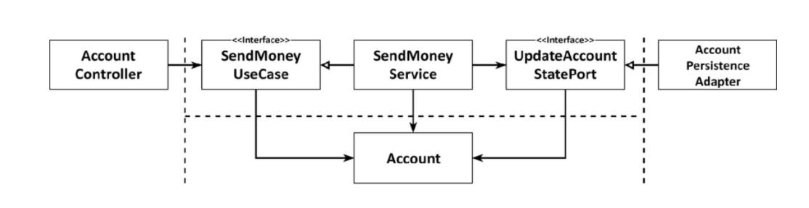
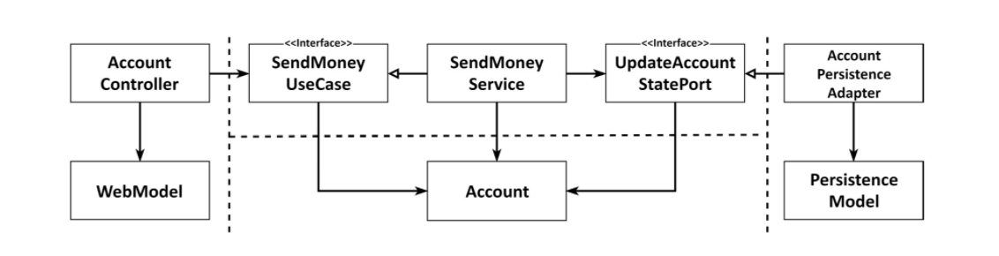
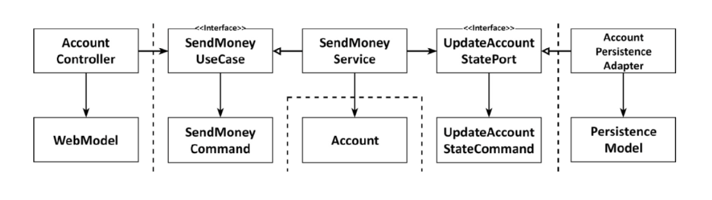
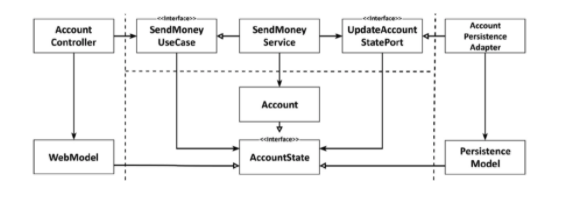

# Get Your Hands Dirty on Clean Architecture

> https://learning.oreilly.com/library/view/get-your-hands/9781839211966/
>
> 스터디
>
> 2021.08.31

## Chapter 8 - Mapping Between Boundaries

이전 장에서 우리는 웹, 애플리케이션, 도메인 및 지속성 계층과 각 계층이 사용 사례 구현에 기여하는 것에 대해 논의했다.

그러나 우리는 각 계층의 모델 간의 매핑이라는 두려운 편재적인 주제를 거의 다루지 않았다. 매퍼 구현을 피하기 위해 두 계층에서 동일한 모델을 사용할지 여부에 대해 논의한 적이 있을 것이다.

인수는 다음과 같이 진행되었을 수 있습니다.

#### **Pro-Mapping Developer**:

레이어 간에 매핑하지 않으면 두 레이어에서 동일한 모델을 사용해야 하므로 레이어가 밀접하게 결합된다.

#### Contra-Mapping Developer:

레이어 간에 매핑을 수행하면 CRUD만 수행하고 레이어 간에 동일한 모델을 갖기 때문에 많은 사용 사례에서 과도하게 많은 상용구 코드를 생성한다.

이와 같은 토론에서 흔히 그렇듯이, 양쪽 주장에는 모두 진실이 있다. 장단점이 있는 몇 가지 매핑 전략에 대해 논의하고 해당 개발자가 결정을 내리는 데 도움이 될 수 있는지 살펴보자.

### The "No Mapping" Strategy

첫 번째 전략은 실제로 매핑을 전혀 하지 않는다.

포트 인터페이스가 도메인 모델을 입력 및 출력 모델로 사용하는 경우 레이어 간에 매핑할 필요가 없다.

앞의 그림은 BuckPal 예제 애플리케이션의 "Send Money" 사용 사례와 관련된 구성 요소를 보여준다.

웹 계층에서 웹 컨트롤러는 SendMoneyUseCase 인터페이스를 호출하여 사용 사례를 실행한다. 이 인터페이스는 Account 객체를 인수로 사용한다. 이는 웹 계층과 응용 프로그램 계층 모두 Account 클래스에 액세스해야 함을 의미한다. 둘 다 동일한 모델을 사용하고 있다.

애플리케이션의 다른 쪽에서는 Persistence 와 애플리케이션 계층 간에 동일한 관계가 있다. 모든 레이어가 동일한 모델을 사용하기 때문에 레이어 간의 매핑을 구현할 필요가 없다.

그러나 이 디자인의 결과는 무엇일까?

웹 및 지속성 계층에는 해당 모델에 대한 특별한 요구 사항이 있을 수 있다. 예를 들어, 웹 계층이 REST를 통해 모델을 노출하는 경우 모델 클래스에는 특정 필드를 JSON으로 직렬화하는 방법을 정의하는 주석이 필요할 수 있다. 데이터베이스 매핑을 정의하는 일부 주석이 필요할 수 있는 ORM 프레임워크를 사용하는 경우 Persistence 계층도 마찬가지이다.

이 예에서는 **도메인 및 애플리케이션 계층에서 관심이 없더라도 이러한 모든 특수 요구 사항을 Account 도메인 모델 클래스에서 처리해야 한다. 이는 웹, 애플리케이션 및 퍼시스턴스 계층과 관련된 이유로 Account 클래스를 변경해야 하므로 단일 책임 원칙에 위배된다.**

기술 요구 사항 외에도 각 계층에는 계정 클래스의 특정 사용자 정의 필드가 필요할 수 있다. 이로 인해 특정 필드가 한 계층에서만 관련이 있는 단편화된 도메인 모델이 발생할 수 있다.

그러나 이것이 우리가 "매핑 없음" 전략을 절대로 구현해서는 안 된다는 것을 의미할까?

지저분하게 느껴질 수 있지만 "매핑 없음" 전략은 완벽하게 유효할 수 있다.

간단한 CRUD 사용 사례를 고려하자. 웹 모델에서 도메인 모델로, 도메인 모델에서 지속성 모델로 동일한 필드를 매핑해야 합니까? 나는 우리가하지 않는다고 말할 것이다.

그리고 도메인 모델의 JSON 또는 ORM 주석은 어떤가? 그들은 정말로 우리를 귀찮게할까? 영속성 계층에서 무언가가 변경되면 도메인 모델에서 주석 한두 개를 변경해야 하는 경우에는 어떻게 해야 할까?

모든 레이어가 정확히 같은 구조에서 정확히 같은 정보를 필요로 하는 한 "매핑 없음" 전략은 완벽하게 유효한 옵션이다.

그러나 응용 프로그램 또는 도메인 계층에서 웹 또는 지속성 문제를 처리하자마자(아마도 주석 제외) 다른 매핑 전략으로 이동해야 한다.

여기 소개에서 두 개발자를 위한 교훈이 있습니다. 과거에 특정 매핑 전략을 결정했지만 나중에 변경할 수 있다.

내 경험상 많은 사용 사례는 단순한 CRUD 사용 사례로 시작된다. 나중에 더 비싼 매핑 전략을 정당화하는 다양한 동작과 검증을 통해 본격적인 비즈니스 사용 사례로 성장할 수 있다. 또는 **영원히 CRUD 상태를 유지할 수 있다. 이 경우 다른 매핑 전략에 투자하지 않은 것이 좋다.**

### The "Two-Way" Mapping Strategy

각 레이어에 고유한 모델이 있는 매핑 전략은 다음 그림에 설명된 "양방향" 매핑 전략이라고 한다.

각 어댑터에 고유한 모델이 있는 경우 어댑터는 해당 모델을 도메인 모델에 매핑하고 다시 도메인 모델에 매핑해야 한다.

각 계층에는 도메인 모델과 완전히 다른 구조를 가질 수 있는 자체 모델이 있다.

웹 계층은 웹 모델을 들어오는 포트에서 예상하는 도메인 모델에 매핑한다. 또한 들어오는 포트에서 반환된 도메인 개체를 다시 웹 모델에 매핑한다.

지속성 계층은 나가는 포트에서 사용하는 도메인 모델과 지속성 모델 간의 유사한 매핑을 담당한다.

두 레이어 모두 두 방향으로 매핑되므로 "양방향" 매핑이라는 이름이 지정된다.

각 레이어에 자체 모델이 있으므로 각 레이어는 다른 레이어에 영향을 주지 않고 자체 모델을 수정할 수 있다(내용이 변경되지 않는 한). 웹 모델은 데이터를 최적으로 표현할 수 있는 구조를 가질 수 있다. **도메인 모델은 사용 사례를 가장 잘 구현할 수 있는 구조를 가질 수 있습니다.** 그리고 **지속성 모델은 객체를 데이터베이스에 유지하기 위해 ORM에 필요한 구조를 가질 수 있다**.

**이 매핑 전략은 또한 웹이나 지속성 문제로 더럽혀지지 않은 깨끗한 도메인 모델로 이어진다.** JSON 또는 ORM 매핑 주석이 포함되어 있지 않는다. **단일 책임 원칙이 충족된다.**

"양방향" 매핑의 또 다른 장점은 "매핑 없음" 전략 다음으로 개념적으로 가장 간단한 매핑 전략이라는 것이다. 매핑 책임은 명확하다. 외부 레이어/어댑터는 내부 레이어의 모델에 매핑되고 그 뒤로 매핑된다. **내부 계층은 자신의 모델만 알고 매핑 대신 도메인 논리에 집중할 수 있다.**

모든 매핑 전략과 마찬가지로 "양방향" 매핑에도 단점이 있다.

우선, 일반적으로 많은 상용구 코드가 발생한다. 코드 양을 줄이기 위해 시중에 나와 있는 많은 매핑 프레임워크 중 하나를 사용하더라도 일반적으로 모델 간의 매핑을 구현하는 데 많은 시간이 걸린다. 이는 부분적으로 매핑 로직 디버깅이 고통스럽다는 사실 때문이다. 특히 일반 코드 및 리플렉션 레이어 뒤에 내부 작동을 숨기는 매핑 프레임워크를 사용할 때 그렇다.

또 다른 단점은 도메인 모델이 계층 경계를 넘어 통신하는 데 사용된다는 것이다. 들어오는 포트와 나가는 포트는 도메인 객체를 입력 매개 변수 및 반환 값으로 사용한다. 이것은 외부 계층의 요구에 의해 유발되는 변경에 취약하게 만드는 반면, 도메인 논리의 요구로 인해 도메인 모델이 진화하는 것이 바람직하다.

"매핑 없음" 전략과 마찬가지로 "양방향" 매핑 전략은 만능이 아니다. 그러나 많은 프로젝트에서 이러한 종류의 매핑은 가장 단순한 CRUD 사용 사례에 대해서도 전체 코드 기반에서 준수해야 하는 신성한 법칙으로 간주된다. 이것은 불필요하게 개발 속도를 늦춘다.

**어떤 매핑 전략도 철칙으로 간주되어서는 안 된다. 대신 각 사용 사례에 대해 결정해야 한다.**

### The "Full" Mapping Strategy

또 다른 매핑 전략은 다음 그림에 스케치된 "전체" 매핑 전략이다.

각 작업에 고유한 모델이 필요한 경우 웹 어댑터와 응용 프로그램 계층은 각각 실행하려는 작업에서 예상하는 모델에 해당 모델을 매핑한다.

이 매핑 전략은 작업별로 별도의 입력 및 출력 모델을 도입한다. 계층 경계를 넘어 통신하기 위해 도메인 모델을 사용하는 대신 그림의 SendMoneyUseCase 포트에 대한 입력 모델 역할을 하는 SendMoneyCommand와 같은 각 작업에 특정한 모델을 사용한다. 이러한 모델을 "명령", "요청" 또는 이와 유사한 것으로 부를 수 있다.

웹 계층은 입력을 응용 프로그램 계층의 명령 개체에 매핑하는 역할을 한다. 이러한 명령은 해석의 여지가 거의 없이 응용 프로그램 계층에 대한 인터페이스를 매우 명시적으로 만든다. 각 사용 사례에는 고유한 필드 및 유효성 검사가 있는 고유한 명령이 있다. 어떤 필드를 채워야 하고 어떤 필드를 비워 두는 것이 더 좋은지 추측할 필요가 없다. 그렇지 않으면 현재 사용 사례에서 원하지 않는 유효성 검사가 트리거될 것이기 때문이다.

그런 다음 응용 프로그램 계층은 사용 사례에 따라 도메인 모델을 수정하는 데 필요한 모든 개체에 명령 개체를 매핑하는 작업을 담당한다.

당연히 한 계층에서 여러 명령으로 매핑하려면 단일 웹 모델과 도메인 모델 간의 매핑보다 훨씬 더 많은 매핑 코드가 필요하다. 그러나 이 매핑은 하나만이 아니라 여러 사용 사례의 요구 사항을 처리해야 하는 매핑보다 구현 및 유지 관리가 훨씬 쉽다.

나는 이 매핑 전략을 글로벌 패턴으로 옹호하지 않는다. 애플리케이션의 상태 수정 사용 사례를 명확하게 구분하기 위해 웹 계층(또는 다른 들어오는 어댑터)과 애플리케이션 계층 사이에서 장점을 가장 잘 발휘한다. 매핑 오버 헤드로 인해 응용 프로그램과 지속성 계층 사이에서 사용하지 않는다.

또한 어떤 경우에는 이러한 종류의 매핑을 작업의 입력 모델로 제한하고 단순히 도메인 개체를 출력 모델로 사용한다. 그런 다음 SendMoneyUseCase는 예를 들어 업데이트된 잔액과 함께 Account 개체를 반환할 수 있다.

**이것은 매핑 전략이 혼합될 수 있고 혼합되어야 함을 보여준다. 매핑 전략이 모든 계층에 걸쳐 전역 규칙일 필요는 없다.**

### The "One-Way" Mapping Strategy

또 다른 장단점이 있는 또 다른 매핑 전략이 있습니다. 다음 그림에 설명된 "일방향" 전략이 있다.

동일한 "상태" 인터페이스를 구현하는 도메인 모델 및 어댑터 모델을 사용하면 각 계층은 다른 계층에서 수신하는 개체를 한 방향으로 매핑하기만 하면 된다.

이 전략에서 모든 계층의 모델은 관련 속성에 대한 getter 메서드를 제공하여 **도메인 모델의 상태를 캡슐화하는 동일한 인터페이스를 구현**한다.

도메인 모델 자체는 애플리케이션 계층 내의 서비스에서 액세스할 수 있는 풍부한 동작을 구현할 수 있다. 도메인 객체를 외부 계층에 전달하려는 경우 도메인 객체가 수신 및 발신 포트에서 예상하는 상태 인터페이스를 구현하기 때문에 매핑 없이 전달할 수 있다.

그런 다음 외부 레이어는 인터페이스로 작업할 수 있는지 또는 자체 모델에 매핑해야 하는지 여부를 결정할 수 있다. 수정 동작이 상태 인터페이스에 의해 노출되지 않기 때문에 실수로 도메인 객체의 상태를 수정할 수 없다.

외부 계층에서 응용 프로그램 계층으로 전달하는 객체도 이 상태 인터페이스를 구현한다. 그런 다음 응용 프로그램 계층은 해당 동작에 액세스하기 위해 실제 도메인 모델에 매핑해야 한다. 이 매핑은 공장의 DDD 개념과 잘 어울립니다. DDD의 관점에서 팩토리는 특정 상태에서 도메인 개체를 재구성하는 책임이 있으며, 이는 정확히 우리가 하고 있는 일이다(Eric Evans의 Domain-Driven Design, Addison-Wesley, 2004, p. 158).

매핑 책임은 분명하다. 레이어가 다른 레이어에서 객체를 받으면 해당 레이어가 작업할 수 있는 것으로 매핑한다. 따라서 각 레이어는 한 방향으로만 매핑되므로 "단방향" 매핑 전략이 된다.

그러나 매핑이 계층에 분산되어 있으므로 이 전략은 다른 전략보다 개념적으로 더 어렵다.

이 전략은 레이어 전반에 걸쳐 모델이 유사할 때 가장 큰 장점을 발휘한다. 예를 들어, 읽기 전용 작업의 경우 상태 인터페이스가 필요한 모든 정보를 제공하기 때문에 웹 계층은 자체 모델에 매핑할 필요가 전혀 없을 수 있다.

### When to Use Which Mapping Strategy?

이것은 백만 달러짜리 질문다. 그렇지 않은가?

대답은 "상황에 따라 다르다" 입니다.

각 매핑 전략에는 서로 다른 장단점이 있기 때문에 단일 전략을 전체 코드베이스에 대한 강력하고 빠른 전역 규칙으로 정의하려는 충동을 억제해야 한다. 동일한 코드 기반 내에서 패턴을 혼합하는 것이 어수선하게 느껴지기 때문에 이것은 우리의 본능에 어긋난다. 그러나 단순히 우리의 깔끔한 느낌을 제공하기 위해 특정 직업에 가장 적합한 패턴이 아닌 패턴을 고의로 선택하는 것은 무책임하고 단순하다.

또한 시간이 지남에 따라 소프트웨어가 발전함에 따라 어제 작업에 가장 적합했던 전략이 오늘날에도 여전히 작업에 가장 적합하지 않을 수 있다. 고정된 매핑 전략으로 시작하여 시간이 지남에 따라 유지하는 대신(무슨 일이 있어도) 우리는 코드를 빠르게 발전시키고 나중에 레이어를 더 잘 분리하는 데 도움이 되는 더 복잡한 전략으로 이동할 수 있는 간단한 전략으로 시작할 수 있다.

어떤 전략을 사용할지 그리고 언제 팀 내에서 일련의 지침에 동의해야 하는지 결정하기 위해. 이 지침은 어떤 매핑 전략이 어떤 상황에서 첫 번째 선택이어야 하는지에 대한 질문에 답해야 한다. 그들은 또한 그들이 첫 번째 선택인 이유에 대해 답해야 이러한 이유가 일정 시간 후에도 여전히 적용되는지 여부를 평가할 수 있다.

예를 들어, 사용 사례를 수정하기 위해 쿼리에 대해 수행하는 것과 다른 매핑 지침을 정의할 수 있다. 또한, 웹과 애플리케이션 계층, 그리고 애플리케이션과 지속성 계층 간에 서로 다른 매핑 전략을 사용하고 싶을 수도 있다.

이러한 상황에 대한 지침은 다음과 같다.

**수정 사용 사례를 작업하는 경우**이라면 **사용 사례를 서로 분리하기 위해 "전체 매핑" 전략이 웹 계층과 애플리케이션 계층 간의 첫 번째 선택**이다. 이를 통해 명확한 사용 사례별 유효성 검사 규칙이 제공되며 특정 사용 사례에서 필요하지 않은 필드를 처리할 필요가 없다.

**수정 사용 사례에서 작업하는 경우** **매핑 오버헤드 없이 코드를 빠르게 발전시킬 수 있도록 "매핑 없음" 전략이 애플리케이션과 지속성 레이어 사이에서 첫 번째 선택**이다. 그러나 **애플리케이션 계층에서 지속성 문제를 처리해야 하는 즉시 지속성 문제를 지속성 계층에서 유지하기 위해 "양방향" 매핑 전략으로 이동한다.**

**쿼리 작업**을 하는 경우 **매핑 오버헤드 없이 코드를 빠르게 발전시킬 수 있도록 "매핑 없음" 전략이 웹과 애플리케이션 계층 사이, 애플리케이션과 지속성 계층 사이에서 첫 번째 선택**이다. 그러나 **응용 프로그램 계층에서 웹 또는 지속성 문제를 처리해야 하는 즉시 웹과 응용 프로그램 계층 또는 응용 프로그램 계층과 지속성 계층 간의 "양방향" 매핑 전략으로 이동한다.**

이러한 지침을 성공적으로 적용하려면 개발자의 마음에 있어야 한다. 따라서 지침은 팀 노력으로 지속적으로 논의되고 수정되어야 한다.

### How Does This Help Me Build Maintainable Software?

들어오는 포트와 나가는 포트가 애플리케이션 레이어 사이의 게이트키퍼 역할을 하여 레이어가 서로 통신하는 방법과 레이어 간의 매핑 여부와 방법을 정의한다.

각 사용 사례에 대해 **좁은 포트를 사용**하여 다양한 사용 사례에 대해 서로 다른 매핑 전략을 선택하고 다른 사용 사례에 영향을 주지 않고 시간이 지남에 따라 발전할 수 있으므로 **특정 시간에 특정 상황에 가장 적합한 전략을 선택할 수 있다.**

**상황별로 매핑 전략을 선택하는 것**은 모든 상황에 대해 단순히 동일한 매핑 전략을 사용하는 것보다 확실히 더 어렵고 더 많은 의사 소통이 필요하지만, **필요한 작업만 수행하고 유지 관리가 더 쉬운 코드베이스로 팀에 보상을 줄 것**이다. 매핑 지침이 알려져 있기 때문이다.

