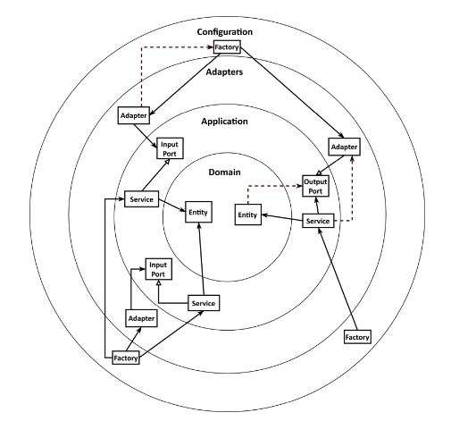
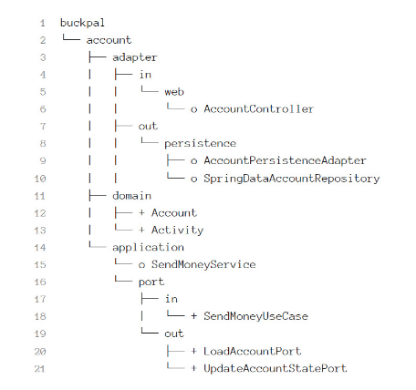
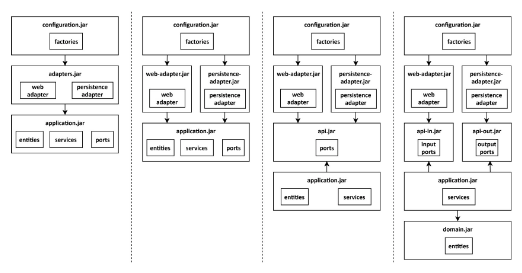
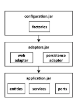
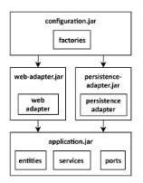
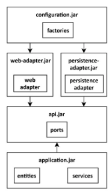
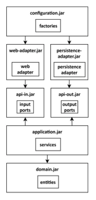

# Get Your Hands Dirty on Clean Architecture

> https://learning.oreilly.com/library/view/get-your-hands/9781839211966/
>
> 스터디
>
> 2021.09.08

## Chapter 10 - Enforcing Architecture Boundaries

우리는 이전 장에서 아키텍처에 대해 많이 이야기했으며 코드를 작성하는 방법과 코드를 넣을 위치에 대한 결정을 안내하는 대상 아키텍처가 있다는 것에 기분이 좋다.

그러나 모든 규모 이상의 소프트웨어 프로젝트에서 아키텍처는 시간이 지남에 따라 침식되는 경향이 있다. 계층 간의 경계가 약해지고 코드를 테스트하기가 더 어려워지며 일반적으로 새로운 기능을 구현하는 데 점점 더 많은 시간이 필요하다.

이 장에서는 아키텍처 내에서 경계를 강화하여 아키텍처 침식을 방지하기 위해 취할 수 있는 몇 가지 조치에 대해 논의한다.

### Boundaries and Dependencies

아키텍처 경계를 적용하는 다양한 방법에 대해 이야기하기 전에 아키텍처 내 경계가 있는 위치와 "경계 적용"이 실제로 의미하는 바에 대해 논의해 보자.



아키텍처 경계를 적용한다는 것은 종속성이 올바른 방향을 가리키도록 하는 것을 의미한다. 점선 화살표는 아키텍처에 따라 허용되지 않는 종속성을 표시한다.

앞의 그림은 6각형 아키텍처의 요소가 '2장, 종속성 반전'에서 소개된 일반 클린 아키텍처 접근 방식과 유사한 4개의 레이어에 분산되는 방법을 보여준다.

가장 안쪽 레이어는 도메인 엔터티를 포함한다. 응용 프로그램 계층은 응용 프로그램 서비스 내에서 사용 사례를 구현하기 위해 해당 도메인 엔터티에 액세스할 수 있다. 어댑터는 input port를 통해 해당 서비스에 액세스하거나 output port를 통해 해당 서비스에서 액세스하고 있다. 마지막으로 구성 계층에는 어댑터 및 서비스 개체를 만들고 종속성 주입 메커니즘에 제공하는 팩토리가 포함된다.

앞의 그림에서 아키텍처 경계가 매우 명확해진다. 각 레이어와 다음 내부 및 외부 이웃 사이에는 경계가 있다. **종속성 규칙에 따르면 이러한 계층 경계를 넘는 종속성은 항상 안쪽을 가리켜야 한다.**

이 장에서는 종속성 규칙을 적용하는 방법에 대해 설명한다. 잘못된 방향을 가리키는 잘못된 종속성이 없는지 확인하고 싶다(그림의 점선 화살표).

### Visibility Modifiers

경계를 강화하기 위해 Java가 제공하는 가장 기본적인 도구인 접근 제어자부터 시작한다.

접근 제어자는 지난 몇 년 동안 내가 수행한 거의 모든 초급 취업 면접의 주제였다. 인터뷰 대상자에게 Java가 제공하는 접근 제어자와 차이점이 무엇인지 묻고 싶다.

대부분의 인터뷰 대상자는 public, protected 및 private 수정자만 나열합니다. 거의 아무도 package-private(또는 "default") 수식어를 모른다. 인터뷰 대상자가 이전 지식에서 답변을 추상화할 수 있는지 여부를 확인하기 위해 이러한 접근 제어자가 왜 의미가 있는지에 대해 질문할 수 있는 기회는 항상 환영한다.

그렇다면 왜 package-private 수정자가 그렇게 중요한 수정자일까? Java 패키지를 사용하여 클래스를 응집력 있는 "모듈"로 그룹화할 수 있기 때문이다. 이러한 모듈 내의 클래스는 서로 액세스할 수 있지만 패키지 외부에서는 액세스할 수 없다. 그런 다음 특정 클래스를 공개하여 모듈에 대한 진입점 역할을 하도록 선택할 수 있다. 이렇게 하면 잘못된 방향을 가리키는 종속성을 도입하여 실수로 종속성 규칙을 위반할 위험이 줄어든다.

접근 제어자를 염두에 두고 '3장, 코드 구성'에서 논의한 패키지 구조를 다시 살펴보자.



외부 세계에서 액세스할 필요가 없기 때문에 지속성 패키지 package-private의 클래스를 만들 수 있다(이전 트리에서 "o"로 표시됨). 지속성 어댑터는 구현하는 출력 포트를 통해 액세스한다. 같은 이유로 SendMoneyService 클래스를 패키지 비공개로 만들 수 있다. 종속성 주입 메커니즘은 일반적으로 리플렉션을 사용하여 클래스를 인스턴스화하므로 패키지 전용일지라도 해당 클래스를 인스턴스화할 수 있다.

Spring에서 이 접근 방식은 9장, 애플리케이션 어셈블링에서 논의된 클래스 경로 스캐닝 접근 방식을 사용하는 경우에만 작동한다.

예제의 나머지 클래스는 아키텍처 정의에 따라 공개("+"로 표시)되어야 한다. 도메인 패키지는 다른 계층에서 액세스할 수 있어야 하고 애플리케이션 계층은 웹 및 지속성 어댑터에서 액세스할 수 있어야 한다.

package-private 수정자는 소수의 클래스만 있는 작은 모듈에 적합하다. 그러나 패키지가 특정 수의 클래스에 도달하면 동일한 패키지에 너무 많은 클래스가 있는 것이 혼란스러워진다. 이 경우 코드를 더 쉽게 찾을 수 있도록 하위 패키지를 만드는 것을 좋아한다. 이것은 Java가 하위 패키지를 다른 패키지로 취급하고 우리가 하위 패키지의 package-private 멤버에 액세스할 수 없기 때문에 package-private 수정자가 전달하지 못하는 곳이다. 따라서 하위 패키지의 구성원은 공개되어야 하며 외부 세계에 노출되어야 하므로 아키텍처가 불법적인 종속성에 취약하게 된다.

### Post-Compile Checks

클래스에서 public 한정자를 사용하자마자 컴파일러는 아키텍처에 따라 종속성의 방향이 잘못된 방향을 가리키더라도 다른 클래스에서 사용하도록 허용한다. 이러한 경우 컴파일러는 우리를 도와주지 않기 때문에 종속성 규칙이 위반되지 않았는지 확인하는 다른 방법을 찾아야 한다.

한 가지 방법은 사후 컴파일 검사를 도입하는 것이다. 즉, 코드가 이미 컴파일되었을 때 런타임에 수행되는 검사이다. 이러한 런타임 검사는 지속적 통합 빌드 내에서 자동화된 테스트 중에 가장 잘 실행된다.

이러한 종류의 Java 검사를 지원하는 도구는 ArchUnit(https://github.com/TNG/ArchUnit)이다. 무엇보다도 ArchUnit은 종속성이 예상 방향을 가리키는지 확인하는 API를 제공한다. 위반을 발견하면 예외가 발한니다. JUnit과 같은 단위 테스트 프레임워크를 기반으로 하는 테스트 내에서 실행하는 것이 가장 좋으며, 종속성 위반 시 테스트가 실패한다.

ArchUnit을 사용하면 이전 섹션에서 설명한 패키지 구조에 정의된 대로 각 레이어에 자체 패키지가 있다고 가정하고 레이어 간의 종속성을 확인할 수 있다. 예를 들어, 도메인 계층에서 외부 애플리케이션 계층으로의 종속성이 없는지 확인할 수 있다.

```java
class DependencyRuleTests {
  
  @Test
  void domainLayerDoesNotDependOnApplicationLayer() {
    noClasses()
        .that()
        .resideInAPackage("buckpal.domain..")
        .should()
        .dependOnClassesThat()
        .resideInAnyPackage("buckpal.application..")
        .check(new ClassFileImporter()
        	.importPackages("buckpal.."));
  }
}
```

약간의 작업으로 ArchUnit API 위에 일종의 도메인 특정 언어(DSL)를 만들 수도 있다. 이 언어를 사용하면 육각형 아키텍처 내에서 모든 관련 패키지를 지정한 다음 해당 패키지 간의 모든 종속성이 올바른 방향을 가리키는지 자동으로 확인할 수 있다.

```java
class DependencyRuleTests {

  @Test
  void validateRegistrationContextArchitecture() {
    HexagonalArchitecture.boundedContext("account")
        .withDomainLayer("domain")
        .withAdaptersLayer("adapter")
          .incoming("web")
          .outgoing("persistence")
          .and()
        .withApplicationLayer("application")
          .services("service")
          .incomingPorts("port.in")
          .outgoingPorts("port.out")
          .and()
        .withConfiguration("configuration")
        .check(new ClassFileImporter()
            .importPackages("buckpal.."));
  }
}
```

앞의 코드 예제에서는 먼저 경계 컨텍스트의 상위 패키지를 지정한다(단일 경계 컨텍스트에만 걸쳐 있는 경우 완전한 애플리케이션일 수도 있음). 그런 다음 도메인, 어댑터, 응용 프로그램 및 구성 계층에 대한 하위 패키지를 지정한다. 그런 다음 check()에 대한 마지막 호출은 일련의 검사를 실행하여 패키지 종속성이 종속성 규칙에 따라 유효한지 확인한다. 이 육각형 아키텍처 DSL에 대한 코드는 https://github.com/thombergs/buckpal에 있는 예제 프로젝트의 HexagonalArchitecture 클래스에서 사용할 수 있다.

컴파일 후 검사는 불법적인 종속성과 싸우는 데 큰 도움이 될 수 있지만 안전하지는 않다. 예를 들어, 앞의 코드 예제에서 패키지 이름 buckpal의 철자를 틀리면 테스트에서 클래스를 찾지 못하므로 종속성 위반이 없다. 단일 오타 또는 더 중요한 것은 패키지 이름을 바꾸는 단일 리팩토링이 전체 테스트를 쓸모없게 만들 수 있다는 것이다. 클래스가 발견되지 않으면 실패하지만 여전히 리팩토링에 취약한 검사를 추가하여 이 문제를 해결할 수 있다. 사후 컴파일 검사는 항상 코드베이스와 병렬로 유지되어야 한다.

### Build Artifacts

지금까지 코드베이스 내에서 아키텍처 경계를 구분하기 위한 유일한 도구가 패키지되었다. 우리의 모든 코드는 동일한 모놀리식 빌드 아티팩트의 일부였다.

빌드 아티팩트는 (아마도 자동화된) 빌드 프로세스의 결과이다. 현재 Java 세계에서 가장 널리 사용되는 빌드 도구는 Maven과 Gradle이다. 따라서 지금까지 단일 Maven 또는 Gradle 빌드 스크립트가 있고 Maven 또는 Gradle을 호출하여 애플리케이션 코드를 단일 JAR 파일로 컴파일, 테스트 및 패키징할 수 있다고 상상해 보자.

빌드 도구의 주요 기능 중 하나는 종속성 해결이다. 특정 코드베이스를 빌드 아티팩트로 변환하기 위해 빌드 도구는 먼저 코드 베이스가 의존하는 모든 아티팩트가 사용 가능한지 확인한다. 그렇지 않은 경우 아티팩트 저장소에서 로드를 시도한다. 이것이 실패하면 코드 컴파일을 시도하기도 전에 오류와 함께 빌드가 실패한다.

이를 활용하여 아키텍처의 모듈과 계층 간의 종속성을 적용(따라서 경계를 적용)할 수 있다. 이러한 각 모듈 또는 계층에 대해 자체 코드베이스와 자체 빌드 아티팩트(JAR 파일)가 있는 별도의 빌드 모듈을 생성한다. 각 모듈의 빌드 스크립트에서 아키텍처에 따라 허용되는 다른 모듈에 대한 종속성만 지정한다. 클래스를 클래스 경로에서 사용할 수 없고 컴파일 오류가 발생하기 때문에 개발자는 더 이상 부주의로 잘못된 종속성을 생성할 수 없다.



불법적인 종속성을 방지하기 위해 아키텍처를 여러 빌드 아티팩트로 나누는 다양한 방법

앞의 그림은 아키텍처를 별도의 빌드 아티팩트로 나누는 불완전한 옵션 세트를 보여준다.



왼쪽부터 구성, 어댑터 및 애플리케이션 계층에 대한 별도의 빌드 아티팩트가 있는 기본 3개 모듈 빌드를 볼 수 있다. 구성 모듈은 어댑터 모듈에 액세스할 수 있으며, 이는 차례로 애플리케이션 모듈에 액세스할 수 있다. 구성 모듈은 또한 애플리케이션 모듈 간의 암시적, 전이적 종속성으로 인해 애플리케이션 모듈에 액세스할 수 있다.

어댑터의 모듈에는 웹 어댑터와 지속성 어댑터가 포함되어 있다. 이는 빌드 도구가 해당 어댑터 간의 종속성을 금지하지 않음을 의미한다. 이러한 어댑터 간의 종속성은 종속성 규칙에 의해 엄격히 금지되지는 않지만(두 어댑터가 동일한 외부 계층 내에 있기 때문에) 대부분의 경우 어댑터를 서로 격리된 상태로 유지하는 것이 좋다.

결국, 우리는 일반적으로 퍼시스턴스 레이어의 변경 사항이 웹 레이어로 누출되는 것을 원하지 않으며 그 반대의 경우도 마찬가지이다(단일 책임 원칙을 기억하십시오).

애플리케이션을 특정 타사 API에 연결하는 어댑터와 같은 다른 유형의 어댑터도 마찬가지이다. 우리는 어댑터 사이에 우발적인 종속성을 추가하여 해당 API의 세부 정보가 다른 어댑터로 누출되는 것을 원하지 않는다.



따라서 그림 10.2의 두 번째 열에 표시된 것처럼 단일 어댑터 모듈을 각 어댑터에 대해 하나씩 여러 빌드 모듈로 분할할 수 있다.



다음으로 애플리케이션 모듈을 더 분할하기로 결정할 수 있다. 여기에는 현재 애플리케이션에 대한 수신 및 발신 포트, 해당 포트를 구현하거나 사용하는 서비스, 많은 도메인 논리를 포함해야 하는 도메인 엔터티가 포함된다.

도메인 엔터티를 포트 내에서 전송 개체로 사용하지 않기로 결정한 경우(즉, 8장, 경계 간 매핑에서 "매핑 없음" 전략을 허용하지 않으려는 경우) 종속성 반전 원칙을 적용하고 포트 인터페이스만 포함하는 별도의 API 모듈을 나타낸다(그림 10.2의 세 번째 열).

어댑터 모듈과 애플리케이션 모듈은 API 모듈에 액세스할 수 있지만 그 반대는 불가능하다. API 모듈은 도메인 엔터티에 대한 액세스 권한이 없으며 포트 인터페이스 내에서 사용할 수 없다. 또한 어댑터는 더 이상 엔터티 및 서비스에 직접 액세스할 수 없으므로 포트를 통과해야 한다.



한 단계 더 나아가 API 모듈을 둘로 나눌 수도 있다. 한 부분은 들어오는 포트만 포함하고 다른 부분은 나가는 포트만 포함한다(그림 10.1의 네 번째 열). 이런 식으로 입력 또는 나가는 포트에만 종속성을 선언하여 특정 어댑터가 들어오는 어댑터인지 나가는 어댑터인지를 매우 명확하게 할 수 있다.

또한 애플리케이션 모듈을 더 분할하여 서비스만 포함하는 모듈과 도메인 엔터티만 포함하는 다른 모듈을 만들 수 있다. **이렇게 하면 엔터티가 서비스에 액세스하지 않고 도메인 빌드 아티팩트에 대한 종속성을 단순히 선언하여 다른 응용 프로그램(사용 사례 및 서비스가 다름)이 동일한 도메인 엔터티를 사용할 수 있다.**

그림 10.2는 애플리케이션을 빌드 모듈로 나누는 다양한 방법이 있음을 보여주며, 물론 그림에 묘사된 4가지 방법 이상이 있다. 요점은 모듈을 미세하게 자를수록 모듈 간의 종속성을 더 강력하게 제어할 수 있다는 것이다. 그러나 더 미세하게 잘라낼수록 이러한 모듈 간에 더 많은 매핑을 수행해야 하며 8장, 경계 간 매핑에서 소개한 매핑 전략 중 하나를 시행한다.

그 외에도 **빌드 모듈로 아키텍처 경계를 구분하는 것은 단순한 패키지를 경계로 사용하는 것보다 많은 이점이 있다.**

**첫째, 빌드 도구는 순환 종속성을 절대적으로 싫어한다.** 순환 종속성은 원 내에서 한 모듈의 변경이 잠재적으로 원 내의 다른 모든 모듈의 변경을 의미하므로 단일 책임 원칙에 위배되기 때문에 나쁘다. 빌드 도구는 순환 종속성을 허용하지 않는다. 문제를 해결하는 동안 무한 루프에 빠지기 때문이다. 따라서 빌드 모듈 간에 순환 종속성이 없음을 확인할 수 있다.

반면에 Java 컴파일러는 둘 이상의 패키지 간에 순환 종속성이 있는지 여부를 전혀 신경 쓰지 않는다.

**둘째, 빌드 모듈은 다른 모듈을 고려할 필요 없이 특정 모듈 내에서 격리된 코드 변경을 허용한다.** 특정 어댑터에서 일시적인 컴파일 오류를 일으키는 응용 프로그램 계층에서 주요 리팩토링을 수행해야 한다고 상상해 보자. 어댑터와 애플리케이션 계층이 동일한 빌드 모듈 내에 있는 경우, 대부분의 IDE는 테스트를 컴파일하기 위해 어댑터가 필요하지 않더라도 어댑터의 모든 컴파일 오류를 수정해야 애플리케이션 계층에서 테스트를 실행할 수 있다고 주장한다. 그러나 응용 프로그램 계층이 자체 빌드 모듈에 있는 경우 IDE는 그 당시 어댑터에 대해 신경 쓰지 않으며 마음대로 응용 프로그램 계층 테스트를 실행할 수 있다. Maven 또는 Gradle을 사용하여 빌드 프로세스를 실행하는 경우에도 마찬가지이다. 두 레이어가 동일한 빌드 모듈에 있는 경우 두 레이어 중 하나의 컴파일 오류로 인해 빌드가 실패한다.

따라서 여러 빌드 모듈은 **각 모듈에서 격리된 변경을 허용**한다. 각 모듈을 자체 코드 리포지토리에 넣어 서로 다른 팀이 서로 다른 모듈을 유지 관리할 수 있도록 선택할 수도 있다.

마지막으로, **빌드 스크립트에서 명시적으로 선언된 각 모듈 간 종속성을 사용하여 새 종속성을 추가하는 것은 우연이 아닌 의식적인 행동이 된다.** 현재 액세스할 수 없는 특정 클래스에 액세스해야 하는 개발자는 빌드 스크립트에 종속성을 추가하기 전에 종속성이 정말 합리적인지 여부에 대한 질문에 대해 약간의 생각을 할 수 있기를 바란다.

이러한 장점은 빌드 스크립트를 유지 관리해야 하는 추가 비용과 함께 제공되므로 아키텍처를 다른 빌드 모듈로 분할하기 전에 어느 정도 안정적이어야 한다.

### How Does This Help Me Build Maintainable Software?

소프트웨어 아키텍처는 기본적으로 아키텍처 요소 간의 종속성을 관리하는 것이다. 종속성이 큰 진흙 덩어리가 된다면 아키텍처는 큰 진흙 덩어리가 된다.

따라서 시간이 지남에 따라 아키텍처를 보존하려면 종속성이 올바른 방향을 가리키는지 지속적으로 확인해야 한다.

새 코드를 생성하거나 기존 코드를 리팩토링할 때 패키지 구조를 염두에 두고 패키지 외부에서 액세스해서는 안 되는 클래스에 대한 종속성을 피하기 위해 가능한 경우 package-private 가시성을 사용해야 한다.

단일 빌드 모듈 내에서 아키텍처 경계를 적용해야 하고 패키지 구조가 허용하지 않아 package-private 수정자가 작동하지 않는 경우 ArchUnit과 같은 사후 컴파일 도구를 사용할 수 있다.

그리고 아키텍처가 충분히 안정적이라고 느낄 때마다 아키텍처 요소를 자체 빌드 모듈로 추출해야 한다. 이렇게 하면 종속성을 명시적으로 제어할 수 있기 때문이다.

세 가지 접근 방식을 모두 결합하여 아키텍처 경계를 강화하고 시간이 지남에 따라 코드 기반을 유지 관리할 수 있다.
