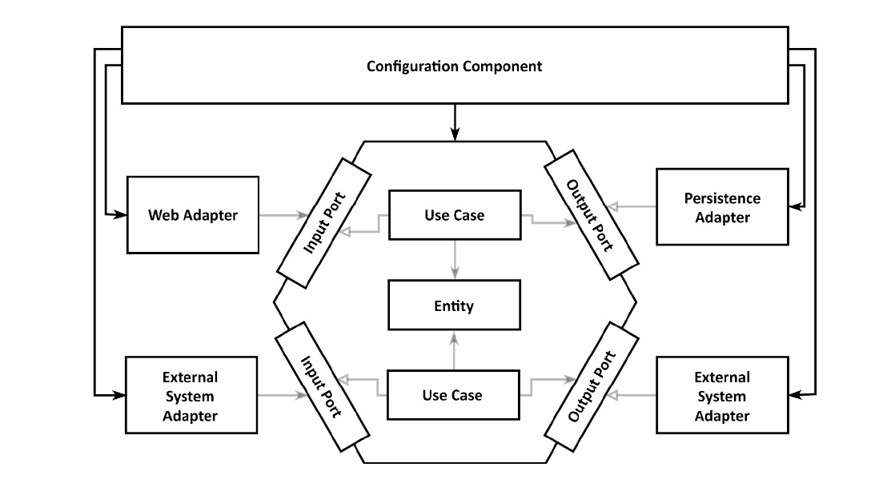

# Get Your Hands Dirty on Clean Architecture

> https://learning.oreilly.com/library/view/get-your-hands/9781839211966/
>
> 스터디
>
> 2021.09.08

## Chapter 9 - Assembling the Application

이제 일부 사용 사례, 웹 어댑터 및 지속성 어댑터를 구현했으므로 이를 작동하는 응용 프로그램으로 조합해야 한다.
3장, 코드 구성에서 논의했듯이, 우리는 클래스를 인스턴스화하고 시작할 때 함께 연결하기 위해 종속성 주입 메커니즘에 의존한다. 
이 장에서는 일반 Java와 Spring 및 Spring Boot 프레임워크를 사용하여 이를 수행하는 방법에 대한 몇 가지 접근 방식을 논의한다.

### Why Even Care about Assembly

사용 사례와 어댑터를 필요한 때와 장소에 인스턴스화하지 않는 이유는 무엇일까? 우리는 올바른 방향을 가리키는 코드 종속성을 유지하기를 원하기 때문이다. **기억하자. 모든 종속성은 응용프로그램의 도메인 코드를 향하여 안쪽을 가리켜야 한다. 그래야 외부 계층의 무언가가 변경될 때 도메인 코드를 변경할 필요가 없다.**

사용 사례가 지속성 어댑터를 호출하고 자체적으로 인스턴스화해야 하는 경우 잘못된 방향으로 코드 종속성을 생성한 것이다. 이것이 우리가 나가는 포트 인터페이스를 만든 이유이다. 사용 사례는 인터페이스만 알고 런타임에 이 인터페이스의 구현을 제공한다.

이 프로그래밍 스타일의 좋은 부작용은 우리가 만들고 있는 코드가 훨씬 더 테스트 가능하다는 것이다. 클래스에 필요한 모든 객체를 생성자에 전달할 수 있다면 실제 객체 대신 모의 객체를 전달하도록 선택할 수 있으므로 클래스에 대한 격리된 단위 테스트를 쉽게 만들 수 있다.

그렇다면 객체 인스턴스를 만드는 책임은 누구에게 있을까? 종속성 규칙을 위반하지 않고 어떻게 할까?

대답은 다음 그림과 같이 우리 아키텍처에 중립적이며 인스턴스화하기 위해 모든 클래스에 종속성이 있는 구성 구성 요소가 있어야 한다는 것이다.



중립 configuration component는 인스턴스화하기 위해 모든 클래스에 액세스할 수 있다.

2장, 종속성 반전에서 소개된 깨끗한 아키텍처에서 이  configuration component는 종속성 규칙에 정의된 대로 모든 내부 계층에 액세스할 수 있는 가장 바깥쪽 원에 있다.

configuration component는 우리가 제공한 부품에서 작동하는 응용 프로그램을 조립하는 역할을 한다. 다음을 수행해야 한다.

- 웹 어댑터 인스턴스 만들기
- HTTP 요청이 실제로 웹 어댑터로 라우팅되는지 확인
- 사용 사례 인스턴스 생성
- 사용 사례 인스턴스와 함께 웹 어댑터 제공
- 지속성 어댑터 인스턴스 생성
- 지속성 어댑터 인스턴스와 함께 사용 사례 제공
- 지속성 어댑터가 실제로 데이터베이스에 액세스할 수 있는지 확인

그 외에도 configuration component는 구성 파일 또는 명령줄 매개 변수와 같은 특정 구성 매개 변수에 액세스할 수 있어야 한다. 그런 다음 configuration component는 이러한 매개 변수를 애플리케이션 구성 요소에 전달하여 액세스할 데이터베이스 또는 전자 메일 전송에 사용할 서버와 같은 동작을 제어한다.

여기에는 많은 책임이 있습니다("변경 이유" 참조). 여기서 우리는 단일 책임 원칙을 위반하고 있지 않는가?
맞다, 하지만 나머지 애플리케이션을 깨끗하게 유지하려면 연결을 처리하는 외부 component가 필요하다.
그리고 이 component는 작동하는 응용 프로그램으로 조립하기 위해 모든 움직이는 부품을 알아야 한다.

### Assembling via Plain Code

애플리케이션 조립을 담당하는 configuration component를 구현하는 방법에는 여러 가지가 있다. 종속성 주입 프레임워크를 지원하지 않고 애플리케이션을 빌드하는 경우 일반 코드로 이러한 component를 만들 수 있다.

```java
package copyeditor.configuration;

class Application {
    public static void main(String[] args) {
        AccountRepository accountRepository = new AccountRepository();
        ActivityRepository activityRepository = new ActivityRepository();

        AccountPersistenceAdapter accountPersistenceAdapter =
            new AccountPersistenceAdapter(accountRepository, activityRepository);

        SendMoneyUseCase sendMoneyUseCase =
            new SendMoneyUseService(
                accountPersistenceAdapter,  // LoadAccountPort
                accountPersistenceAdapter); // UpdateAccountStatePort

        SendMoneyController sendMoneyController =
            new SendMoneyController(sendMoneyUseCase);
        
        startProcessingWebRequests(sendMoneyController);
    }
}
```

이 코드 조각은 그러한 configuration component가 어떻게 보일 수 있는지에 대한 단순화된 예시이다.
Java에서 응용 프로그램은 기본 메서드에서 시작된다. 이 방법 내에서 웹 컨트롤러에서 지속성 어댑터에 이르기까지 필요한 모든 클래스를 인스턴스화하고 함께 연결한다.

마지막으로 HTTP를 통해 웹 컨트롤러를 노출하는 startProcessingWebRequests()라는 신비한 메서드를 호출한다. 이 메서드는 HTTP를 통해 웹 어댑터를 노출하는 데 필요한 부트스트랩 논리에 대한 자리 표시자일 뿐이다(이를 직접 구현하고 싶지는 않음). 그러면 애플리케이션이 요청을 처리할 준비가 된다.

이 일반 코드 접근 방식은 응용 프로그램을 조립하는 가장 기본적인 방법이다. 그러나 몇 가지 단점이 있다.

우선, 앞의 코드는 단일 웹 컨트롤러, 사용 사례 및 지속성 어댑터만 있는 애플리케이션을 위한 것이다. 완전한 엔터프라이즈 애플리케이션을 부트스트랩하기 위해 이와 같은 코드를 얼마나 생성해야 하는지 상상해 보자.

둘째, 패키지 외부에서 모든 클래스를 직접 인스턴스화하므로 해당 클래스는 모두 공개되어야 한다. 이는 예를 들어 Java가 public이기 때문에 지속성 어댑터에 직접 액세스하는 사용 사례를 방지하지 않는다는 것을 의미한다. package-private 가시성을 사용하여 이와 같은 원치 않는 종속성을 피할 수 있다면 좋을 것이다.

운 좋게도 package-private 종속성을 유지하면서 어려운 작업을 수행할 수 있는 종속성 주입 프레임워크가 있다. Spring Framework는 현재 Java 세계에서 가장 인기 있는 프레임워크이다. Spring은 또한 무엇보다도 웹 및 데이터베이스 지원을 제공하므로 결국 신비한 startProcessingWebRequests() 메소드를 구현할 필요가 없다.

### Assembling via Spring's Classpath Scanning

Spring Framework를 사용하여 애플리케이션을 어셈블하면, 이 결과를 애플리케이션 컨텍스트라고 한다. 응용 프로그램 컨텍스트에는 응용 프로그램을 구성하는 모든 객체가 포함된다(Java 용어의 "빈").

Spring은 각각 고유한 장점과 단점이 있는 애플리케이션 컨텍스트를 어셈블하는 여러 접근 방식을 제공한다. 가장 널리 사용되는(그리고 가장 편리한) 접근 방식인 클래스 경로 스캔에 대해 논의하는 것으로 시작한다.

클래스 경로 스캐닝을 통해 Spring은 클래스 경로에서 사용 가능한 모든 클래스를 살펴보고 @Component 주석으로 주석이 달린 클래스를 검색한다. 그런 다음 프레임워크는 이러한 각 클래스에서 객체를 만든다. 클래스에는 6장, 지속성 어댑터 구현의 AccountPersistenceAdapter와 같이 **모든 필수 필드를 인수로 사용하는 생성자가 있어야 한다.**

```java
@RequiredArgsConstructor
@Component
class AccountPersistenceAdapter implements LoadAccountPort, UpdateAccountStatePort {
    
    private final AccountRepository accountRepository;
    private final ActivityRepository activityRepository;
    private final AccountMapper accountMapper;
    
    @Override
    public Account loadAccount(
        AccountId accountId,
        LocalDateTime baselineDate) {
        // ...
    }
    
    @Override
    public void updateActivities(Account account) {
        // ...
    }
}
```

이 경우 우리는 생성자를 직접 작성하지 않았지만, 대신 모든 최종 필드를 인수로 사용하는 생성자를 생성하는 @RequiredArgsConstructor 주석을 사용하여 Lombok 라이브러리가 이를 수행하도록 했다.

Spring은 이 생성자를 찾고 필요한 인수 유형의 @Component 주석 클래스를 검색하고 유사한 방식으로 인스턴스화하여 애플리케이션 컨텍스트에 추가한다. 필요한 모든 객체를 사용할 수 있게 되면, 마침내 AccountPersistenceAdapter의 생성자를 호출하고 결과 객체를 응용 프로그램 컨텍스트에 추가한다.

클래스 경로 스캐닝은 애플리케이션을 조립하는 매우 편리한 방법이다. 코드 기반 전체에 일부 @Component 주석을 뿌리고 올바른 생성자를 제공하기만 하면 된다.

Spring이 선택하도록 우리 고유의 스테레오타입 주석을 생성할 수도 있다. 예를 들어 @PersistenceAdapter 주석을 만들 수 있다.

```java
@Target({ElementType.TYPE})
@Retention(RetentionPolicy.RUNTIME)
@Documented
@Component
public @interface PersistenceAdapter {

    @AliasFor(annotation = Component.class)
    String value() default "";
}
```

이 주석은 @Component로 메타 주석이 달려있어 Spring이 클래스 경로 스캔 중에 선택해야 함을 알린다. 이제 @Component 대신 @PersistenceAdapter를 사용하여 지속성 어댑터 클래스를 애플리케이션의 일부로 표시할 수 있다. 이 주석을 사용하여 코드를 읽는 사람들에게 아키텍처를 더 명확하게 만들었다.

그러나 **클래스 경로 스캐닝 접근 방식에는 단점**이 있습니다. 
첫째, 클래스에 프레임워크별 주석을 넣어야 한다는 점에서 침투적이다. 당신이 클린 아키텍처 강경파라면 이것은 우리 코드를 특정 프레임워크에 묶기 때문에 금지된다고 말할 것이다.

일반적인 응용 프로그램 개발에서 클래스의 단일 주석은 그렇게 큰 문제가 아니며 필요한 경우 쉽게 리팩토링할 수 있다.

그러나 다른 개발자가 사용할 라이브러리나 프레임워크를 구축할 때와 같은 다른 상황에서는 사용자에게 Spring 프레임워크에 대한 종속성을 방해하고 싶지 않기 때문에 이것이 불가능할 수 있다.

클래스 경로 스캐닝 접근 방식의 또 다른 잠재적인 단점은 마법 같은 일이 발생할 수 있다는 것이다. 그리고 "마법"이란 나쁜 종류의 마법을 의미하며, Spring 전문가가 아닌 경우 파악하는 데 며칠이 걸릴 수 있는 설명할 수 없는 효과를 유발한다.

클래스패스 스캐닝은 애플리케이션 조합에 사용하기에 매우 둔감한 무기이기 때문에 마법이 발생한다. Spring이 애플리케이션의 부모 패키지를 가리키도록 하고 이 패키지 내에서 @Component 주석이 달린 클래스를 찾도록 지시한다.

애플리케이션 내에 존재하는 모든 단일 클래스를 마음으로 알고 있나? 아마 그렇지 않을 것이다. 실제로 응용 프로그램 컨텍스트에 포함하고 싶지 않은 클래스가 있다. 아마도 이 클래스는 응용 프로그램 컨텍스트를 악의적으로 조작하여 추적하기 어려운 오류를 일으킬 수도 있다.

좀 더 제어할 수 있는 다른 접근 방식을 살펴본다.

### Assembling via Spring's Java Config

클래스 경로 스캐닝이 애플리케이션 어셈블리의 곤봉이라면 Spring의 Java Config는 메스이다. 이 접근 방식은 이 장의 앞부분에서 소개한 일반 코드 접근 방식과 비슷하지만 덜 복잡하고 프레임워크를 제공하므로 모든 것을 손으로 코딩할 필요가 없다.

이 접근 방식에서 **우리는 애플리케이션 컨텍스트에 추가될 빈 세트를 구성하는 각각의 책임이 있는 구성 클래스를 생성한다.**

예를 들어, 모든 지속성 어댑터를 인스턴스화하는 구성 클래스를 만들 수 있다.

```java
@Configuration
@EnableJpaRepositories
class PersistenceAdapterConfiguration {
    
    @Bean
    AccountPersistenceAdapter accountPersistenceAdapter(
        AccountRepository accountRepository,
        ActivityRepository activityRepository,
        AccountMapper accountMapper
    ){
        return new AccountPersistenceAdapter(
            accountRepository,
            activityRepository,
            accountMapper);
    }
    
    @Bean
    AccountMapper accountMapper(){
        return new AccountMapper();
    }
}
```

@Configuration 주석은 이 클래스를 Spring의 클래스 경로 스캐닝에 의해 선택되는 구성 클래스로 표시한다. 따라서, 이 경우에는 **여전히 클래스 경로 스캔을 사용하고 있지만 모든 단일 빈 대신 구성 클래스만 선택하므로 사악한 마법이 발생할 가능성이 줄어든다.**

빈 자체는 구성 클래스의 @Bean 주석 팩토리 메서드 내에서 생성된다. 앞의 경우 애플리케이션 컨텍스트에 지속성 어댑터를 추가한다. 생성자에 대한 입력으로 두 개의 저장소와 매퍼가 필요하다. Spring은 자동으로 이러한 객체를 팩토리 메소드에 대한 입력으로 제공한다.

Spring은 어디에서 저장소 객체를 가져올까? 다른 구성 클래스의 팩토리 메소드에서 수동으로 생성된 경우 Spring은 이전 코드 예제의 팩토리 메소드에 대한 매개변수로 자동으로 제공한다. 그러나 이 경우 @EnableJpaRepositories 주석에 의해 트리거되는 Spring 자체에 의해 생성된다. Spring Boot가 이 주석을 찾으면 우리가 정의한 모든 Spring Data 저장소 인터페이스에 대한 구현을 자동으로 제공한다.

Spring Boot에 익숙하다면 사용자 정의 구성 클래스 대신 @EnableJpaRepositories 주석을 기본 애플리케이션 클래스에 추가할 수 있다는 것을 알 수 있다. 맞다, 가능하지만 실제로 지속성이 필요하지 않은 테스트 내에서 애플리케이션을 시작하더라도 애플리케이션이 시작될 때마다 JPA(Java Persistence API) 저장소를 활성화한다. 따라서 이러한 "기능 주석"을 별도의 구성 "모듈"로 이동함으로써 훨씬 더 유연해졌으며 항상 전체를 시작하지 않고도 애플리케이션의 일부를 시작할 수 있습니다.

PersistenceAdapterConfiguration 클래스를 사용하여 지속성 계층에 필요한 모든 객체를 인스턴스화하는 긴밀한 범위의 지속성 모듈을 만들었다. 이것은 Spring의 클래스 경로 스캐닝에 의해 자동으로 선택될 것이고 우리는 여전히 애플리케이션 컨텍스트에 실제로 추가되는 빈을 완전히 제어할 것이다.

마찬가지로 웹 어댑터 또는 애플리케이션 계층 내의 특정 모듈에 대한 구성 클래스를 만들 수 있다. 그런 다음 특정 모듈을 포함하지만 다른 모듈의 빈을 모의하는 응용 프로그램 컨텍스트를 만들 수 있으므로 테스트에서 큰 유연성을 얻을 수 있다. 이러한 각 모듈의 코드를 별도의 리팩토링 없이 자체 코드베이스, 자체 패키지 또는 자체 JAR(Java Archive) 파일로 푸시할 수도 있다.

또한 **이 접근 방식은 클래스 경로 스캐닝 접근 방식처럼 코드베이스 전체에 @Component 주석을 뿌릴 것을 강요하지 않는다. 따라서 Spring Framework(또는 이에 대한 다른 프레임워크)에 대한 종속성 없이 애플리케이션 계층을 깨끗하게 유지할 수 있다.**

그러나 이 솔루션에는 함정이 있다. 구성 클래스가 생성하는 빈의 클래스(이 경우 지속성 어댑터 클래스)와 동일한 패키지 내에 있지 않은 경우 해당 클래스는 public이어야 한다. 가시성을 제한하기 위해 패키지를 모듈 경계로 사용하고 각 패키지 내에 전용 구성 클래스를 만들 수 있다. 이런 식으로 우리는 하위 패키지를 사용할 수 없지만 10장, 아키텍처 경계 강화에서 논의할 것이다.

### How Does This Help Me Build Maintainable Software?

Spring과 Spring Boot(및 유사한 프레임워크)는 우리의 삶을 더 쉽게 만들어주는 많은 기능을 제공한다. 주요 기능 중 하나는 애플리케이션 개발자로서 우리가 제공하는 부품(클래스)에서 애플리케이션을 조합하는 것이다.

클래스패스 스캐닝은 매우 편리한 기능이다. Spring이 패키지를 가리키도록 하면 찾은 클래스에서 애플리케이션을 어셈블한다. 이를 통해 애플리케이션 전체에 대해 생각할 필요가 없어 신속한 개발이 가능하다.

그러나 일단 코드 기반이 커지면 이는 곧 투명성 부족으로 이어진다. 우리는 정확히 어떤 빈이 애플리케이션 컨텍스트에 로드되었는지 모른다. 또한 테스트에 사용할 애플리케이션 컨텍스트의 격리된 부분을 쉽게 시작할 수 없다.

애플리케이션 조립을 담당하는 전용 Configuration Component를 생성하여 이 책임에서 애플리케이션 코드를 해방할 수 있다(읽기 : "변경 이유" – "SOLID"의 "S" 기억하는가?). 우리는 서로 분리된 채로 시작할 수 있고 코드베이스 내에서 쉽게 이동할 수 있는 응집력이 높은 모듈로 보상을 받는다. 평소와 같이 이 Configuration Component를 유지 관리하는 데 추가 시간을 소비해야 한다.
