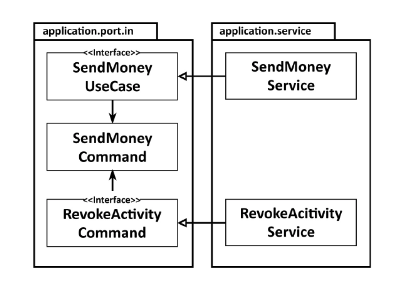
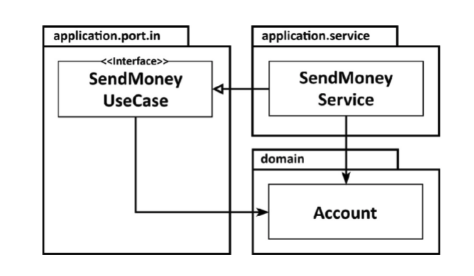
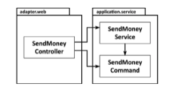
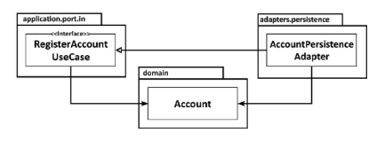

# Get Your Hands Dirty on Clean Architecture

> https://learning.oreilly.com/library/view/get-your-hands/9781839211966/
>
> 스터디
>
> 2021.09.14

## Chapter 11 - Taking Shortcuts Consciously

이 책의 서문에서, **우리가 항상 지름길을 택해야 한다고 느끼는 사실을 저주했다. 엄청난 기술적 부채를 쌓으면서 우리는 결코 갚을 기회가 없다.**

지름길을 선택하는 것을 막으려면 우리는 지름길을 식별할 수 있어야 합니다. 따라서 이 장의 목표는 잠재적인 지름길에 대한 인식을 높이고 그 효과에 대해 논의하는 것이다.

이 정보를 통해 실수로 인한 지름길 선택을 식별하고 수정할 수 있다. 또는 정당화되는 경우 지름길의 효과를 의식적으로 선택할 수도 있다.

건설 공학에 관한 책이나 항공 전자 공학에 관한 책의 앞 문장을 상상해 보자. 우리 대부분은 고층 빌딩이나 비행기와 같은 소프트웨어를 만들고 있지 않다. **소프트웨어는** 부드럽고 하드웨어보다 더 **쉽게 변경할 수 있다**. **따라서 때로는 지름길을 먼저 선택하고 나중에 수정하는 것이 실제로 더 경제적이다.**

### Why Shortcuts Are Like Broken Windows

지름길이 깨진 창문과 같은 이유

1969년, 심리학자 필립 짐바르도는 후에 깨진 창문 이론으로 알려지게 된 이론을 시험하기 위한 실험을 했다.

그는 한 대는 브롱크스 지역에 번호판 없이 주차했고 또 다른 한 대는 팔로 알토의 "더 나은" 지역에 주차했다. 그리고 그는 기다렸다.

브롱크스에 있는 자동차는 **24시간 안에** 귀중한 부품들을 깨끗하게 골라냈고, 그 후 행인들은 무작위로 그것을 부수기 시작했다.

Palo Alto에 있는 차는 **일주일 동안** 손대지 않아서 Zimbardo는 창문을 부쉈다. 그때부터, 그 차는 브롱크스에 있는 차와 비슷한 운명을 맞았고, 지나가는 사람들에 의해 같은 짧은 시간 안에 파괴되었다.

약탈과 자동차 파괴에 참여한 사람들은 모든 사회 계층에서 왔으며, 다른 때는 법을 준수하고 예의 바른 시민들도 포함되어 있었다.

이 인간의 행동은 '창 깨짐 이론'으로 알려지게 되었다.

어떤 것이 낡아 보이거나 손상되거나 [여기에 부정형 형용사 삽입] 하는 것이 일반적으로 권장되지 않는 것처럼 보이는 순간, 인간의 뇌는 그것을 좀 더 그것을 낡아보이게, 손상되게,  [부정형 형용사를 삽입]해도 괜찮다고 느낀다.

이 이론은 삶의 많은 분야에 적용된다.

공공 기물 파손이 흔한 동네에서는, 허가받지 않은 차를 약탈하거나 손상시킬 수 있는 문턱이 낮다.
유리창이 깨졌을 때, 심지어 "좋은" 동네에서도, 차를 더 손상시킬 수 있는 문턱은 낮다.
지저분한 침실에서는 옷을 옷장에 넣지 않고 바닥에 버리는 문턱이 낮다.
왕따가 흔한 집단에서, 조금만 더 왕따를 시키는 문턱은 낮다.
**코드 작업에 적용되는 의미는 다음과 같다.**

**저품질 코드 기반에서 작업할 때 저품질 코드를 더 추가하기 위한 임계값은 낮다.**

**코딩 위반이 많은 코드베이스에서 작업할 때 다른 코딩 위반을 추가하는 임계값은 낮다.**

**지름길이 많은 코드베이스에서 작업할 때 다른 단축키를 추가하는 임계값은 낮다.**

이 모든 것을 염두에 두고 시간이 지남에 따라 많은 소위 "레거시" 코드베이스의 품질이 그렇게 심하게 악화되었다는 것이 정말 놀라운 일까?

### The Responsibility of Starting Clean

깨끗한 시작의 책임

코드 작업은 차를 약탈하는 것처럼 느껴지지 않지만 우리 모두는 무의식적으로 깨진 창문 심리학의 영향을 받는다. 
**따라서 가능한 한 적은 수의 지름길과 적은 기술적 부채로 프로젝트를 깔끔하게 시작하는 것이 중요하다.**
**지름길은 들어오자마자 깨진 창문으로 작용하여 더 많은 지름길을 끌어들이기 때문이다.**

소프트웨어 프로젝트는 종종 매우 비용이 많이 들고 장기적으로 진행되기 때문에 깨진 유리창을 막는 것은 **소프트웨어 개발자**로서 우리의 **큰 책임**이다. 
우리가 프로젝트를 끝내지 못할 수도 있고 다른 사람들이 인계받아야 할지도 모른다.
이들에게는 레거시 코드베이스이기 때문에 깨진 창을 만드는 것에 대한 임계값을 훨씬 더 낮춘다.

하지만, 어떤 때는 지름길이 실용적이라고 결정할 때가 있다.
왜냐하면 우리가 작업하고 있는 코드의 일부가 프로젝트 전체에 그다지 중요하지 않기 때문이다.
우리가 프로토타입 제작 중이거나 경제적인 이유 때문이기도 하다.

마이클 나이가드가 블로그(http://thinkrelevance.com/blog/2011/11/15/documenting-architecture-decisions)에서 제안한 바와 같이 **의식적으로 추가된 지름길을 ADR(Architecture Decision Records) 형태로 문서화하는데 많은 주의를 기울여야 한다.** 우리 미래의 자신과 후계자들을 위해서. **팀의 모든 구성원이 이 문서를 알고 있으면 지름길이 의식적이고 타당한 이유로 사용되었음을 알게 되므로 깨진 창문 효과도 줄일 수 있다.**

### Sharing Models between Use Cases

사용 사례 간 모델 공유

4장, 사용 사례 구현에서 사용 사례마다 입력 및 출력 모델이 달라야 한다고 주장했다.
즉, 입력 매개변수의 유형과 반환 값의 유형이 달라야 한다.

다음 그림은 두 사용 사례가 동일한 입력 모델을 공유하는 예를 보여준다.

사용 사례 간에 입력 또는 출력 모델을 공유하면 사용 사례 간의 결합이 이루어진다.

이 경우 공유의 효과는 SendMoneyUseCase와 RevokeActivityUseCase가 서로 결합된다는 것이다.
공유 SendMoneyCommand 클래스 내에서 무언가를 변경하면 두 사용 사례가 모두 영향을 받는다.
그들은 단일 책임 원칙이라는 측면에서 변화의 이유를 공유한다. 두 사용 사례가 동일한 출력 모델을 공유하는 경우에도 마찬가지이다.

**사용 사례 간에 입력 및 출력 모델을 공유하는 것은** 사용 사례가 기능적으로 바인딩된 경우, 즉 **특정 요구 사항을 공유하는 경우 유효하다.** 이 경우 특정 세부 사항을 변경하면 **실제로 두 사용 사례가 모두 영향을 받기를 원한다.**

그러나 **두 사용 사례가 서로 별도로 확장할 수 있어야 하는 경우 이는 지름길이다.** 이 경우 처음부터 동일하게 보인다면 입력 및 출력 클래스를 복제하는 것을 의미하더라도 **처음부터 사용 사례를 분리해야 한다.**

따라서 **유사한 개념을 중심으로 여러 사용 사례를 구축할 때 사용 사례가 서로 별도로 발전해야 하는지 여부에 대해 정기적으로 질문하는 것이 좋다.** **대답이 "예"가 되 자마자 입력 모델과 출력 모델을 분리할 때이다.**

### Using Domain Entities as Input or Output Models

도메인 엔터티를 입력 또는 출력 모델로 사용

Account 도메인 엔터티와 들어오는 포트 SendMoneyUseCase가 있는 경우 다음 그림과 같이 엔터티를 들어오는 포트의 입력 및/또는 출력 모델로 사용하고 싶을 수 있다.

도메인 엔터티를 사용 사례의 입력 또는 출력 모델로 사용하여 도메인 엔터티를 사용 사례에 연결

들어오는 포트에는 도메인 엔터티에 대한 종속성이 있다. 그 결과 Account 엔터티가 변경되는 또 다른 이유가 추가되었다.

Account 엔터티는 SendMoneyUseCase 들어오는 포트에 대한 종속성이 없다. 그러면 들어오는 포트가 어떻게 엔터티에 대한 변경 이유가 될 수 있습니까?

Account 엔티티에서 현재 사용할 수 없는 사용 사례의 계정에 대한 정보가 필요하다고 가정해 보자. 
이 정보는 궁극적으로 Account 엔티티에 저장되는 것이 아니라 다른 도메인 또는 제한된 컨텍스트에 저장된다.
그럼에도 불구하고 Account 엔터티에 새 필드를 추가하려는 유혹이 있다.
어카운트 엔터티는 이미 사용 사례 인터페이스에서 사용 가능하기 때문이다.

간단한 생성 또는 업데이트 사용 사례의 경우 사용 사례 인터페이스의 도메인 엔터티가 괜찮을 수 있다.
엔터티에는 정확한 정보가 포함되어 있으므로 데이터베이스에서 해당 상태를 유지해야 한다.

사용 사례가 단순히 데이터베이스의 몇 가지 필드를 업데이트하는 것이 아니라 더 복잡한 도메인 논리를 구현하는 경우(도메인 논리의 일부를 풍부한 도메인 엔터티에 위임할 수 있음) 전용 입력 및 출력 모델을 사용해야 한다.
사용 사례 인터페이스의 경우 사용 사례의 변경 사항이 도메인 엔터티에 전파되는 것을 원하지 않기 때문이다.

이 지름길을 위험하게 만드는 것은 많은 사용 사례가 단순한 생성 또는 업데이트 사용 사례로 시작하여 시간이 지남에 따라 복잡한 도메인 논리의 짐승이 된다는 사실이다. 이는 실행 가능한 최소 제품으로 시작하여 앞으로 복잡성을 추가하는 애자일 환경에서 특히 그렇다. **따라서 처음에 도메인 엔터티를 입력 모델로 사용했다면 도메인 엔터티와 독립적인 전용 입력 모델로 대체할 시점을 찾아야 한다.**

### Skipping Incoming Ports

들어오는 포트 건너뛰기

나가는 포트는 애플리케이션 계층과 나가는 어댑터 사이의 종속성을 반전하는 데 필요하지만(종속성이 안쪽을 가리키도록 하기 위해) **종속성 반전을 위해 들어오는 포트가 필요하지 않다.** 다음 그림과 같이 들어오는 어댑터가 중간에 들어오는 포트 없이 애플리케이션 서비스에 직접 액세스하도록 결정할 수 있다.

들어오는 포트가 없으면 도메인 논리에 대해 명확하게 표시된 진입점을 잃게 된다.

들어오는 포트를 제거하여 들어오는 어댑터와 응용 프로그램 계층 간의 추상화 계층을 줄였다. 추상화 레이어를 제거하는 것은 일반적으로 기분이 좋다.

그러나 **들어오는 포트는 애플리케이션 코어에 대한 진입점을 정의**한다. 그것들을 제거한 후에는 특정 사용 사례를 구현하기 위해 호출할 수 있는 서비스 메서드를 찾기 위해 응용 프로그램의 내부에 대해 더 많이 알아야 한다. **전용 수신 포트를 유지함으로써 애플리케이션의 진입점을 한 눈에 식별할 수 있다.** 이를 통해 신규 개발자는 코드베이스에서 특히 쉽게 방향을 잡을 수 있습니다.

**들어오는 포트를 유지하는 또 다른 이유는 아키텍처를 쉽게 적용할 수 있기 때문이다.** 10장 '아키텍처 경계 적용'의 적용 옵션을 사용하면 들어오는 어댑터가 애플리케이션 서비스가 아닌 들어오는 포트만 호출하도록 할 수 있다. 이것은 애플리케이션 계층에 대한 모든 진입점을 매우 의식적인 결정으로 만든다. 들어오는 어댑터에서 호출할 의도가 아닌 서비스 메서드를 더 이상 실수로 호출할 수 없다.

애플리케이션이 충분히 작거나 들어오는 어댑터가 하나뿐이어서 들어오는 포트의 도움 없이 전체 제어 흐름을 파악할 수 있는 경우 들어오는 포트 없이 수행할 수 있다. 그러나 애플리케이션이 계속 작게 유지되거나 전체 수명 동안 들어오는 어댑터가 하나만 있을 것이라는 사실을 얼마나 자주 알 수 있을까?

### Skipping Application Services

들어오는 포트를 제외하고 특정 사용 사례의 경우 다음 그림과 같이 애플리케이션 계층을 전체적으로 건너뛸 수 있다.

응용 프로그램 서비스가 없으면 도메인 논리에 대해 지정된 위치가 없다.

여기에서 나가는 어댑터 내의 AccountPersistenceAdapter 클래스는 들어오는 포트를 직접 구현하고 일반적으로 들어오는 포트를 구현하는 응용 프로그램 서비스를 대체한다.

간단한 CRUD 사용 사례에 대해 이 작업을 수행하는 것은 매우 유혹적이다. 이 경우 애플리케이션 서비스는 일반적으로 도메인 논리를 추가하지 않고 지속성 어댑터에 생성, 업데이트 또는 삭제 요청만 전달하기 때문이다. 전달하는 대신 지속성 어댑터가 사용 사례를 직접 구현하도록 할 수 있다.

그러나 이것은 들어오는 어댑터와 나가는 어댑터 사이에 공유 모델이 필요하다. 이 경우에는 계정 도메인 엔터티이다. 따라서 일반적으로 앞에서 설명한 대로 도메인 모델을 입력 모델로 사용하고 있음을 의미한다.

또한 더 이상 애플리케이션 코어 내에서 사용 사례를 나타내지 않는다. CRUD 사용 사례가 시간이 지남에 따라 더 복잡한 것으로 커지면 사용 사례가 이미 구현되어 있기 때문에 나가는 어댑터에 직접 도메인 논리를 추가하고 싶을 것이다. 이것은 도메인 로직을 분산시켜서, 찾고 유지하기 어렵게 만든다.

결국, boilerplate 통과 서비스를 방지하기 위해 간단한 CRUD 사용 사례에 대한 응용 프로그램 서비스를 건너뛸 수 있다. 그러나 팀은 **사용 사례가 엔터티를 생성, 업데이트 또는 삭제하는 것 이상의 작업을 수행할 것으로 예상되는 즉시 애플리케이션 서비스를 도입하기 위한 명확한 지침을 개발해야 한다.**

### How Does This Help Me Build Maintainable Software?

경제적인 관점에서 지름길이 이해되는 경우가 있다. 이 장에서는 몇 가지 지름길을 사용할지 여부를 결정하는 데 도움이 될 수 있는 결과에 대한 통찰력을 제공했다.

토론을 통해 간단한 CRUD 사용 사례에 대한 지름길 도입하고 싶은 유혹이 있음을 보여준다. 그 이유는 전체 아키텍처를 구현하는 것이 과도하게 느껴지기 때문이다(지름길이 지름길처럼 느껴지지 않음). **그러나 모든 애플리케이션은 작게 시작하기 때문에 사용 사례가 CRUD 상태를 벗어날 때 팀이 동의하는 것이 매우 중요하다. 그래야만 팀이 지름길을 장기적으로 유지 관리가 더 쉬운 아키텍처로 대체할 수 있다.**

**일부 사용 사례는 CRUD 상태를 벗어나지 않는다. 그들에게는 바로 가기를 영구적으로 유지하는 것이 더 실용적일 수 있다. 실제로 유지 관리 오버헤드가 필요하지 않기 때문이다.**

**어떤 경우든 아키텍처와 특정 지름길을 선택한 이유에 대한 결정을 문서화하여 향후 결정을 재평가할 수 있도록 해야 한다.**
