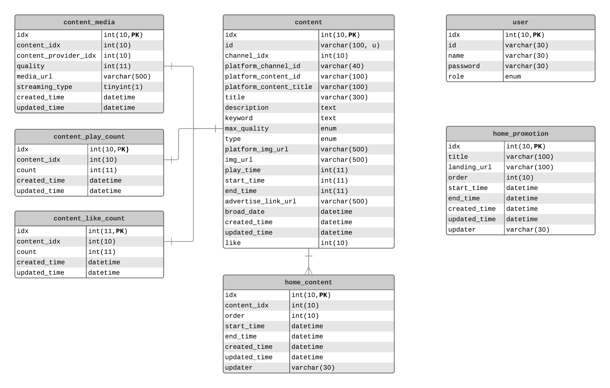
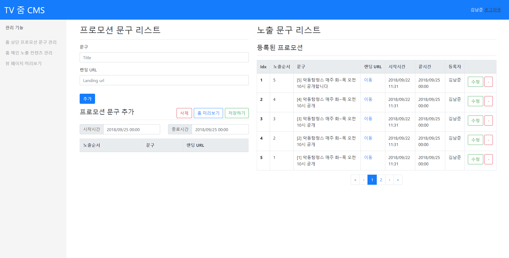
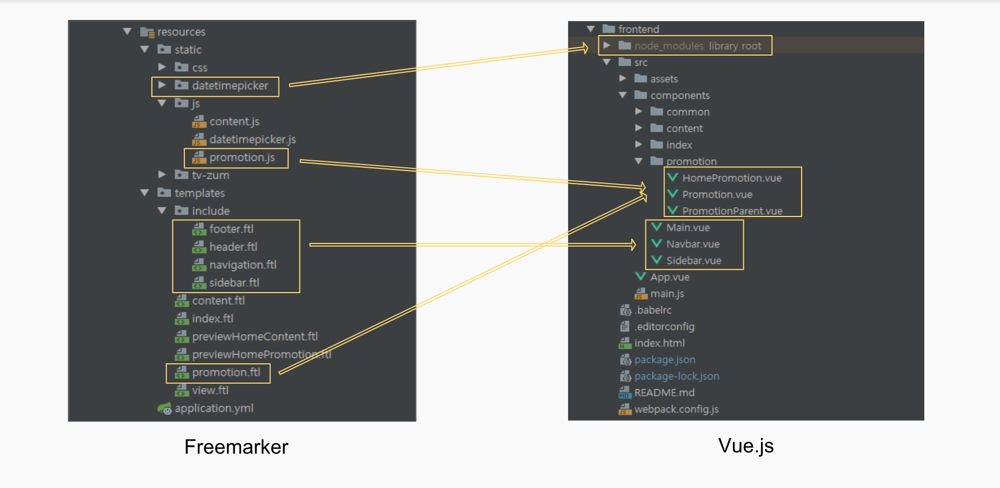

# 파일럿 프로젝트 회고록

> 입사 후 며칠간의 적응 기간이 지나고, 포털개발팀에서 사용하는 기술 스펙 적응과 실무를 하기 전 웹 서비스에 대한 지식과 기술을 습득하기 위한 파일럿 프로젝트를 진행했습니다. 진행에 앞서 가이드 및 기술 지원을 위한 선임분들이 정해졌고, 약 7주간의 여정을 시작했습니다. 이 회고록에는 줌인터넷에 갓 입사한 신입사원이 파일럿 프로젝트를 진행하면서 주어진 요구사항을 구현해 나가는 과정과 개인적으로 느꼈던 기술에 관련된 벽을 허물어가는 과정에 관한 내용을 담았습니다.

## 1. 개요

### 1-1 프로젝트 주제

저의 파일럿 프로젝트 주제는 이번에 새롭게 서비스하기 시작한 [TV줌](https://tv.zum.com/)의 CMS를 만드는 것이었습니다. 처음에 주제를 들었을 때에는 CMS의 개념도 모르고 있었지만, 줌에서 제공하는 모든 서비스에는 운영을 위한 CMS가 있다는 것을 알게됐습니다. CMS가 실제로 사용된다고 가정하고 프로젝트를 진행해야 하므로 약간의 부담감도 있었지만 개발하는 동안에 의식적으로 사용자의 입장을 생각할 수 있었습니다. 그로 인해 서비스를 개발할 때에는 굉장히 디테일한 부분까지 생각해야 하며, 그것이 결코 쉽지 않은 일이라는 것을 느낄 수 있었습니다.
> CMS(Contents Management System)
>
> 게시판, 레이아웃, 모듈과 같은 기능을 모아둔 도구로 실제 서비스하는 사이트의 컨텐츠들을 관리하는 기능을 한다. 게시판 관련 기능 같은 기본적인 작업을 자동화시키기 때문에 웹 사이트 제작에 드는 시간이 많이 감소된다.

### 1-2 요구사항

기능적인 요구사항은 아래와 같습니다. TV줌 메인 페이지의 상단 노출 컨텐츠와 프로모션 문구를 관리 하기 위함이 가장 큰 목적이었고, 부가적으로 현재 TV줌에서 사용하는 기술들에 대해 학습하기 위한 목적도 있었습니다. 중요한 것은 요구하는 기능들은 주어지지만, 그 기능을 어떻게 구현할 지에 대한 고민은 자기 주도적으로 해야 한다는 것입니다. 여러 생각과 고민을 통해서 컨셉을 잡고, 그것을 선임분들과 공유하고 피드백을 받으면서 프로젝트를 진행했습니다.

| 필수기능                                                     | 선택기능                                                     |
| ------------------------------------------------------------ | ------------------------------------------------------------ |
| 1. 홈 메인 상단 노출 컨텐츠 관리 2. 상단 프로모션 문구 관리 3. 홈 미리보기(마크업 제공) | 1. 뷰페이지 미리보기(마크업 제공) &nbsp; 1-1. 광고 없이 mp4 파일 재생(video.js를 학습하기 위함) 2. 메인 상단 노출 컨텐츠 스케줄링 3. 상단 프로모션 스케줄링 4. 레디스 데이터(재생수 등) 확인 및 관리 |

필수로 사용해야 하는 기술 스펙과 선택적으로 사용해도 좋은 기술 스펙도 전달받았습니다. Back-end 기술 스펙에는 그나마 공부해오던 것들이 있어서 모르던 것들을 학습하면서 진행하면 된다고 생각했지만, Front-end 기술 스펙에는 사용해보지 못한 것들이 대부분이었습니다. Webpack config 파일에 대한 울렁증도 있었고, 자바스크립트를 깊이 공부해본 적도 없으며, Vue.js라는 핫한 프론트엔드 프레임워크는 접해본 적도 없던 터라 이 부분에서 다가오는 벽이 가장 크게 느껴졌습니다.

| Back-end                                                     | Front-end                                                    |
| ------------------------------------------------------------ | ------------------------------------------------------------ |
| Spring Boot Gradle Java 8 JPA Querydsl Redis/Ehcache/Guava cache/Java Local cache (선택) | Freemarker Webpack Vue.js Video.js ES6 (선택) + Bootstrap4 |

## 2. 일정

기술적인 벽을 느꼈기 때문에 전략을 세울 수 밖에 없었습니다. 요구사항에 명시된 기능 구현이라는 목적을 달성하기 위해서 Main 프로젝트를 계속해서 진행하되, 모르는 것들에 대한 학습과 Main 프로젝트에 적용시킬 서브 프로젝트들을 진행하면서 제가 느끼던 벽을 조금씩 허물기로 했습니다. 당연히 시간이 많이 걸릴거라고 생각했고, 꽤나 자주 제가 생각한대로 진행되지 않아서 당황도 했습니다. 하지만, 개인적으로 이 기간에 혼자서 전략도 세워보고, 일정도 관리해보고, 거기에 맞추려고 노력해봤던 것들이 분명 나중에 많은 도움이 될 것 같습니다.

### 2-1 프로젝트 진행 과정

- 1주차 : 파일럿 프로젝트를 진행하기 위해 컨셉을 잡고, 설계 리뷰를 진행하면서 방향을 잡았습니다. 기능 구현을 위해서 화면에 대한 설계와 동작 시나리오, 데이터베이스 테이블과 구조에 대한 고민, 백엔드 비즈니스 로직의 흐름에 대한 고민을 가장 많이 했던 시간입니다.
- 2, 3주차 : 가장 중요한 필수 기능인 메인 상단 노출 컨텐츠 관리 기능과 상단 홈 프로모션 문구 관리에 집중했습니다. 이 기간에는 경험이 있는 Spring Boot + Freemarker로 기능 구현에 초점을 맞추고, 1차 리뷰 후에 진행할 Vue.js로의 전환을 위해서 Vue.js를 구성하는 중요한 요소들에 대해 학습했습니다.
- 4주차 : 1차 코드 리뷰가 끝나고 받은 수정 사항들을 반영하고, 내부적으로 문제가 있다고 느낀 프로모션 관리 기능을 수정했습니다. 그리고 3주차에 학습했던 Vue.js 개념을 바탕으로 서브 프로젝트 Todo 애플리케이션을 만들어 보면서 Vue가 화면을 동적으로 생성하는 법과 싱글 파일 컴포넌트 구조로 프로젝트를 구성하는 방법, Back-end와 어떻게 통신하고 데이터를 처리 하는지에 대해 알게됐습니다.
- 5주차 : Vue.js 서브 프로젝트를 진행하면서 학습한 것을 바탕으로 Freemarker로 구성된 화면단을 Vue.js 싱글 파일 컴포넌트 구조로 변경했고, 이에 따라서 Back-end 구조도 수정 반영했습니다. 이 과정에서 Back-end 비즈니스 로직이 화면단으로 많이 옮겨졌습니다. 추가적으로 또 하나의 서브 프로젝트를 진행했습니다. 선택 기능인 뷰페이지 미리보기(Video.js로 영상 컨트롤)을 구현하기 위해서 Video.js를 학습했고, 이 화면에서 영상의 재생수를 Redis로 관리하면 좋겠다고 생각해서 Jedis 라이브러리와 Spring-Data-Redis를 사용해서 기능을 구현했습니다.
- 6주차 : 영상 컨텐츠를 컨트롤하기 위해 Video.js 기능을 확장했고, 서브 프로젝트로 진행해 오던 것들을 메인 프로젝트에 적용시켰습니다. 그리고 레디스로 유지중이던 컨텐츠의 재생수를 주기적으로 DB에 업데이트 하기 위해 Spring Scheduler에 대해서 학습했고, 스케줄링 기능을 구현했습니다.
- 7주차 : 2차 리뷰를 통해서 받았던 피드백을 바탕으로 코드 리팩토링을 진행했고, 사용자 경험을 개선하기 위해 등록된 컨텐츠, 프로모션들을 페이징하기 위한 기능과 노출예정인 컨텐츠, 프로모션 삭제시 확인 절차를 거치는 기능을 추가 구현했습니다.

## 3. Database

### 3-1 테이블 구조

TV줌의 서비스 특성상 [SMR(Smart Media Representative)사](http://www.smartmediarep.com/main/main.html)로부터 제공받은 컨텐츠를 바탕으로 서비스 하기 때문에 컨텐츠를 저장하는 테이블의 경우 제가 직접 정의하거나, 변경할 수 없었습니다. 따라서, 홈 메인 상단 노출 컨텐츠 관리 기능을 구현하는데 있어서 필요한 home_content 테이블을 별도로 정의하고 관리와 스케줄링, 히스토리 관리에 필요한 컬럼을 추가해서 사용했습니다. 그리고 재생수와 좋아요수는 실시간 변동이 잦기 때문에, 저장하는 테이블을 따로 관리해서 매번 컨텐츠의 모든 정보를 포함하는 테이블을 업데이트 하는 부담을 줄이고자 했습니다. 따라서, 평소에는 Redis로 데이터를 유지하고 스케줄링을 통해 Redis에 유지중인 데이터를 DB에 업데이트하는 방식으로 재생수와 좋아요수를 관리합니다.

하지만 홈 상단 노출 프로모션 문구의 경우 CMS 사용자가 모든 부분(프로모션 문구 추가, 수정, 삭제, 스케줄링 등)을 직접 컨트롤하기 때문에, 하나의 테이블로 모든 것이 관리가 가능하다고 생각했습니다. 결과적으로 프로모션 문구와 해당 문구의 랜딩 URL, 노출 순서, 스케줄링 시간과 최종 수정자를 포함하는 home_promotion 하나의 테이블을 사용하여 기능 구현이 가능했습니다.

## 4. Frontend 구조

### 4-1 화면 설명

화면의 구성은 기본적으로 Navbar와 CMS 기능 선택을 위한 Sidebar가 위치하고, 기능을 선택할 때 마다 해당 기능을 사용하기 위한 화면 컴포넌트가 동적으로 렌더링 됩니다. 프로젝트의 포커스가 기능 구현에 초점이 맞춰져 있었기 때문에, Bootstrap-Vue 라이브러리를 이용하여 화면의 그리드 시스템과 디자인을 적용했습니다.

예를 들면, 아래의 화면에서 노출 프로모션 문구 관리 기능을 사용하는 CMS 담당자는 노출시키기 위한 프로모션 문구를 추가하고, 노출 순서에 맞게 프로모션 문구의 롤링이 이루어 지는지 홈 미리보기 기능을 통해 확인할 수 있습니다. 확인 후에, 원하는 스케줄링 시간을 선택하고 저장 하면, 오른쪽 화면의 등록된 프로모션 리스트에 동적으로 반영됩니다.

뒤에서 자세히 설명드리겠지만, Freemarker 템플릿 엔진으로 렌더링하는 화면과 싱글 파일 컴포넌트 구조의 Vue.js로 그리는 화면은 겉으로 보기에 차이가 없습니다. 하지만, 이렇게 화면 요소를 동적으로 처리해야하는 부분들을 구현하는데 있어 Freemarker로 서버사이드 렌더링을 할 때보다 Vue.js 적용 후에 더 효율적으로 구현할 수 있었습니다.

### 4-2 구조 변경(Freemarker -> Vue.js)

파일럿 프로젝트를 하면서 가장 많은 코드의 변경과 프로젝트 구조의 변경이 일어났던 시점은 Freemarker로 구현된 화면단을 Vue.js로 컨버팅 하는 서브 프로젝트를 진행할 때였습니다. 프론트엔드 프로젝트를 독립적으로 분리하는 과정을 거치면서 아래와 같은 장점들을 가져갈 수 있었습니다.

* Bootstrap, Bootstrap-datetimepicker 등 gradle과 static으로 관리하던 프론트엔드 의존 라이브러리들을 독립적으로 프론트엔드 프로젝트의 package.json 파일에서 관리할 수 있게 됐습니다.
* 템플릿 엔진으로 중복 렌더링 하던 공통요소(header.ftl, footer.ftl, navigation.ftl 등)를 Vue의 컴포넌트로 만들어서 화면의 변경이 없다면 초기에 한번만 렌더링 합니다.
* 각 기능별로 있던 `.ftl` 파일과 동작을 위한 코드가 있던 `.js` 파일의 내용이 하나의 `.vue` 파일로 관리되면서 Vue.js의 싱글 파일 컴포넌트 구조로 변경 되었고, 덕분에 하나의 파일에서 html 코드와 js 코드를 관리할 수 있습니다.
* 프론트엔드 프로젝트와 백엔드 프로젝트가 분리되면서 webpack-dev 서버를 통해서 별도로 프론트엔드 프로젝트를 구동시키기 때문에, 코드의 수정이 있어도 스프링 부트 프로젝트를 re-run 하지 않아도 돼서 개발 생산성이 매우 좋아졌습니다.

### 4-3 Single File Component 구조로 변경된 화면

### 4-4 Component의 Parent-Child 통신과 데이터 바인딩

## 5. Backend 구조

### 5-1. Backend 요청/응답 흐름

### 5-2. Spring Scheduler로 Redis데이터 DB에 업데이트 하기

## 6. 구현 기능 정리

### 6-1 홈 메인 상단 노출 프로모션 관리

### 6-2 홈 메인 상단 노출 컨텐츠 관리

### 6-3 뷰페이지 미리보기, 재생수 관리

## 7. 마치며

> 줌인터넷 포털개발팀에서의 파일럿 프로젝트가 무사히 끝나고 실무를 하게 되는 시점에서 드는 솔직한 생각입니다.
>
> 처음에는 맨몸으로 들어온 초보자에게 '여기 무기, 갑옷 있으니까 알아서 입고 나와'라고 하는 것 같았습니다. 초보자의 원래 스타일을 확인 하기 위함이었겠죠? 근데 중간 중간 리뷰를 거치면서 동료들이 '그 자세에서는 무기 이렇게 잡는건 어때? 이렇게 찌르는게 편하지 않아?'라는 식의 조언을 해줬습니다. 그것들을 받아들이고 적응하는 과정을 거치면서 저에게 포털개발팀의 팀 컬러가 조금씩 입혀졌다고 생각합니다. 혹시 제가 비유를 어렵게 하고있나요..?
>
> 정리하자면 파일럿 프로젝트의 전과 후 저의 모습에는 많은 변화가 있었습니다. 조금은 특별한 느낌의 성장을 경험했다고 하면 맞을 것 같네요. 회사와 저 모두에게 유익한 시간이었을것이라고 생각합니다. 긴 글 읽어주셔서 감사합니다:)