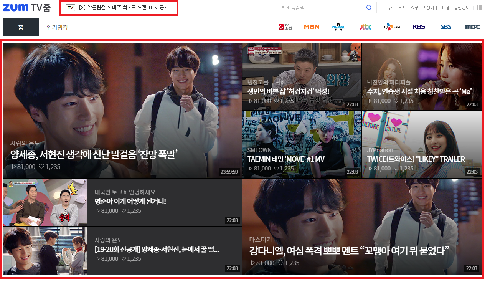
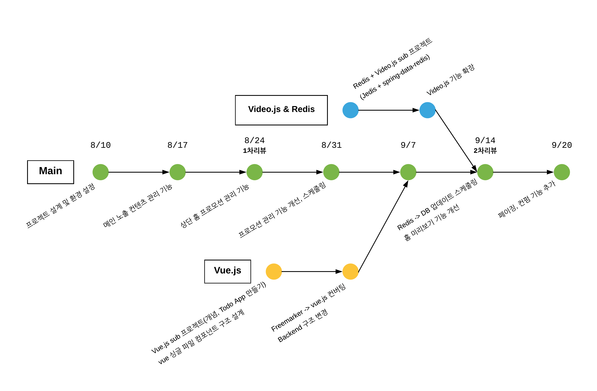

# 파일럿 프로젝트 회고록

> 입사 후 며칠간의 적응 기간이 지나고, 포털개발팀에서 사용하는 기술 스펙 적응과 실무를 하기 전 웹 서비스에 대한 지식과 기술을 습득하기 위한 파일럿 프로젝트를 진행했습니다. 진행에 앞서 가이드 및 기술 지원을 위한 선임분들이 정해졌고, 약 7주간의 여정을 시작했습니다. 이 회고록에는 줌인터넷에 갓 입사한 신입사원이 파일럿 프로젝트를 진행하면서 주어진 요구사항을 구현해 나가는 과정과 개인적으로 느꼈던 기술에 관련된 벽을 허물어가는 과정에 관한 내용을 담았습니다.

{: refdef: style="text-align: center;"}

{: refdef}

## 1. 개요

### 1-1 프로젝트 주제

저의 파일럿 프로젝트 주제는 이번에 새롭게 서비스하기 시작한 [TV줌](https://tv.zum.com/)의 CMS를 만드는 것이었습니다. 처음에 주제를 들었을 때에는 CMS의 개념도 모르고 있었지만, 줌에서 제공하는 모든 서비스에는 운영을 위한 CMS가 있다는 것을 알게됐습니다. CMS가 실제로 사용된다고 가정하고 프로젝트를 진행해야 하므로 약간의 부담감도 있었지만 개발하는 동안에 의식적으로 사용자의 입장을 생각할 수 있었습니다. 그로 인해 서비스를 개발할 때에는 굉장히 디테일한 부분까지 생각해야 하며, 그것이 결코 쉽지 않은 일이라는 것을 느낄 수 있었습니다.
> CMS(Contents Management System)
>
> 게시판, 레이아웃, 모듈과 같은 기능을 모아둔 도구로 실제 서비스하는 사이트의 컨텐츠들을 관리하는 기능을 한다. 게시판 관련 기능 같은 기본적인 작업을 자동화시키기 때문에 웹 사이트 제작에 드는 시간이 많이 감소된다.

### 1-2 요구사항

기능적인 요구사항은 아래와 같습니다. TV줌 메인 페이지의 상단 노출 컨텐츠와 프로모션 문구를 관리 하기 위함이 가장 큰 목적이었고, 부가적으로 현재 TV줌에서 사용하는 기술들에 대해 학습하기 위한 목적도 있었습니다. 중요한 것은 요구하는 기능들은 주어지지만, 그 기능을 어떻게 구현할 지에 대한 고민은 자기 주도적으로 해야 한다는 것입니다. 여러 생각과 고민을 통해서 컨셉을 잡고, 그것을 선임분들과 공유하고 피드백을 받으면서 프로젝트를 진행했습니다.

| 필수기능                                                     | 선택기능                                                     |
| ------------------------------------------------------------ | ------------------------------------------------------------ |
| 1. 홈 메인 상단 노출 컨텐츠 관리 2. 상단 프로모션 문구 관리 3. 홈 미리보기(마크업 제공) | 1. 뷰페이지 미리보기(마크업 제공) &nbsp; 1-1. 광고 없이 mp4 파일 재생(video.js를 학습하기 위함) 2. 메인 상단 노출 컨텐츠 스케줄링 3. 상단 프로모션 스케줄링 4. 레디스 데이터(재생수 등) 확인 및 관리 |

{: refdef: style="text-align: center;"}

{: refdef}

필수로 사용해야 하는 기술 스펙과 선택적으로 사용해도 좋은 기술 스펙도 전달받았습니다. Back-end 기술 스펙에는 공부해오던 것들이 많아서 모르던 것들을 학습하면서 진행하면 된다고 생각했지만, Front-end 기술 스펙에는 사용해보지 못한 것들이 대부분이었습니다. Webpack config 파일에 대한 울렁증도 있었고, 자바스크립트를 깊이 공부해본 적도 없으며, Vue.js라는 핫한 프론트엔드 프레임워크는 접해본 적도 없던 터라 이 부분에서 다가오는 벽이 가장 크게 느껴졌습니다.

| Back-end                                                     | Front-end                                                    |
| ------------------------------------------------------------ | ------------------------------------------------------------ |
| Spring Boot Gradle Java 8 JPA Querydsl Redis/Ehcache/Guava cache/Java Local cache (선택) | Freemarker Webpack Vue.js Video.js ES6 (선택) + Bootstrap4 |

## 2. 일정

### 2-1 프로젝트 진행 과정

{:.aligncenter}

- 1주차 : 파일럿 프로젝트를 진행하기 위해 컨셉을 잡고, 설계 리뷰를 진행하면서 방향을 잡았습니다. 기능 구현을 위해서 화면에 대한 설계와 동작 시나리오, 데이터베이스 테이블과 구조에 대한 고민, 백엔드 비즈니스 로직의 흐름에 대한 고민을 가장 많이 했던 시간입니다.
- 2, 3주차 : 가장 중요한 필수 기능인 메인 상단 노출 컨텐츠 관리 기능과 상단 홈 프로모션 문구 관리에 집중했습니다. 이 기간에는 경험이 있는 Spring Boot + Freemarker로 기능 구현에 초점을 맞추고, 1차 리뷰 후에 진행할 Vue.js로의 전환을 위해서 Vue.js를 구성하는 중요한 요소들에 대해 학습했습니다.
- 4주차 : 1차 코드 리뷰가 끝나고 받은 수정 사항들을 반영하고, 내부적으로 문제가 있다고 느낀 프로모션 관리 기능을 수정했습니다. 그리고 3주차에 학습했던 Vue.js 개념을 바탕으로 서브 프로젝트 Todo 애플리케이션을 만들어 보면서 Vue가 화면을 동적으로 생성하는 법과 싱글 파일 컴포넌트 구조로 프로젝트를 구성하는 방법, Back-end와 어떻게 통신하고 데이터를 처리 하는지에 대해 알게됐습니다.
- 5주차 : Vue.js 서브 프로젝트를 진행하면서 학습한 것을 바탕으로 Freemarker로 구성된 화면단을 Vue.js 싱글 파일 컴포넌트 구조로 변경했고, 이에 따라서 Back-end 구조도 수정 반영했습니다. 이 과정에서 Back-end 비즈니스 로직이 화면단으로 많이 옮겨졌습니다. 추가적으로 또 하나의 서브 프로젝트를 진행했습니다. 선택 기능인 뷰페이지 미리보기(Video.js로 영상 컨트롤)을 구현하기 위해서 Video.js를 학습했고, 이 화면에서 영상의 재생수를 Redis로 관리하면 좋겠다고 생각해서 Jedis 라이브러리와 Spring-Data-Redis를 사용해서 기능을 구현했습니다.
- 6주차 : 영상 컨텐츠를 컨트롤하기 위해 Video.js 기능을 확장했고, 서브 프로젝트로 진행해 오던 것들을 메인 프로젝트에 적용시켰습니다. 그리고 레디스로 유지중이던 컨텐츠의 재생수를 주기적으로 DB에 업데이트 하기 위해 Spring Scheduler에 대해서 학습했고, 스케줄링 기능을 구현했습니다.
- 7주차 : 2차 리뷰를 통해서 받았던 피드백을 바탕으로 코드 리팩토링을 진행했고, 사용자 경험을 개선하기 위해 등록된 컨텐츠, 프로모션들을 페이징하기 위한 기능과 노출예정인 컨텐츠, 프로모션 삭제시 확인 절차를 거치는 기능을 추가 구현했습니다.

## 3. DB 테이블 구조

### 3-1 초기 설계

### 3-2 변경 후 설계

## 4. Frontend 화면 구조

### 4-1 화면 설명

### 4-2 구조 변경(Freemarker -> Vue.js)

### 4-3 Single File Component 구조로 변경된 화면

### 4-4 Component의 Parent-Child 통신과 데이터 바인딩

## 5. Backend 구조

### 5-1. Backend 요청/응답 흐름

### 5-2. Spring Scheduler로 Redis데이터 DB에 업데이트 하기

## 6. 구현 기능 정리

### 6-1 홈 메인 상단 노출 프로모션 관리

### 6-2 홈 메인 상단 노출 컨텐츠 관리

### 6-3 뷰페이지 미리보기, 재생수 관리

