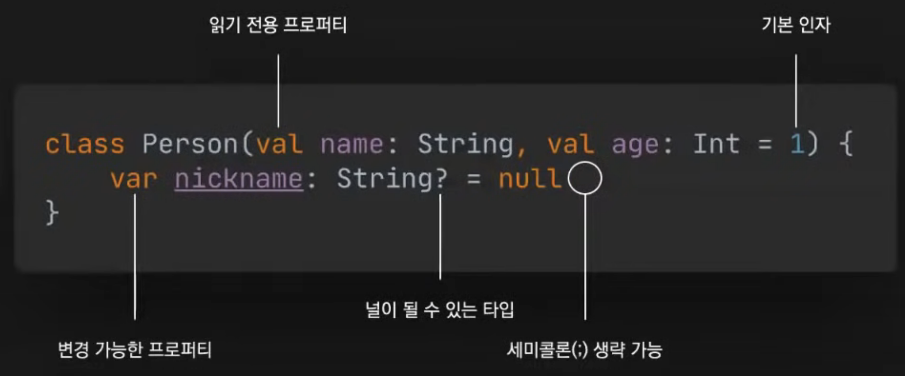
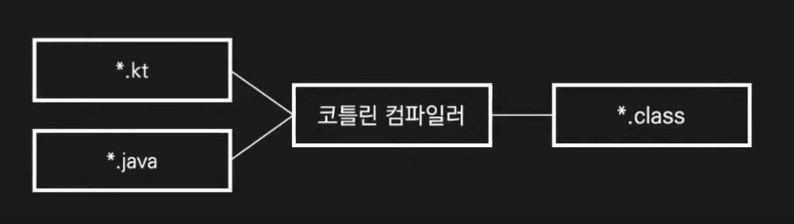
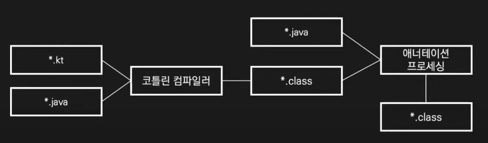

## 어디 가서 코프링 매우 알은 체하기!

> 2021.10.01 우아한테크세미나
>
> 우아한형제들 - Jason

## 코틀린이란

- JVM, 안드로이드, 자바스크립트 및 네이티브를 대상으로 하는 정적 타입 지정 언어
  - 컴파일 시점에 타입이 정해져 있다.(== 자바)
- 젯브레인에서 개발한 오픈 소스(아파치 라이선스 2.0)
- OO 스타일과 FP 스타일을 모두 사용할 수 있으며 두 요소를 혼합하여 사용할 수 있다.
- 간결하고 실용적이며 안전하고 기존 언어와의 상호 운용성을 중시한다.
  - \+ 코루틴(코틀린 라이브러리)
  - 코틀린은 자바와 마찬가지로 섬이름에서 따왔다.(러시아에서 군사적으로 중요한 위치에 있음ㅋㅋ)

## 아이템 1. 코틀린 표준 라이브러리를 익히고 사용하라

- 코틀린 1.3부터 모든 플랫폼에서 사용할 수 있는 kotlin.random.Random이 도입되었다.

- 더 이상 Random을 사용할지 ThreadLocalRandom을 사용할지 고민할 필요가 없다.

- 자바와 관련된 import문을 제거할 수 있다.

- 표준 라이브러리를 사용하면 그 코드를 작성한 전문가의 지식과 여러분보다 앞서 사용한 다른 프로그래머들의 경험을 활용할 수 있다.

  - AS-IS

  ```java
  import java.util.Random
  import java.util.concurrent.ThreadLocalRandom
    
  Random().nextInt()
  ThreadLocalRandom.current().nextInt()
  ```

  - TO-BE

  ```kotlin
  import kotlin.random.Random
  
  Random.nextInt() // Thread Safe
  ```

- 코틀린은 읽기 전용 컬렉션과 변경 가능한 컬렉션을 구별해 제공한다.

- 인터페이스를 만족하는 실제 컬렉션이 반환된다. 따라서 플랫폼별 컬렉션을 사용할 수 있다.

## 코틀린 / JVM

- 코틀린 맛보기

  

  ```kotlin
  class Person(val name: String, val age: Int = 1) {
    var nickname: String? = null
  }
  ```

- 위의 코틀린 코드를 자바로 아래와 같이 표현할 수 있다.

  ```java
  public final class Person {
    @NotNull
    private final String name;
    private final int age;
    @Nullable
    private String nickname;
    
    public Person(String name) {
      this(name, 1);
    }
    
    public Person(@NotNull String name, int age) {
      this.name = name;
      this.age = age;
    }
    
    @NotNull
    public final String getName() {
      return name;
    }
    
    public final int getAge() {
      return age;
    }
    
    @Nullable
    public final String getNickname() {
      return nickname;
    }
    
    public final void setNickname(@Nullable String nickname) {
      this.nickname = nickname;
    }
  }
  ```

- 다른점은

  - @NotNull, @Nullable
    - 코틀린에서는 ? 키워드가 Nullable의 의미를 갖는다. 기본은 NotNull
  - final

- 안전하게 코딩하기 위해 위의 관용구들을 사용해야 했었지만, 

- 코틀린에서는 위의 기능을 제공하기 때문에 기본적으로 안전하게 코딩할 수 있고, 반대로 안전하지 않게 코딩하고 싶을 때 의식적으로 선택할 수 있다.

- **final 키워드를 조심해야 한다.**

  - 코틀린에서 기존 자바 라이브러리나 프레임워크와 같이 쓰게되면 결국 final 때문에 문제가 발생하게 된다.

## 아이템 2. 자바로 역컴파일하는 습관을 들여라

- 코틀린 숙련도를 향상시키는 가장 좋은 방법 중 하나는 작성한 코드가 자바로 어떻게 표현되는지 확인하는 것이다.

- 역컴퍼일을 통해 예기치 않은 코드 생성을 방지할 수 있다.

- 기존 자바 라이브러리와 프레임워크를 사용하며 문제가 발생할 때 빠르게 확인할 수 있다.

- IntelliJ IDEA에서 

  ```
  Tools > Kotlin > Show Kotlin Bytecode => Decompile
  ```

#### 코틀린 컴파일

- 코틀린과 자바를 어떻게 같이 사용할 수 있을까?(컴파일 레벨)

- 코틀린 단독 사용시

  - 코틀린 컴파일러가 해당 코틀린 파일이 링킹하고 있는 다른 코틀린 파일 or 자바 파일을 컴파일해서 .class 파일을 만들어 낸다.

    

- 코틀린 자바 동시 사용시

  - 먼저 .kt 파일(코틀린파일)을 **코틀린 컴파일러**가 해석해서 .class 파일을 만들고,

  - 다음으로 **자바 컴파일러**가 

    - 코틀린 컴파일러가 만든 .class 파일과
    - .java 파일을 컴파일한다.
    - 이 과정에서 **애너테이션 프로세싱** 등 자바 컴파일이 동작하게 되고,
    - 결과적으로 .class 파일이 만들어진다.

  - 이 최종 .class 파일이 나중에 실행가능한 jar 등으로 만들어 진다.

    

## 아이템 3. 롬복 대신 데이터 클래스를 사용하라

- 데이터를 저장하거나 전달하는 것이 주 목적인 클래스를 만드는 경우가 많다.
  - 이러한 클래스의 일부 표준 및 유틸리티 함수는 데이터에서 기계적으로 파생된다.
- 자바에서는 롬복의 @Data를 사용하여 보일러플레이트 코드를 생성한다.
- **애너테이션 프로세서는 코틀린 컴파일 이후에 동작하기 때문에 롬복에서 생성된 자바 코드는 코틀린 코드에서 접근할 수 없다.**
- 코틀린 코드보다 자바 코드를 먼저 컴파일 하도록 빌드 순서를 조정하면 롬복 문제는 해결할 수 있다.
  - 하지만 자바 코드에서 코틀린 코드를 호출할 수 없게 된다.
- 추천하는 방향은
  - 일단 롬복을 없앤다. 롬복에서 디롬복 기능을 제공한다.
  - 또는, 롬복이 붙어 있는 코드들을 DTO 코드일 가능성이 많기 때문에 그것들 먼저 코틀린 코드로 마이그레이션 하는 방법도 있다.

#### 코틀린 데이터 클래스

- 데이터 클래스를 사용하면 컴파일러가 equals(), hashCode(), toString(), copy() 등을 자동으로 생성해 준다.

  - 주 생성자의 매개변수 기반으로 메서드가 자동 생성 된다.

- 주 생성자에는 하나 이상의 매개변수가 있어야 하며, 모든 매개변수는 val(불변) 또는 var(가변)로 표시해야 한다.

- copy()를 적절히 사용하면 데이터 클래스를 불변으로 관리할 수 있다.

- 코드가 간단하기 때문에 한 코틀린 파일에 여러 관련 클래스를 담는 것도 좋은 방법이다.

- 코틀린 1.5부터 자바 16의 레코드 클래스도 지원한다.

  ```kotlin
  val njkim = Person(name = '김남준', age = 29)
  val rapMonster = njkim.copy(age = 28)
  
  data class Person(val name: String, val age: Int)
  ```

- 실제로 DTO, Request/Response 를 한 파일에 몰아서 data class로 만들기도 하고,

  ```kotlin
  //Data Transfer Object
  data class RecruitmentResponse(
    val id: Long,
    val title: String,
    val term: TermResponse,
    val recruitable: Boolean,
    val hidden: Boolean,
    val startDateTime: LocalDateTime,
    val endDateTime: LocalDateTime,
    val status: RecruitmentStatus
  ) {
    constructor(recruitment: Recruitment, term: Term) : this(
      recruitment.id,
      recruitment.title,
      TermResponse(term),
      recruitment.recruitable,
      recruitment.hidden,
      recruitment.startDateTime,
      recruitment.endDateTime,
      recruitment.status
    )
  }
  
  data class TermResposne(val id: Long, val name: String) {
    constructor(term: Term) : this(term.id, term.name)
  }
  ```

- VO등과 같이 Equals와 HashCode가 중요하거나 코틀린 copy()를 사용하고 싶은 클래스도 data class를 활용할 수 있다.

  ```kotlin
  // Value Object
  data class RecruitmentPeriod(
    @Column(nullable = false)
    val startDateTime: LocalDateTime,
    
    @Column(nullable = false)
    val endDateTime: LocalDateTime
  ) {
    init {
      require(endDateTime >= startDateTime)
    }
    
    fun contains(value: LocalDateTime): Boolean =
      (startDateTime..endDateTime).contains(value)
  }
  ```

## Q&A

- data class가 자동으로 만들어주는 함수들은 lombok과 같은 이슈들은 없을까요?
  - 있다. 뒤에서 더 자세히 설명한다.
- IntelliJ에서 JPA 엔티티에 data class를 쓰면 성능상 문제가 있을 수 있다고 경고가 뜨는데, Embedded 클래스에서는 괜찮을까요?
  - 이 역시 뒤에서 설명한다.

## Spring Boot(with Kotlin)

- 아래의 스프링부트 어플리케이션 코틀린 코드는 문제 없는 코드일까?

  ```kotlin
  import org.springframework.boot.authconfigure.SpringBootApplication
  import org.springframework.boot.runApplication
  
  @SpringBootApplication
  class Application
  
  fun main(agrs: Array<String>) {
    runApplication<Application>(*args)
  }
  ```

- 위의 코틀린 파일을 자바 파일로 변환해보면 final class가 된다.

- IDE에서는 @Configuration 클래스는 final class가 되면 안된다며 에러를 뿜는다.

#### final 클래스

- SpringBootApplication 은 @Configuration을 포함하고 스프링은 기본적으로 CGLIB을 사용하여 @Configuration 클래스에 대한 프록시를 생성한다.

- CGLIB은 대상 클래스는 상속하여 프록시를 만든다.

  - final 클래스와 함수는 상속하거나 오버라이드 할 수 없으므로 프록시를 만들 수 없다.

- 상속을 허용하고 오버라이드를 허용하려면 **open 변경자를 추가**해야 한다.

- 스프링 프레임워크 5.2부터 @Configuration의 proxyBeanMethod 옵션을 사용하여 프록시 생성을 비활성화 할 수 있다.

- 아래와 같이 open 변경자를 추가해서 어플리케이션을 띄웠다.

  ```kotlin
  @SpringBootApplication
  open class Application
  ```

- 근데, 우리가 자주 사용하는 @Service, @Controller, @Transactional, @Async, @Cacheable 등의 어노테이션을 붙여서 개발을 한다면 또 final class를 에러를 만나게 될 것이다.
  - 그러면 위와 같이 CGLIB 프록시가 생성하는 모든 클래스에 open을 붙어줘야할까?
  - 그러면 코틀린의 매력이 떨어지지 않을까?
  - 그래서 코틀린에서 컴파일러 플러그인을 제공한다.

#### All-open 컴파일러 플러그인

- 코틀린은 다양한 컴파일러 플러그인을 제공하며 all-open 컴파일러 플러그인은 지정한 어노테이션이 있는 클래스와 모든 멤버에 open 변경자를 추가한다.

- 스프링을 사용하는 경우 all-open 컴파일러 플러그인을 래핑한 kotlin-spring 컴파일러 플러그인을 사용할 수 있다.

- @Component, @Transactional, @Async 등(= 프록시가 필요한 환경) 이 기본적으로 지정된다.

- IntelliJ IDEA에서는 File > Project Structure > Project Settings > Modules > Kotlin > Compiler Plugins에서 **지정된 애너테이션을 확인**할 수 있다.

  ```groovy
  // Gradle gile
  plugins {
    kotlin("plugin.spring") version "1.5.21"
  }
  
  allOpen {
    annotation("com.my.Annotation")
  }
  ```

## 아이템 4. 필드 주입이 필요하면 지연 초기화를 사용 하라

- 생성자를 통해 의존성을 주입하는 것이 가장 좋지만 떄로는 필드를 통해 주입해야 하는 경우도 있다.

- 뒷받침하는 필드(backing field)가 존재하는 프로퍼티는 인스턴스화가 될 때 초기화 되어야 한다. 값이 무조건 있어야 된다는 의미이다.

  - 프로퍼티 = getter, setter, field

- 의존성이 주입될 필드를 널로 초기화할 수 있지만, 널이 될 수 있는 타입은 많은 불편을 초래한다.(뒤에서 부가 설명)

  - null 관련 연산자. null check 등

- 코틀린에서는 lateinit 변경자를 붙이면 프로퍼티를 나중에 초기화할 수 있다. 언어 차원에서 지연 초기화를 지원한다.

- 나중에 초기화하는 프로퍼티는 항상 var여야 한다.

  ```kotlin
  @Autowired
  private lateinit var objectMapper: ObjectMapper
  ```

#### 잭슨 코틀린 모듈

- 잭슨은 기본적으로 역직렬화 과정을 위해 매개변수가 없는 생성자가 필요하다.

- 코틀린에서 매개변수가 없는 생성자를 만들려면 생성자의 모든 매개변수에 기본 인자를 넣어야 한다.

- **잭슨 코틀린 모듈은 매개변수가 없는 생성자가 없더라도 직렬화와 역직렬화를 지원한다.**

  - 잭슨 코틀린 모듈은 스프링 이니셜라이저로 생성된 프로젝트에 기본적으로 포함되어 있다.

- ObjectMapper를 주입받아서 사용하면 코틀린 모듈이 포함되어 있지만, 

- 테스트 코드 등에서 ObjectMapper를 직접 만들어서 사용하면 코틀린 모듈이 포함되어 있지 않다.

  - 아래와 같이 jacksonObjectMapper() 를 사용하거나
  - ObjectMapper()를 만들고 registerKotlinModule()로 등록해주고 사용해야 한다.

  ```kotlin
  val mapper1 = jacksonObjectMapper()
  val mapper2 = ObjectMapper().registerKotlinModule()
  ```

  ```groovy
  dependencies {
    implementation("com.fasterxml.jackson.module:jackson-module-kotlin")
    implementation("org.jetbrains.kotlin:kotlin-reflect")
    implementation("org.jetbrains.kotlin:kotlin-stdlib-jdk8")
  }
  ```

- 스프링에서는 **KotlinDetector** 를 사용하여로 코틀린 사용 여부를 판단하여 코틀린 모듈 추가 여부를 결정한다.

#### 코틀린 애너테이션

- 아래의 코틀린 코드에서 amount라는 프로퍼티는
- **field 이면서 getter, setter, 생성자 parameter 4가지 역할**을 한다.
- 프로퍼티에 @JsonProperty 를 붙이게되면 기본적으로 필드로 인식하기 때문에, 생성자나 getter로 이 어노테이션을 동작시키고 싶을때 의도와 다르게 동작할 수 있다. 주의하자.
- 이런 경우 아래와같이 어노테이션 앞에 param이나 get을 추가로 정의한다.
- 내가 사용하는 라이브러리에 따라서 필드기반, getter기반으로 동작하도록 설정할 수 있다.

```kotlin
data class CancelRequest(
 
  @param:JsonProperty("imp_uid")
  @get:JsonProperty("imp_uid")
  val impUid: String,
  
  @param:JsonProperty("merchant_uid")
  @get:JsonProperty("merchant_uid")
  val merchantUid: String,
  val amount: Long,
  val checksum: Long,
  val reason: String?
) {
  constructor(agencyUsageId: String, refund: Refund) : this(
    agencyUsageId,
    refund.paymentId,
    refund.amount,
    refund.checksum,
    refund.reason
  )
}
```

## 아이템 5. 변경 가능성을 제한하라

- 코틀린 클래스와 멤버가 final인 것처럼 일단 val로 선언하고 필요할 때 var로 변경한다.

- 스프링 부트 2.2부터  스프링 프로퍼티 클래스에서 생성자 바인딩을 사용할 수 있다.

  - https://www.baeldung.com/configuration-properties-in-spring-boot

- 생성자 바인딩을 사용하려면 @EnableConfigurationProperties 또는 **@ConfigurationPropertiesScan**을 사용하면 된다.

  - @Configuration 선언하지 않아도 됨.(java에서도 동일)
  - 코틀린을 코틀린 답게 사용하기 위해서 많은 기존의 자바 라이브러리들이 도움을 주고 있다!

  ```kotlin
  @ConfigurationProperties("application")
  @ConstructorBinding
  data class ApplicationProperties(val url: String)
  
  @ConfigurationPropertiesScan
  @SpringBootApplication
  class Application
  ```

- 클래스에 개념적으로 동일하지만 하나는 공개된 API의 일부이고 다른 하나는 구현 세부 사항인 두 개의 프로퍼티가 있는 경우 private 프로퍼티 이름의 접두사로 밑줄을 사용한다. 

  - 그리고 이를 **뒷받침하는 프로퍼티(backing property)라고 한다.**

- JVM에서는 기본 getter 및 setter가 있는 private 프로퍼티에 대해 함수 호출 오버헤드를 방지하도록 최적화되어 있다.

  - getter를 두번 호출하거나 하지 않는다.

- 아래에 코드에서 students는 immutable하고, private한 _student는 mutable 하다.

  ```kotlin
  @OneToMany(cascade = [CascadeType.PERSIST, CascadeType.MERGE], orphanRemoval = true)
  @JoinColumn(name = "session_id", nullable = false)
  private val _students: MutableSet<Student> = students.toMutableSet()
  val students: Set<Student>
      get() = _students
  ```

- 위의 코드에서 students는 프로퍼티지만 실제로 backing field가 생성되지 않는다.(뒷받침하는 필드. Backing field)
  - custom한 getter를 만들어 놓았기 때문에 실제로 backing field가 생기지 않는다.
  - 오히려 _students에 대해 필드가 생기고, JPA에서는 이 필드를 영속화 한다.
  - 뒤에 JPA 이야기에서 자세히 다룬다.

## Q&A


## Persistence(with Kotlin)


## LGTM!!


