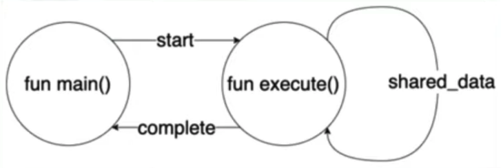
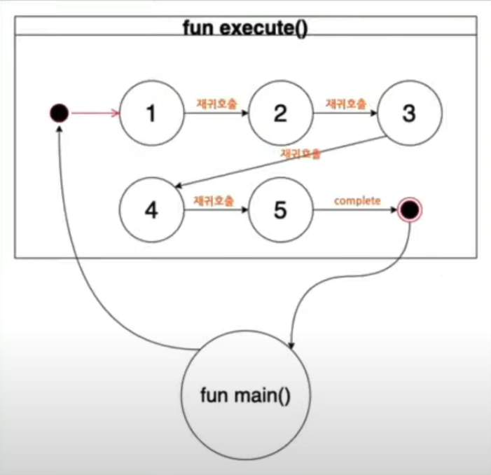
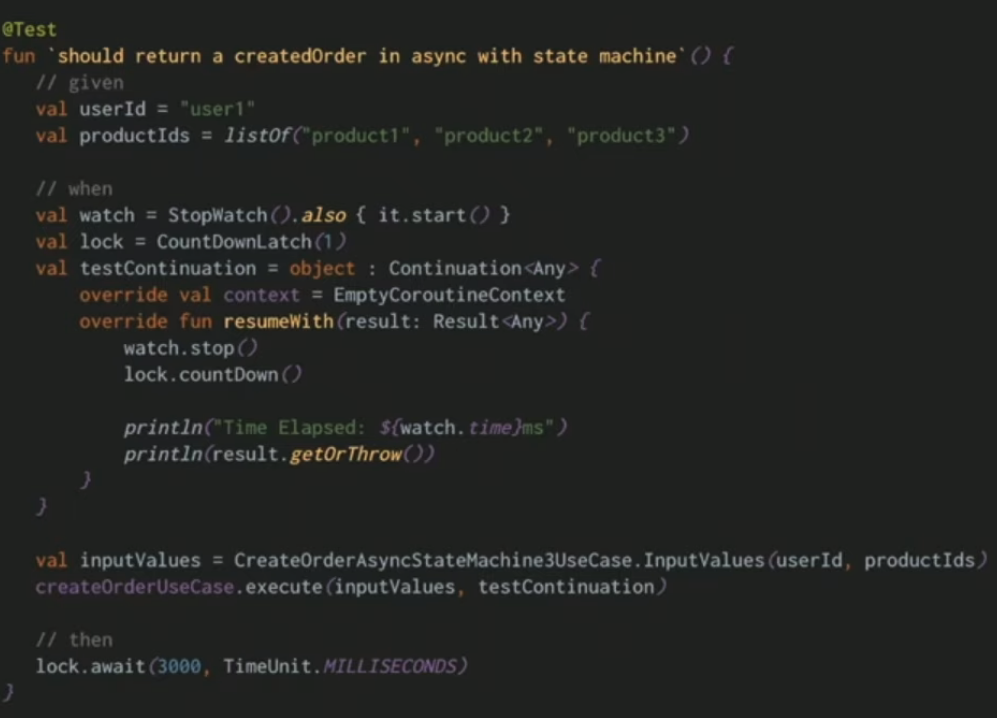

## 당근 서버 밋업 - Kotlin Coroutine 톺아보기

> 당근마켓 로컬 커머스 팀 김태우님
>
> 자료 : https://www.slideshare.net/xodn4195/kotlin-coroutines-250871163
>
> 코드 : https://github.com/gaaon/kotlin-coroutines-examples
>
> 목차
>
> 1. 비동기에 대한 고민
> 2. 코루틴 소개
> 3. 코루틴 톺아보기
> 4. 다음회 예고

## 비동기에 대한 고민

- 동기 프로그래밍과 다르다
  - 한번에 이해하기 어렵다
  - 추적이 어렵다
  - 에러 핸들링이 어렵다
- 다양한 비동기 라이브러리가 존재한다
  - 어떻게 혼용해서 써야 할까?
    - 리액터와 CompletableFuture의 혼용 시점은?
  - 어떤 결과 타입을 반환해야 할까?
  - 또 다른 비동기 라이브러리가 추가되면?
- 이런 고민들을 하다가 **코루틴**을 찾았다. 장점은 아래와 같다
  - 우수한 가독성
  - 에러 핸들링
  - 동시성 처리
  - Flow
  - Channel

## 코루틴 소개

- 코루틴화 시킬 수 있는 함수들은 suspend가 붙어 있어야 한다.
- 각 확장 함수들을 사용할 수 있다.
  - 비동기 라이브러리들이 suspend 함수 내에서 동작하기 위한 브릿지 역할을 한다.
  - `Maybe<T>.awaitSingle`
  - `Publisher<T>.awaitLast`
  - `Flow<T>.toList`
  - `CompletableFuture<T>.await`
- 동기코드와 Coroutine 비동기 코드가 거의 유사하게 작성 될 수 있다.
  - 콜백헬이나 subscribe헬 등이 없는
- 코루틴 실행
  - `runBlocking`은 동기코드에서 코루틴을 실행할 수 있게 브릿지 역할을 한다.

## 코루틴 톺아보기

- 코루틴?

  - 경량화된 스레드 아닌가요?
  - 특정 지점에서 정지했다가 재개할 수 있는 스레드 아닌가요?

- 코루틴은 **코틀린 컴파일러**에 의해 **FInite State Machine** 기반의 **재귀 함수**로 변환 된다.

  

  - execute 함수가 실행되면 재귀 호출을 이용해서 스스로(execute함수)를 실행하면서 state를 변경 한다.

  - state가 최종에 도달하면 값을 caller에 반환한다.

    

- 코틀린 컴파일러가 suspend가 붙은 함수에 추가적인 코드를 추가 한다.

  - **Continuation** 인자를 타겟 함수에 추가하고 Continuation 구현체를 생성한다.
  - 타켓 함수 내의 모든 suspend 함수에 대한 continuation 객체를 패스 한다.
  - 코드를 분리해서 switch case 안에 넣고 label을 이용해서 state를 변경 한다.

- FSM 기반의 동기 코드 작성해보기

  - SharedData를 통해서 여러가지 context를 저장
  - label은 state machine의 현재 state 값
  - 이전 state에서 찾은 값들을 buyer, address, products, stores, order에 저장
  - resumeWith로 재귀 호출을 하고 결과를 result에 저장
  - 인자의 sharedData가 null이라면 생성하고 아니명 있는 sharedData를 사용

  ```kotlin
  class SharedData {
    var label: Int = 0
    lateinit var result: Any
    lateinit var buyer: User
    lateinit var address: Address
    lateinit var products: List<Produce>
    lateinit var stores: List<Store>
    lateinit var order: Order
    lateinit var resumeWith: (result: Any) -> Order
  }
  
  fun execute(
    inputValues: InputValues,
    sharedData: SharedData? = null
  ): Order {
    val (userId, productIds) = inputValues
    
    val that = this
    val shared = sharedData ?: SharedData().apply {
      this.resumeWith = fun (result: Any): Order {
        this.result = result
        return that.execute(inputValues, this)
      }
    }
  }
  ```

- **FSM 기반의 비동기 코드**

  ```kotlin
  class SharedDataContinuation( // 실제로 continuation 구현체는 method 안에
    val completion: Continuation<Any>,
  ) : Continuation<Any> {
    var label: Int = 0
    lateinit var result: Any
    lateinit var buyer: User
    lateinit var address: Address
    lateinit var products: List<Produce>
    lateinit var stores: List<Store>
    lateinit var order: Order
    lateinit var resume: () -> Unit
    
    override val context: CoroutineContext = completion.context
    override dun resumeWith(result: Result<Any) {
      this.result = result
      this.resume()
    }
  }
  
  fun execute(
    inputValues: InputValues,
    completion: Continuation<Any>
  ) {
    val (userId, productIds) = inputValues
    
    val that = this
    val cont = completion as? SharedDataContinuation
      ?: SharedDataContinuation(completion).apply {
        resume = fun() {
          // recursive self
          that.execute(inputValues, this)
        }
      }
  }
  ```

  - FSM 기반의 비동기 코드 수행

    

- FSM 기반의 코루틴 