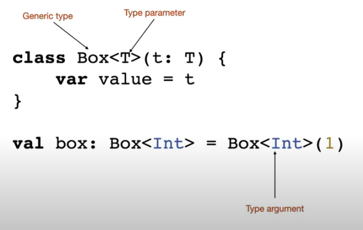
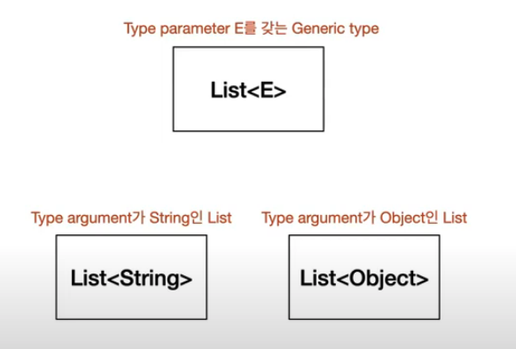
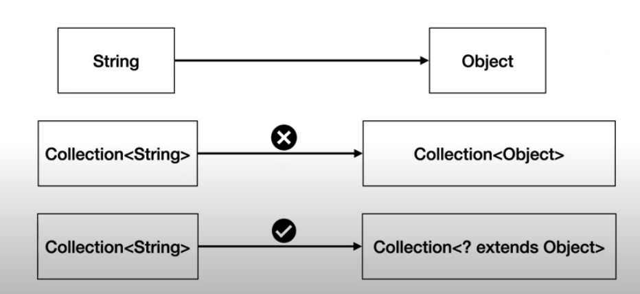
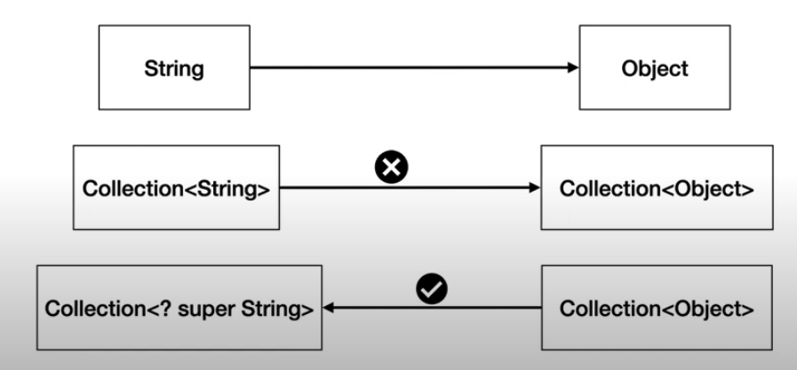

# Java와 Kotlin generic type variance 비교

> 우아한 코틀린 밋업 / 김유민님
>
> 왜 읽어도 이해가 안 되는 걸까?

## Generic 용어



- 예시

  

## Java의 제네틱 타입

- 자바의 제네릭 타입은 **invariant(불변)** 이다.

  - invariant : 어떤 변환 뒤에도 기존의 성질이 변화하지 않고 유지되는 개념
  - String은 Object의 하위 타입이다.
  - 하지만 `List<String>` 은 `List<Object>` 의 하위 타입이 아니다. 
    - 서로 다른 타입이다. 
    - 타입 불일치로 대입 연산도 불가하다.

- 자바에서 **invariant**는 안전망이었으나, 종종 개발의 유연함을 막는 장애물이기도 했다.

  ```java
  interface Collection<E> {
    void addAll(Collection<E> items);
  }
  
  ...
    
  void copyAll(Collection<Object> to, Collection<String> from) {
    to.addAll(from);  // compile ERROR
  }
  ```

- 이런 불편함을 해결하기 위해 개발자가 안전하다고 판단하면 **extends-bound wildcard**를 통해 상속관계를 지정하도록 했다.

  ```java
  interface Collection<E> {
    void addAll(Collection<? extends E> items);
  }
  
  ...
    
  void copyAll(Collection<Object> to, Collection<String> from) {
    to.addAll(from);  // compile OK
  }
  ```

  - **extends-bound wildcard**은 아래와 같이 제네릭 타입을 **covariant**(같이 변하는)하게 만들었다.
  - String과 Object 관계 처럼 컬렉션도 상속관계가 됐다.

  

- **super-bound wildcard** 으로 만들면 상위 타입으로 만들 수도 있다.

  - 이런 특성을 **contravariant**(반대로 변하는) 라고 한다.

  

- 언제 super를 쓰고, 언제 extends를 쓰나?

- 개념이 어렵다 보니 **PECS**(Producer Extends Consumer Super) 법칙이라는 개념이 나왔다.

  - addAll()의 items는 E를 가져오기만(생산하기만) 하는 **Producer**다.
    - 따라서, **extends**를 쓴다. 
  - compareTo()에서 other는 T를 소비하기만하는 **Consumer**이다.
    - 따아서, **super** 를 쓰자.

  ```java
  interface Collection<E> {
    void addAll(Collection<? extends E items);  // Producer (produce E)
  }
  
  interface Collection<T> {
    int compareTo(Comparator<? super T> other);  // Consumer (consume T) 
  }
  ```

- 제네릭을 잘 쓰자고 저런 법칙까지 써야하나? ;;;

## Kotlin 제네릭 타입

- 이것은 Java언어 차원에서 제공하는 제네릭 타입 variance에 Producer, Consumer 개념이 적용되어 있지 않기 때문이다.

- 코틀린은 언어 차원에서 Producer, Consumer개념이 반영 되어 있다.

- 코틀린의 읽기 전용 List 예를 들어 보자.

  - 읽기 전용 List는 새로운 원소를 추가하거나 하는 Operation을 수행할 수 없다.

  - 따라서, 타입 파라미터 E 관점에서 리스트는 원소를 생산하기만하는 Producer이다.

  - 이런 경우 제네릭 타입파라미터 E앞에 out을 붙인다.

  - **declaration-site variance**라고 한다. 제네릭 타입의 선언부에서 in, out 키워드를 정의.

    ```kotlin
    interface List<out E> : Collection<E> {
    	...
    }
    ```

- MutableList 예를 보자.

  - 읽기와 쓰기가 모두 가능하다.
  - out 키워드가 없다. Producer, Consumer가 아니다. 추가하기도하고 읽기도 한다.
  - 따라서, out을 달아 줄 수가 없다.
  - 제네릭타입의 선언부가 아니라 사용하는 쪽인 copy()에서 out키워드를 선언하기 때문에
  - **use-site variance**라고 한다.(= **type projection**) 사용하는 측에서 in, out 키워드를 사용

  ```kotlin
  interface MutableList<E> : List<E>, MutableCollection<E> {
    override fun add(element: E): Boolean
    oberride fun remove(element: E): BOolean
    // ...
  }
  
  fun copy(from: MutableList<out Any), to: MutableList<Any>) {
    ...
  }
  
  fun test() {
    copy(mutableListOf(1, 2, 3, 4), mutableListOf())
  }
  
  ```

  

  

