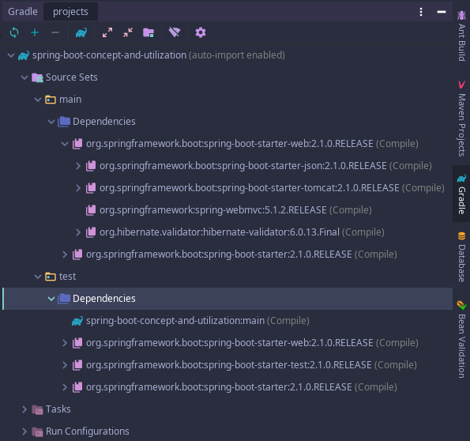

# 2. 스프링 부트 원리

> [백기선 - 스프링 부트 개념과 활용](https://www.inflearn.com/course/%EC%8A%A4%ED%94%84%EB%A7%81%EB%B6%80%ED%8A%B8/)

## 1. 의존성 관리 이해

* https://docs.spring.io/spring-boot/docs/current/reference/htmlsingle/#using-boot-dependency-management
* spring-boot-stater-* 의 부모인 spring-boot-stater-parent, 그리고 다시 그 parent의 부모인 spring-boot-dependencies 에 정의되어 있는 pom.xml의 dependencyManegement 영역 안에 해당 릴리즈 버전에서 관리하는 의존성들이 정의 되어 있다.
  * 그렇기 때문에 우리는 각 스타터의 버전을 명시하지 않아도 되고, parent가 관리하는 버전을 사용하게 된다.
* gradle을 사용한다면 intellij의 gradle 탭에서 참조하고 있는 각 의존성들의 버전들과 하위 의존성들의 상세 버전까지 확인 할 수 있다.



* 스프링 부트의 dependencies에서 관리하는 의존성의 경우 버전 명시를 하지 않고 stater 위주로 추가해서 사용하면 된다. 별도의 버전 호환을 체크 하지 않고 사용할 수 있다. 하지만, 특별히 버전을 명시해서 사용해야 하는 경우는 명시해서 사용하면 설정 값이 해당 버전으로 오버라이딩 되기 때문에 그 버전을 사용 할 수 있다.

## 2. 의존성 관리 응용

### 버전 관리 해주는 의존성 추가

* 사용하고 싶은 dependency stater 등록

```groovy
dependencies {
  ...
	implementation('org.springframework.boot:spring-boot-starter-data-jpa')
	...    
}
```

* 스타터만 추가했을뿐인데, 해당 스프링 부트 릴리즈 버전에서 관리되고 있는 의존성의 하위 의존성들까지 추가가 된다.


### 버전 관리 안해주는 의존성 추가

* 별도로 추가해야 하는 의존성들은 https://mvnrepository.com/ 를 통해서 검색해서 직접 추가하면 된다. 스타터의 parent에서 버전관리가 되지 않으므로 직접 버전까지 명시해줘야 한다.

### 기존 의존성 버전 변경하기

* 추가적으로 부트에서 관리하고 있는 의존성의 버전을 개발자가 직접 수정해서 사용할 수 있다. 

```groovy
implementation('org.springframework.boot:spring-boot-starter-data-jpa:2.0.3.RELEASE')
```

## 3. 자동 설정 이해

* @SpringBootApplication 이 선언되어 있는 메인 클래스에서 저 애노테이션을 따라 들어가보면,
* @SpringBootConfiguration, @EnableAutoConfiguration, @ComponentScan 등이 선언되어 있다.
* 애플리케이션에서 빈은 사실 두 단계로 나눠서 읽힌다.
  * 1단계 : @ComponentScan
  * 2단계 : @EnableAutoConfiguration
* @ComponentScan 에서는
  * @Component
  * @Configuration, @Repository, @Service, @Controller, @RestController
  * 위의 애노테이션
* @EnableAutoConfiguration 에서는
  * spring.factories
    * org.springframework.boot.autoconfigure.EnableAutoConfiguration
  * @Configuration
  * @ConditionalOnXxxYyyZzz

